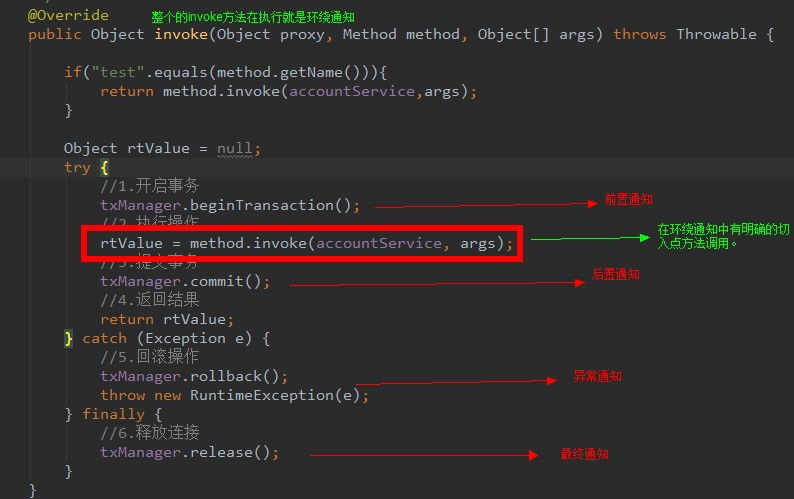

<h1 id="Spring" align="center">Spring</h1>
<!-- @import "[TOC]" {cmd="toc"} -->

<!-- code_chunk_output -->

- [1. Spring IOC](#1-spring-ioc)
  - [1.1. IOC容器的原理](#11-ioc容器的原理)
  - [1.2. IOC 容器装配 Bean](#12-ioc-容器装配-bean)
  - [1.3. Spring IOC相关面试题](#13-spring-ioc相关面试题)
  - [1.4. 托管 Bean 的三种方式](#14-托管-bean-的三种方式)
  - [1.5. bean的作用范围](#15-bean的作用范围)
  - [1.6. 依赖注入](#16-依赖注入)
  - [1.7. Spring IOC 相关注解](#17-spring-ioc-相关注解)
  - [1.8. Spring 整合 jUnit](#18-spring-整合-junit)
  - [1.9. 循环依赖问题](#19-循环依赖问题)
    - [1.9.1. 什么是循环依赖？](#191-什么是循环依赖)
    - [1.9.2. 什么情况下循环依赖可以被处理？](#192-什么情况下循环依赖可以被处理)
    - [1.9.3. Spring是如何解决的循环依赖？](#193-spring是如何解决的循环依赖)
      - [1.9.3.1. 简单的循环依赖（没有AOP）](#1931-简单的循环依赖没有aop)
      - [1.9.3.2. 结合了AOP的循环依赖](#1932-结合了aop的循环依赖)
- [2. Spring AOP](#2-spring-aop)
  - [2.1. 动态代理](#21-动态代理)
    - [2.1.1. Proxy 示例代码](#211-proxy-示例代码)
    - [2.1.2. cglib 示例代码](#212-cglib-示例代码)
  - [2.2. AOP 面向切面编程](#22-aop-面向切面编程)
  - [2.3. AOP 中的注解](#23-aop-中的注解)
- [3. Spring MVC](#3-spring-mvc)
- [4. Spring Boot](#4-spring-boot)
  - [4.1. Spring Boot 简介](#41-spring-boot-简介)
  - [4.2. 配置文件](#42-配置文件)
  - [4.3. Spring Boot 场景启动器](#43-spring-boot-场景启动器)

<!-- /code_chunk_output -->

# 1. Spring IOC

Spring的IoC容器是 Spring 的核心，Spring AOP是 Spring 框架的重要组成部分。

在传统的面向对象程序设计中，调用者A **依赖于** 被调用者 B，当 A 需要使用到 B 的功能时，往往是由 A 来创建 B 的实例。而在 Spring 中，A 对 B对象的**控制权不再由自己管理**了，而是交由 Spring 容器来管理，即**控制反转**。Spring 容器创建 B 对象后，将其注入给 A 使用，即**依赖注入**。

依赖注入：从外部注入 A 依赖的对象 B。
控制反转：把 对 B 的控制权，由 A 的内部 反转到 外部来了。
- 控制指的是：当前对象对内部成员的控制权。
- 反转指的是：这种控制权不由当前对象**内部**管理了，由其他**外部**(类,第三方容器)来管理。
- 对象的创建交给外部容器完成，这个就做控制反转。

IoC(思想，设计模式)主要的实现方式有两种：依赖查找，依赖注入。
依赖注入是一种更可取的方式(实现的方式)


使用IOC的好处：
1. 不用自己组装，拿来就用。
2. 享受单例的好处，效率高，不浪费空间。
3. 便于单元测试，方便切换mock组件。
4. 便于进行AOP操作，对于使用者是透明的。
5. 统一配置，便于修改。
6. 解耦，做到编译期不依赖，运行时才依赖


## 1.1. IOC容器的原理

IOC 容器其实就是一个大工厂。它用来管理我们所有的对象以及依赖关系。
- 通过 Java 的反射技术来实现的。
- 通过配置文件或者注解来描述类和类之间的关系。
- IOC容器就可以根据配置文件，利用反射来构建出对象及其依赖关系。


1. 根据Bean配置信息在容器内部创建Bean定义注册表
2. 根据注册表加载、实例化bean、建立Bean与Bean之间的依赖关系
3. 将这些准备就绪的Bean放到Map缓存池中，等待应用程序调用


两种 Bean 工厂：
- BeanFactory：这是最基础、面向Spring的
- ApplicationContext：在BeanFactory基础之上，面向开发者提供了一系列的功能

区别：
1. ApplicationContext 在初始化时就实例化所有的单例对象。BeanFactory直到第一次访问某个bean时才实例化。
2. ApplicationContext 利用反射自动识别配置文件中定义的BeanPostProcessor、 InstantiationAwareBeanPostProcesso 和BeanFactoryPostProcessor 后置器并注册；BeanFactory 需要手动调用`addBeanPostProcessor()`方法进行注册。

Bean 的初始化：
1. BeanDefinitionReader 读取并解析配置文件，对每个 `<bean>`产生一个BeanDefinition对象，保存到BeanDefinitionRegistry中。
2. 容器遍历所有的 BeanDefinition对象，使用InstantiationStrategy 实例化所有的 Bean 对象，使用 BeanWrapper给每个Bean对象设置属性。


## 1.2. IOC 容器装配 Bean

**装配 Bean 的 4 种方式：**
1. XML 配置文件
2. 注解
3. JavaConfig 类
4. Groovy DSL配置

**依赖注入的 3 种方式：**
1. setter 注入
2. 构造器注入
3. 工厂方法注入

**Bean 对象之间的 3 种关系：**
1. 依赖
2. 继承
3. 引用

**Bean 的作用域：**
- singleton 单例：Spring默认的bean作用域，spring容器一旦加载会直接实例化对象，多次获取的是同一个对象
- prototype 原型：多例，spring容器加载后不会创建对象，每次获取对象之前实例化，每次获取的都是不同对象
- request
- session
- globalSession

单例对象返回多例的成员变量：需要用`lookup`方法注入


## 1.3. Spring IOC相关面试题

**1、什么是 Spring?**
Spring 是 用于 Java 企业级开发的，轻量级的，非侵入式的 开源的 开发框架。Spring框架目标是简化 Java 企业级应用开发。
*侵入式的做法就是要求用户代码知道框架的代码，表现为用户代码需要继承框架提供的类。非侵入式则不需要用户代码引入框架代码的信息，从类的编写者角度来看，察觉不到框架的存在。*

**2、Spring 框架的好处?**
- **轻量**：Spring 是轻量的，基本的版本大约2MB。
- **控制反转**：Spring通过控制反转实现了松散耦合，对象们给出它们的依赖，而不是创建或查找依赖的对象们。
- **面向切面的编程**(AOP)：Spring支持面向切面的编程，并且把应用业务逻辑和系统服务分开。
- **容器**：Spring 包含并管理应用中对象的生命周期和配置。
- **MVC框架**：Spring的WEB框架是个精心设计的框架，是Web框架的一个很好的替代品。
- **事务管理**：Spring 提供一个持续的事务管理接口，可以扩展到上至本地事务下至全局事务（JTA）。
- **异常处理**：Spring 提供方便的API把具体技术相关的异常（比如由JDBC，Hibernate or JDO抛出的）转化为一致的unchecked 异常。

**3、Spring可以分为6大模块：**
- Spring **Core**：spring的核心功能。IOC容器, 解决对象创建及依赖关系
- Spring **Web**：Spring对web模块的支持。
  - 可以与struts整合,让struts的action创建交给spring
  - spring mvc模式
- Spring **EE**：spring 对javaEE其他模块的支持
- Spring **AOP** ：面向切面编程
- Spring **DAO**：Spring 对jdbc操作的支持 【JdbcTemplate模板工具类】
- Spring **ORM**：spring对orm的支持：
  - 既可以与hibernate整合，【session】
  - 也可以使用spring的对hibernate操作的封装

 


**涉及到Spring core的开发jar包有6个**：

- commons-logging.jar：日志
- spring-beans.jar：bean节点
- spring-context.jar：spring上下文节点
- spring-core.jar：spring核心功能
- spring-expression.jar：spring表达式相关表

- log4j.jar：spring 依赖于 log4j

 

## 1.4. 托管 Bean 的三种方式

1. 使用默认空参构造器创建
   当 \<bean\> 标签中只有 id 和 class 属性时, 使用空参构造器注入。如果没有空参构造器则创建对象失败。
2. 使用实例工厂方法获取 Bean 的对象, 先要创建工厂实例, 在通过工厂获取 bean 对象, 并存入 Spring 的 IOC 容器中
3. 使用静态工厂方法获取 Bean 的对象, 并存入 Spring 的 IOC 容器中
4. 使用实现了 FactoryBean 接口的实例工厂

```xml
<!-- 1. 通过 AccountServiceImpl 的空参构造器, 创建其对象 -->
<bean id="accountService" class="com.itheima.service.impl.AccountServiceImpl"></bean>

<!-- 
  2. 通过 InstanceFactory 的空参构造器, 创建工厂对象
  在通过工厂 instanceFactory 的方法 getAccountService 获取 accountService 的对象
 -->
<bean id="instanceFactory" class="com.itheima.factory.InstanceFactory"></bean>
<bean id="accountService" factory-bean="instanceFactory" factory-method="getAccountService"></bean>

<!-- 3. 通过静态工厂 StaticFactory 的静态方法 getAccountService 获取 accountService 的对象-->
<bean id="accountService" class="com.itheima.factory.StaticFactory" factory-method="getAccountService"></bean>

  <!-- 4. User4FactoryBean 必须实现 FactoryBean 接口 -->
<bean id="accountService" class="com.igeekhome.factory.User4FactoryBean" />
```

## 1.5. bean的作用范围
\<bean\> 标签的 scope 属性：用于指定bean的作用范围
- singleton：单例 (默认值), spring容器一旦加载会直接实例化对象，多次获取的是同一个对象
- prototype：多例, spring容器加载后不会创建对象，每次获取对象之前实例化，每次获取的都是不同对象
- request：作用于web应用的请求范围
- session：作用于web应用的会话范围
- global-session：作用于集群环境的全局会话范围(当不是集群环境时,它等于session)


## 1.6. 依赖注入

```xml
<?xml version="1.0" encoding="UTF-8"?>
<beans xmlns="http://www.springframework.org/schema/beans"
    xmlns:xsi="http://www.w3.org/2001/XMLSchema-instance"
    xmlns:p="http://www.springframework.org/schema/p" 
    xsi:schemaLocation="http://www.springframework.org/schema/beans
        http://www.springframework.org/schema/beans/spring-beans.xsd">
  
<!-- 构造器注入 -->
  <bean name="user1" class="song.pojo.User">
  <!-- 默认按照构造函数参数顺序赋值 -->
      <constructor-arg value="1001"></constructor-arg>
      <constructor-arg value="松松"></constructor-arg>
  </bean>
  
  <!-- index指定参数 -->
  <bean name="user2" class="song.pojo.User">
      <constructor-arg index="1" value="松松"></constructor-arg>
      <constructor-arg index="0" value="1001"></constructor-arg>
  </bean>
  
  <!-- name（构造器参数名，而不是类的属性名）指定参数 -->
  <bean name="user3" class="song.pojo.User">
      <constructor-arg name="username" value="松松"></constructor-arg>
      <constructor-arg name="userid" value="1001"></constructor-arg>
  </bean>
  
   <!-- type类型指定参数 -->
  <bean name="user4" class="song.pojo.User">
      <constructor-arg type="java.lang.String" value="松松"></constructor-arg>
      <constructor-arg type="int" value="1001"></constructor-arg>
  </bean>
  
  
<!-- setter方法注入 -->
  <bean id="person1" class="song.pojo.Person">
      <property name="id">
          <value>1001</value>    
      </property>
      <property name="name" value="松松"></property>
      <property name="sex" value="男"/>
      <property name="email" value="songsong@song.net"/>
      <property name="high" value="180.78"/>
      <property name="hello" value="hello, world"/>
  </bean>

<!-- 配置Dao -->
<bean id="dao" class="song.dao.UserDaoImpl" ></bean>
<!-- 配置Service -->
<bean id="userService" class="song.service.UserServiceImpl" >
    <property name="dao" ref="userDao"></property>
</bean>

<!-- 自动装配
    -default: 不装配
    -byName:  按照名称自动注入  dao - setDao
    -byTpye:  按照类型自动注入  UserDao
    -constructor: 使用构造器注入
 -->
<bean id="userService" class="song.service.UserServiceImpl" autowire="byName" ></bean>

<!-- p命名空间  需要setter方法 -->
<!-- xmlns:p="http://www.springframework.org/schema/p" -->
<bean name="personp" class="song.pojo.Person" p:id="1000" p:name="松松">
</bean>

<!-- 集合的注入
  array list set 可以互换
  map property  可以互换
 -->
<bean class="song.pojo.CollectionBean" >
    <!-- 数组的注入 -->
    <property name="array">
        <array>
            <value>松松1</value>
            <value>松松2</value>
            <value>松松3</value>
            <value>松松4</value>
        </array>
    </property>
    <!-- List的注入 -->
    <property name="list">
        <list>
            <value>松松5</value>
            <value>松松6</value>
            <value>松松7</value>
            <value>松松8</value>
        </list>
    </property>
    <!-- Set的注入 -->
    <property name="set">
        <set>
            <value>1</value>
            <value>3</value>
            <value>1</value>
            <value>3</value>
            <value>2</value>
            <value>3</value>
            <value>2</value>
            <value>2</value>
        </set>
    </property>
    <!-- Map的注入 -->
    <property name="map">
        <map>
            <entry>
                <key><value>id</value></key>
                <value>1001</value>
            </entry>
            <entry key="name" value="松松"></entry>
            <entry key="sex" value="男"/>
        </map>    
    </property>
    <!-- Properties的注入 -->
    <property name="properties">
        <props>
            <prop key="id">1002</prop>
            <prop key="name">松松</prop>
            <prop key="sex">男</prop>
        </props>
    </property>
</bean>

</beans>
```


## 1.7. Spring IOC 相关注解

这在之前需要在配置文件中指定需要扫描的包  
```xml
<?xml version="1.0" encoding="UTF-8"?>
<beans xmlns="http://www.springframework.org/schema/beans"
       xmlns:xsi="http://www.w3.org/2001/XMLSchema-instance"
       xmlns:context="http://www.springframework.org/schema/context"
       xsi:schemaLocation="http://www.springframework.org/schema/beans
        http://www.springframework.org/schema/beans/spring-beans.xsd
        http://www.springframework.org/schema/context
        http://www.springframework.org/schema/context/spring-context.xsd">

    <!--告知spring在创建容器时要扫描的包，配置所需要的标签不是在beans的约束中，而是一个名称为context名称空间和约束中-->
    <context:component-scan base-package="com.itheima"></context:component-scan>
</beans>
```

**@Component: 把当前类的对象存入 Spring 容器中**  
value: 用于指定 Bean 的 id. 当我们不写时，它的默认值是当前类名，且首字母改小写.  
这个注解用于实现类上面.

```java
@Component(value="userService")
// 当注解中只有一个属性且属性名为value时, 可以省略
@Component("userService")
```
Component衍生的三个语义化注解:
  - @Controller 表现层
  - @Service    业务层
  - @Repository 持久层


**@Autowired: 自动按照类型注入。**  
只要容器中有唯一的一个bean对象类型和要注入的变量类型匹配，就可以注入成功; 如果没有,则注入失败;   
如果有多个, 选择与变量名称相同 id 的 Bean 对象注入; 如果没有, 则报错.


**@Qualifier: 在 @Autowired 的基础之上, 按照名称注入**  
value: 用于指定注入bean的id, @Qualifier 必须和 @Autowired 一起使用, 不能单独使用

```java
@Autowired
@Qualifier("accountDao1")
private IAccountDao accountDao = null;
```

**@Resource: 直接按照 Bean 的 id 注入, 可以独立使用**  
name: 用于指定注入 Bean 的 id,

```java
@Resource(name = "accountDao2")
private IAccountDao accountDao = null;
```

**@Value: 用于注入基本类型和String类型的数据**  
value：用于指定数据的值. 它可以使用 spring 中 SpEL (也就是 spring 的 el 表达式)  
SpEL 的写法：${表达式}

**@Scope("prototype"): 用于指定作用范围**

**@Lazy: 懒加载, 当需要去使用到对象的时候才初始化**

**@PostConstruct: 用于指定初始化方法**

**@PreDestroy: 用于指定销毁方法**

**@Configuration: 指定当前类是一个配置类**  
当配置类作为AnnotationConfigApplicationContext对象创建的参数时，该注解可以不写。

**@ComponentScan: 用于通过注解指定spring在创建容器时要扫描的包**  
value和basePackages的作用是一样的: 都是用于指定创建容器时要扫描的包, 他们互为别名  
等同于在xml中配置了:
```xml
<context:component-scan base-package="com.itheima"></context:component-scan>
```

**@Bean: 用于把当前方法的返回值作为bean对象存入spring的ioc容器中**  
name: 用于指定bean的id。当不写时，默认值是当前方法的名称.  
当我们使用注解配置方法时，如果方法有参数，spring框架会去容器中查找有没有可用的bean对象。查找的方式和@Autowired注解的作用是一样的.

**@Import: 用于导入其他的配置类**  
value: 用于指定其他配置类的字节码。  
当我们使用Import的注解之后，有Import注解的类就父配置类，而导入的都是子配置类

**@PropertySource: 用于指定properties文件的位置**  
value: 指定文件的名称和路径。classpath 表示类路径下


## 1.8. Spring 整合 jUnit

1. 导入spring整合junit的jar
```xml
<dependency>
  <groupId>org.springframework</groupId>
  <artifactId>spring-test</artifactId>
  <version>5.0.2.RELEASE</version>
</dependency>

<!-- jUnit 版本必须在 4.12 及以上 -->
<dependency>
  <groupId>junit</groupId>
  <artifactId>junit</artifactId>
  <version>4.12</version>
</dependency>
```

2. @RunWith: 把测试的 main 替换成 Spring 提供的

3. @ContextConfiguration: 指定 Spring 的运行器  
locations：指定xml文件的位置  
classes：指定注解类所在地位置

```java
@RunWith(SpringJUnit4ClassRunner.class)
@ContextConfiguration(classes = SpringConfiguration.class)
```

在 SpringBoot 中 @ContextConfiguration 被 @SpringBootTest 代替了

```java
@RunWith(SpringJUnit4ClassRunner.class)
@SpringBootTest(classes = ReadingListApplication.class)
```

## 1.9. 循环依赖问题

> 图解Spring解决循环依赖·掘金 https://juejin.im/post/6844904122160775176#heading-4
> 面试必杀技，讲一讲Spring中的循环依赖·博客园 https://www.cnblogs.com/daimzh/p/13256413.html

只有在setter方式注入的情况下，循环依赖才能解决 **（错）**
三级缓存的目的是为了提高效率 **（错）**

### 1.9.1. 什么是循环依赖？

两个或两个以上的类，按照一定顺序依次依赖，这个依赖图中形成了一个环。

> 创建新的A时，发现要注入原型字段B，又创建新的B发现要注入原型字段A...
> 这就套娃了, 你猜是先StackOverflow还是OutOfMemory?
> Spring怕你不好猜，就先抛出了BeanCurrentlyInCreationException


### 1.9.2. 什么情况下循环依赖可以被处理？

Spring解决循环依赖的前置条件：
1. 出现循环依赖的Bean必须要是单例
2. 依赖注入的方式不能全是构造器注入的方式

```java
@Component
public class A {
    private B b;
    public A(B b) {
        this.b = b;
    }
}
@Component
public class B {
    private A a;
    public B(A a){
        this.a = a;
    }
}
```
全构造器的循环依赖无法被解决：Spring 直接抛出异常
```log
Caused by: org.springframework.beans.factory.BeanCurrentlyInCreationException: Error creating bean with name 'a': Requested bean is currently in creation: Is there an unresolvable circular reference?
```

**不同注入方式的循环依赖解决**
|依赖情况|依赖注入方式|循环依赖是否被解决|
|:-:|:-:|:-:|
|AB相互依赖（循环依赖）|均采用setter方法注入|是|
|AB相互依赖（循环依赖）|均采用构造器注入|否|
|AB相互依赖（循环依赖）|A中注入B的方式为setter方法，B中注入A的方式为构造器|是|
|AB相互依赖（循环依赖）|A中注入B的方式为构造器，B中注入A的方式为setter方法|否|

为什么 3 可以，4 不可以？

Spring在创建Bean时默认会根据自然排序进行创建，所以A会先于B进行创建。
对于 3，可以使用空参构造器创建出 A 对象并放入三级缓存，然后 set B 对象时会使用带参构造器创建B，可以创建成功，因为可以从缓存中拿到 A 对象。
对于 4，使用带参构造器创建 A，由于没有 B 对象，无法创建 A 对象。


### 1.9.3. Spring是如何解决的循环依赖？

#### 1.9.3.1. 简单的循环依赖（没有AOP）

**Spring在创建Bean的过程中分为三步:**
1. 实例化，new了一个对象
。对应方法：`AbstractAutowireCapableBeanFactory::createBeanInstance`
2. 属性注入，为对象填充属性。对应方法：`AbstractAutowireCapableBeanFactory::populateBean`
3. 初始化，执行aware接口中的方法，初始化方法，完成AOP代理。对应方法：`AbstractAutowireCapableBeanFactory::initializeBean`

**Spring存储对象的三级缓存**
1. singletonObjects：一级缓存，单例池，容器，存放创建完成的单例Bean。
2. earlySingletonObjects：二级缓存，存放半成品Bean（完成实例化，但是还未进行属性注入及初始化的对象）。
3. singletonFactories：三级缓存，存放Bean工厂的对象（二级缓存中存储的就是从这个工厂中获取到的对象）。


#### 1.9.3.2. 结合了AOP的循环依赖

其实在普通循环依赖下只需要二级缓存就可。


# 2. Spring AOP

面向切面编程：将相同逻辑的重复代码横向抽取出来，使用**动态代理**技术将这些重复代码织入到目标对象方法中，实现和原来一样的功能。

Spring AOP 无法代理 final 和 static 的方法，也不能代理 final 类。因为它们不能被重写。

## 2.1. 动态代理

静态代理的代理类是在程序运行之前编写好的；而动态代理的代理类是在运行时动态生成的。

> JDK动态代理-超详细源码分析 <https://www.jianshu.com/p/269afd0a52e6>

特点: 字节码随用随创建, 随用随加载.  
可以在不修改源码的基础上对方法进行增强

- 基于接口的动态代理  Proxy - JDK
- 基于子类的动态代理  Enhancer - cglib

### 2.1.1. Proxy 示例代码

接口
```java
public interface IProducer {
    /**
     * 销售
     * @param money
     */
    public void saleProduct(float money);
    /**
     * 售后
     * @param money
     */
    public void afterService(float money);
}
```
接口的实现类，被代理对象
```java
public class Producer implements IProducer{
    /**
     * 销售
     * @param money
     */
    public void saleProduct(float money){
        System.out.println("销售产品，并拿到钱："+money);
    }
    /**
     * 售后
     * @param money
     */
    public void afterService(float money){
        System.out.println("提供售后服务，并拿到钱："+money);
    }
}
```
获取代理类对象，并执行增强方法
```java
public static void main(String[] args) {
	// 被代理对象，源对象
    final Producer producer = new Producer();
    /**
     * 动态代理：
     *  特点：字节码随用随创建，随用随加载
     *  作用：不修改源码的基础上对方法增强
     *  分类：
     *      基于接口的动态代理
     *      基于子类的动态代理
     *  基于接口的动态代理：
     *      涉及的类：Proxy
     *      提供者：JDK官方
     *  如何创建代理对象：
     *      使用Proxy类中的newProxyInstance方法
     *  创建代理对象的要求：
     *      被代理类最少实现一个接口，如果没有则不能使用
     *  newProxyInstance方法的参数：
     *      ClassLoader：类加载器
     *          它是用于加载代理对象字节码的。和被代理对象使用相同的类加载器。固定写法。
     *      Class[]：字节码数组
     *          它是用于让代理对象和被代理对象有相同方法。固定写法。
     *      InvocationHandler：用于提供增强的代码
     *          它是让我们写如何代理。我们一般都是些一个该接口的实现类，通常情况下都是匿名内部类，但不是必须的。
     *          此接口的实现类都是谁用谁写。
     */
	// 获取代理对象，增强后的对象
    IProducer proxyProducer = (IProducer) Proxy.newProxyInstance(
			// 被代理类的类加载器
			producer.getClass().getClassLoader(),
			// 被代理类的接口类型
			producer.getClass().getInterfaces(),
			// 增强方法的接口
			new InvocationHandler() {
				/**
					* 作用：执行被代理对象的任何接口方法都会经过该方法
					* @param proxy   代理对象的引用
					* @param method  当前执行的方法
					* @param args    当前执行方法所需的参数
					* @return        和被代理对象方法有相同的返回值
					* @throws Throwable
					*/
				@Override
				public Object invoke(Object proxy, Method method, Object[] args) throws Throwable {
					//提供增强的代码
					Object returnValue = null;

					//1.获取方法执行的参数
					Float money = (Float)args[0];
					//2.判断当前方法是不是销售
					if("saleProduct".equals(method.getName())) {
						// 执行原方法
						returnValue = method.invoke(producer, money*0.8f);
					}
					// 返回原方法的返回值
					return returnValue;
				}
			}
		);
	// 执行代理类对象的增强方法
    proxyProducer.saleProduct(10000f);
}
```

简要版
```java
// 获取代理类
UserService proxy = (UserService)Proxy.newProxyInstance(
    // 被代理类的类加载器
    userService.getClass().getClassLoader(),
    // 被代理类的接口类型
    userService.getClass().getInterfaces(),
    // 增强方法的接口
    new InvocationHandler() {
        /**
        * 增强方法
        * @param proxy  代理类对象
        * @param method 接口中的方法
        * @param args   方法参数
        * @return 必须和原方法相同
        * @throws Throwable
        */
        @Override
        public Object invoke(Object proxy, Method method, Object[] args) throws Throwable {
            // before
            Integer money = (Integer) args[0];
            System.out.println("扣钱 10 元");
            money -= 10;

            // 执行原方法
            return method.invoke(userService, money);
        }
    }
);

// 执行代理类方法
proxy.saveMoney(100);
```

**JDK 动态代理和为什么需要接口**

> 1.在需要继承proxy类获得有关方法和InvocationHandler构造方法传参的同时,java不能同时继承两个类，我们需要和想要代理的类建立联系，只能实现一个接口
> 
> 2.需要反射获得代理类的有关参数，必须要通过某个类，反射获取有关方法
> 
> 3.成功返回的是object类型，要获取原类，只能继承/实现，或者就是那个代理类
> 
> 4.对具体实现的方法内部并不关心，这个交给InvocationHandler.invoke那个方法里去处理就好了，我只想根据你给我的接口反射出对我有用的东西
> 
> 5.考虑到设计模式，以及proxy编者编写代码的逻辑使然
>
> 引用自 <https://blog.csdn.net/linglingma9087/article/details/80311518>


JDk 动态代理类 Proxy 的 newProxyInstance 方法源码

```java
/**
 * Returns an instance of a proxy class for the specified interfaces
 * that dispatches method invocations to the specified invocation
 * handler.
 * 返回指定接口的代理类实例，该接口将方法调用分派给指定的调用处理程序。
 *
 * @param   loader the class loader to define the proxy class
 *          代理类加载器, 和被代理类一致
 * @param   interfaces the list of interfaces for the proxy class to implement
 *          要实现的代理类的接口列表
 * @param   h the invocation handler to dispatch method invocations to
 *          要将方法调用分派到的调用处理程序
 */
@CallerSensitive
public static Object newProxyInstance(
    ClassLoader loader,
    Class<?>[] interfaces,
    InvocationHandler h
    )
    throws IllegalArgumentException
{
    Objects.requireNonNull(h);

    final Class<?>[] intfs = interfaces.clone();
    final SecurityManager sm = System.getSecurityManager();
    if (sm != null) {
        checkProxyAccess(Reflection.getCallerClass(), loader, intfs);
    }

    /*
     * Look up or generate the designated proxy class.
     */
    Class<?> cl = getProxyClass0(loader, intfs);

    /*
     * Invoke its constructor with the designated invocation handler.
     */
    try {
        if (sm != null) {
            checkNewProxyPermission(Reflection.getCallerClass(), cl);
        }

        final Constructor<?> cons = cl.getConstructor(constructorParams);
        final InvocationHandler ih = h;
        if (!Modifier.isPublic(cl.getModifiers())) {
            AccessController.doPrivileged(new PrivilegedAction<Void>() {
                public Void run() {
                    cons.setAccessible(true);
                    return null;
                }
            });
        }
        return cons.newInstance(new Object[]{h});
    } catch (IllegalAccessException|InstantiationException e) {
        throw new InternalError(e.toString(), e);
    } catch (InvocationTargetException e) {
        Throwable t = e.getCause();
        if (t instanceof RuntimeException) {
            throw (RuntimeException) t;
        } else {
            throw new InternalError(t.toString(), t);
        }
    } catch (NoSuchMethodException e) {
        throw new InternalError(e.toString(), e);
    }
}
```

### 2.1.2. cglib 示例代码

```java
public class Producer {

    /**
     * 销售
     * @param money
     */
    public void saleProduct(float money){
        System.out.println("销售产品，并拿到钱："+money);
    }

    /**
     * 售后
     * @param money
     */
    public void afterService(float money){
        System.out.println("提供售后服务，并拿到钱："+money);
    }
}

public static void main(String[] args) {
    final Producer producer = new Producer();

    /**
        * 动态代理：
        *  特点：字节码随用随创建，随用随加载
        *  作用：不修改源码的基础上对方法增强
        *  分类：
        *      基于接口的动态代理
        *      基于子类的动态代理
        *  基于子类的动态代理：
        *      涉及的类：Enhancer
        *      提供者：第三方cglib库
        *  如何创建代理对象：
        *      使用Enhancer类中的create方法
        *  创建代理对象的要求：
        *      被代理类不能是最终类
        *  create方法的参数：
        *      Class：字节码
        *          它是用于指定被代理对象的字节码。
        *
        *      Callback：用于提供增强的代码
        *          它是让我们写如何代理。我们一般都是些一个该接口的实现类，通常情况下都是匿名内部类，但不是必须的。
        *          此接口的实现类都是谁用谁写。
        *          我们一般写的都是该接口的子接口实现类：MethodInterceptor
        */
    Producer cglibProducer = (Producer)Enhancer.create(producer.getClass(), new MethodInterceptor() {
        /**
            * 执行被代理对象的任何方法都会经过该方法
            * @param proxy
            * @param method
            * @param args
            *    以上三个参数和基于接口的动态代理中invoke方法的参数是一样的
            * @param methodProxy ：当前执行方法的代理对象
            * @return
            * @throws Throwable
            */
        @Override
        public Object intercept(Object proxy, Method method, Object[] args, MethodProxy methodProxy) throws Throwable {
            //提供增强的代码
            Object returnValue = null;

            //1.获取方法执行的参数
            Float money = (Float)args[0];
            //2.判断当前方法是不是销售
            if("saleProduct".equals(method.getName())) {
                returnValue = method.invoke(producer, money*0.8f);
            }
            return returnValue;
        }
    });
    cglibProducer.saleProduct(12000f);
}
```


## 2.2. AOP 面向切面编程

在 Spring 中, 会根据被代理目标类是否实现了接口来决定使用哪种动态代理的方式.

- Joinpoint(连接点): 所谓连接点是指可以被拦截到的点。在 spring 中, 这些点指的是方法, 因为 spring 只支持方法类型的连接点。 
- Pointcut(切入点): 所谓切入点是指我们要对哪些 Joinpoint 进行拦截的定义。 
- Advice(通知/增强): 所谓通知是指拦截到 Joinpoint 之后所要做的事情就是通知。   
  通知的类型：前置通知, 后置通知, 异常通知, 最终通知, 环绕通知。
- Introduction(引介): 引介是一种特殊的通知在不修改类代码的前提下, Introduction 可以在运行期为类动态地添加一些方法或 Field。 
- Target(目标对象): 代理的目标对象。 
- Weaving(织入): 是指把增强应用到目标对象来创建新的代理对象的过程。   
  spring 采用动态代理织入，而 AspectJ 采用编译期织入和类装载期织入。 
- Proxy（代理）:   一个类被 AOP 织入增强后，就产生一个结果代理类。
- Aspect(切面):   是切入点和通知（引介）的结合。 **切面就是配置**




```xml
<?xml version="1.0" encoding="UTF-8"?>
<beans xmlns="http://www.springframework.org/schema/beans"
       xmlns:xsi="http://www.w3.org/2001/XMLSchema-instance"
       xmlns:aop="http://www.springframework.org/schema/aop"
       xsi:schemaLocation="http://www.springframework.org/schema/beans
        http://www.springframework.org/schema/beans/spring-beans.xsd
        http://www.springframework.org/schema/aop
        http://www.springframework.org/schema/aop/spring-aop.xsd">

    <!-- 配置srping的Ioc,把service对象配置进来-->
    <bean id="accountService" class="com.itheima.service.impl.AccountServiceImpl"></bean>

    <!-- 配置Logger类 -->
    <bean id="logger" class="com.itheima.utils.Logger"></bean>

    <!--配置AOP-->
    <aop:config>
        <!--配置切面 -->
        <aop:aspect id="logAdvice" ref="logger">
            <!-- 配置通知的类型，并且建立通知方法和切入点方法的关联-->
            <aop:before method="printLog" pointcut="execution( public void com.itheima.service.impl.AccountServiceImpl.saveAccount() )"></aop:before>
        </aop:aspect>
    </aop:config>

</beans>
```

**切入点表达式的写法**

需要 aspectjweaver 依赖

关键字: `execution(表达式)`

表达式语法: 访问修饰符  返回值  包名.包名.包名...类名.方法名(参数列表)

标准的表达式写法: `public void com.itheima.service.impl.AccountServiceImpl.saveAccount()`

- 访问修饰符可以省略  
`void com.itheima.service.impl.AccountServiceImpl.saveAccount()`

- 返回值可以使用通配符，表示任意返回值  
`* com.itheima.service.impl.AccountServiceImpl.saveAccount()`

- 包名可以使用通配符，表示任意包。但是有几级包，就需要写几个*.  
`* *.*.*.*.AccountServiceImpl.saveAccount())`

- 包名可以使用..表示当前包及其子包  
`* *..AccountServiceImpl.saveAccount()`

- 类名和方法名都可以使用*来实现通配  
`* *..*.*()`

- 参数列表  
    - 可以直接写数据类型: 
        - 基本类型直接写名称 `int`
        - 引用类型写包名.类名的方式 `java.lang.String`
    - 可以使用通配符表示任意类型，但是必须有参数
    - 可以使用 .. 表示有无参数均可，有参数可以是任意类型
    
- 全通配写法: `* *..*.*(..)`

- 实际开发中切入点表达式的通常写法:  
切到业务层实现类下的所有方法 `* com.itheima.service.impl.*.*(..)`


**四种通知类型**

```xml
<!--配置AOP-->
<aop:config>
    <!--配置切面 -->
    <aop:aspect id="logAdvice" ref="logger">
        <!-- 配置前置通知：在切入点方法执行之前执行-->
        <aop:before method="beforePrintLog" pointcut="execution(* com.itheima.service.impl.*.*(..))" ></aop:before>

        <!-- 配置后置通知：在切入点方法正常执行之后值。它和异常通知永远只能执行一个-->
        <aop:after-returning method="afterReturningPrintLog" pointcut="execution(* com.itheima.service.impl.*.*(..))" ></aop:after-returning>

        <!-- 配置异常通知：在切入点方法执行产生异常之后执行。它和后置通知永远只能执行一个-->
        <aop:after-throwing method="afterThrowingPrintLog" pointcut="execution(* com.itheima.service.impl.*.*(..))" ></aop:after-throwing>

        <!-- 配置最终通知：无论切入点方法是否正常执行它都会在其后面执行-->
        <aop:after method="afterPrintLog" pointcut="execution(* com.itheima.service.impl.*.*(..))" ></aop:after>
    </aop:aspect>
</aop:config>
```

**配置切入点表达式 aop:pointcut**

```xml
<aop:config>
    <!-- 配置切入点表达式 id属性用于指定表达式的唯一标识。expression属性用于指定表达式内容
            此标签写在aop:aspect标签内部只能当前切面使用。
            它还可以写在aop:aspect外面，此时就变成了所有切面可用

            **aop:pointcut 必须出现在 aop:aspect 之前**
        -->
    <aop:pointcut id="pt1" expression="execution(* com.itheima.service.impl.*.*(..))"></aop:pointcut>
    <!--配置切面 -->
    <aop:aspect id="logAdvice" ref="logger">
        <!-- 配置前置通知：在切入点方法执行之前执行-->
        <aop:before method="beforePrintLog" pointcut-ref="pt1" ></aop:before>

        <!-- 配置后置通知：在切入点方法正常执行之后值。它和异常通知永远只能执行一个-->
        <aop:after-returning method="afterReturningPrintLog" pointcut-ref="pt1"></aop:after-returning>

        <!-- 配置异常通知：在切入点方法执行产生异常之后执行。它和后置通知永远只能执行一个-->
        <aop:after-throwing method="afterThrowingPrintLog" pointcut-ref="pt1"></aop:after-throwing>

        <!-- 配置最终通知：无论切入点方法是否正常执行它都会在其后面执行-->
        <aop:after method="afterPrintLog" pointcut-ref="pt1"></aop:after>
    </aop:aspect>
</aop:config>
```

**环绕通知**

重载整个通知包括切入点, 即环绕通知重载了整个切面.

```xml
<aop:config>
    <!--配置切面 -->
    <aop:aspect id="logAdvice" ref="logger">
        <!-- 配置环绕通知 详细的注释请看Logger类中-->
        <aop:around method="aroundPringLog" pointcut="execution(* com.itheima.service.impl.*.*(..))"></aop:around>
    </aop:aspect>
</aop:config>
```
```java
public class Logger {
   /**
    * 环绕通知
    * 问题：
    *      当我们配置了环绕通知之后，切入点方法没有执行，而通知方法执行了。
    * 分析：
    *      通过对比动态代理中的环绕通知代码，发现动态代理的环绕通知有明确的切入点方法调用，而我们的代码中没有。
    * 解决：
    *      Spring框架为我们提供了一个接口：ProceedingJoinPoint。该接口有一个方法proceed()，此方法就相当于明确调用切入点方法。
    *      该接口可以作为环绕通知的方法参数，在程序执行时，spring框架会为我们提供该接口的实现类供我们使用。
    *
    * spring中的环绕通知：
    *      它是spring框架为我们提供的一种可以在代码中手动控制增强方法何时执行的方式。
    */
    public Object aroundPringLog(ProceedingJoinPoint pjp){
        Object rtValue = null;
        try{
            Object[] args = pjp.getArgs();//得到方法执行所需的参数

            System.out.println("Logger类中的aroundPringLog方法开始记录日志了。。。前置");

            rtValue = pjp.proceed(args);//明确调用业务层方法（切入点方法）

            System.out.println("Logger类中的aroundPringLog方法开始记录日志了。。。后置");

            return rtValue;
        }catch (Throwable t){
            System.out.println("Logger类中的aroundPringLog方法开始记录日志了。。。异常");
            throw new RuntimeException(t);
        }finally {
            System.out.println("Logger类中的aroundPringLog方法开始记录日志了。。。最终");
        }
    }
}
```


## 2.3. AOP 中的注解

开启注解之前需要在配置文件中的配置

```xml
<!-- 配置spring创建容器时要扫描的包-->
<context:component-scan base-package="com.itheima"></context:component-scan>

<!-- 配置spring开启注解AOP的支持 -->
<aop:aspectj-autoproxy></aop:aspectj-autoproxy>
```

- **@EnableAspectJAutoProxy: 使用注解来启用AOP**

- **@Aspect: 表示当前类是一个切面类**

- **@Pointcut: 指定切点表达式**  
```java
@Pointcut("execution(* com.itheima.service.impl.*.*(..))")
private void pt1(){}
```

- **@Before("pt1()"): 前置通知**

- **@AfterReturning("pt1()"): 后置通知**

- **@AfterThrowing("pt1()"): 异常通知**

- **@After("pt1()"): 最终通知**

- **@Around("pt1()"): 环绕通知**

**用注解配置通知时, 后置/异常通知个最终通知存在调用顺序错误的情况. 这是一个坑, 可能是框架代码写错了???**


# 3. Spring MVC

```sequence
浏览器 -> DispatcherServlet : 1.发送请求

    DispatcherServlet -> HandlerMapping : 2.请求获取Handler
    HandlerMapping -> HandlerMapping : 3.寻找具体的处理器\n(xml配置、注解)
    HandlerMapping --> DispatcherServlet : 4.HandlerExecutionChain\n（HandelIntercepter和Handle）

    DispatcherServlet -> HandlerAdapter : 5.请求执行Handler
        HandlerAdapter -> Handler(Controller) : 6.执行相应方法
        Handler(Controller) --> HandlerAdapter : 7.ModelAndView
    HandlerAdapter --> DispatcherServlet : 8.ModelAndView

    DispatcherServlet -> ViewReslover : 9.请求视图解析 ModelAndView
    ViewReslover -> ViewReslover : 10.视图解析
    ViewReslover --> DispatcherServlet : 11.View

    DispatcherServlet -> DispatcherServlet : 12.渲染视图\n（将模型数据填充至视图中）

DispatcherServlet --> 浏览器 : 13.响应结果
```
SpringMVC 流程
1. 用户发送请求至前端控制器DispatcherServlet。
2. DispatcherServlet收到请求调用HandlerMapping处理器映射器。
3. 处理器映射器找到具体的处理器(可以根据xml配置、注解进行查找)，生成处理器对象及处理器拦截器(如果有则生成)一并返回给DispatcherServlet。
4. DispatcherServlet调用HandlerAdapter处理器适配器。
5. HandlerAdapter经过适配调用具体的处理器(Controller，也叫后端控制器)。
6. Controller执行完成返回ModelAndView。
7. HandlerAdapter将controller执行结果ModelAndView返回给DispatcherServlet。
8. DispatcherServlet将ModelAndView传给ViewReslover视图解析器。
9. ViewReslover解析后返回具体View。
10. DispatcherServlet根据View进行渲染视图（即将模型数据填充至视图中）。
11. DispatcherServlet响应用户。

DispatcherServlet：作为前端控制器，整个流程控制的中心，控制其它组件执行，统一调度，降低组件之间的耦合性，提高每个组件的扩展性。
HandlerMapping：通过扩展处理器映射器实现不同的映射方式，例如：配置文件方式，实现接口方式，注解方式等。 
HandlAdapter：通过扩展处理器适配器，支持更多类型的处理器。
ViewResolver：通过扩展视图解析器，支持更多类型的视图解析，例如：jsp、freemarker、pdf、excel等。


# 4. Spring Boot

## 4.1. Spring Boot 简介

Spring Boot 核心

- 自动配置
- 起步依赖 org.springframework.boot:spring-boot-starter-web
- 命令行界面: Spring Boot CLI利用了起步依赖和自动配置，让你专注于代码本身。Spring Boot CLI是Spring Boot的非必要组成部分。
- Actuator: 提供在运行时检视应用程序内部情况的能力


@SpringBootApplication 这个注解 开启组件扫描和自动配置, 由以下三个注解组合
    
- @SpringBootConfiguration 继承自@Configuration, 标明该类使用Spring基于Java的配置, 而非XML配置
    - @Configuration
        - @Component
- @EnableAutoConfiguration 启用自动配置
    - @AutoConfigurationPackage 自动配置包 
    - @Import(AutoConfigurationPackages.Registrar.class)
- @ComponentScan 启用组件扫描


## 4.2. 配置文件

application.properties  
application.yml

yml 语法:

k:(空格)v : 表示一对键值对 (空格必须有)  
以空格的缩进来控制层级关系；只要是左对齐的一列数据，都是同一个层级的


**引号:**

name: "zhangsan \n lisi"：输出；zhangsan 换行 lisi  
name: 'zhangsan \n lisi'：输出；zhangsan \n lisi

**数组:**

```yaml
- cat
- dog
- tigger

# 行内写法

[cat,dog,tigger]

```

## 4.3. Spring Boot 场景启动器

文件结构
```
hello-spring-boot-starter
    |-- pom.xml：这个 jar 包中只有一个 pom 文件，用于引入 hello-spring-boot-starter-autoconfigurer 和其他需要依赖的 jar 包
hello-spring-boot-starter-autoconfigurer
    |-- pom.xml
    |-- src
        |-- java
            |-- priv.abadstring.hello
                |-- HelloProperties.java : 配置信息，读取 application.xxx 配置文件的数据
                |-- HelloService.java    : 业务功能实现类
                |-- HelloServiceAutoConfiguration.java : 自动配置类
        |-- resources
            |-- META-INF
                |-- spring.factories : 告诉 SpringBoot 自动配置类是哪一个
```
hello-spring-boot-starter/pom.xml
```xml
<?xml version="1.0" encoding="UTF-8"?>
<project xmlns="http://maven.apache.org/POM/4.0.0"
         xmlns:xsi="http://www.w3.org/2001/XMLSchema-instance"
         xsi:schemaLocation="http://maven.apache.org/POM/4.0.0 http://maven.apache.org/xsd/maven-4.0.0.xsd">
    <modelVersion>4.0.0</modelVersion>

    <groupId>priv.abadstring</groupId>
    <artifactId>hello-spring-boot-starter</artifactId>
    <version>1.0-SNAPSHOT</version>

    <dependencies>
        <!--引入自动配置模块-->
        <dependency>
            <groupId>priv.abadstring</groupId>
            <artifactId>hello-spring-boot-starter-autoconfigurer</artifactId>
            <version>1.0.0-SNAPSHOT</version>
        </dependency>
    </dependencies>

</project>
```
hello-spring-boot-starter-autoconfigurer/pom.xml
```xml
<?xml version="1.0" encoding="UTF-8"?>
<project xmlns="http://maven.apache.org/POM/4.0.0"
         xmlns:xsi="http://www.w3.org/2001/XMLSchema-instance"
         xsi:schemaLocation="http://maven.apache.org/POM/4.0.0 http://maven.apache.org/xsd/maven-4.0.0.xsd">
    <modelVersion>4.0.0</modelVersion>

    <groupId>priv.abadstring</groupId>
    <artifactId>hello-spring-boot-starter-autoconfigurer</artifactId>
    <version>1.0.0-SNAPSHOT</version>

    <parent>
        <groupId>org.springframework.boot</groupId>
        <artifactId>spring-boot-starter-parent</artifactId>
        <version>1.5.10.RELEASE</version>
        <relativePath/> <!-- lookup parent from repository -->
    </parent>

    <dependencies>
        <!--引入spring-boot-starter；所有starter的基本配置-->
        <dependency>
            <groupId>org.springframework.boot</groupId>
            <artifactId>spring-boot-starter</artifactId>
        </dependency>
    </dependencies>

</project>
```
hello-spring-boot-starter-autoconfigurer/src/main/resources/META-INF/spring.factories
```factories
org.springframework.boot.autoconfigure.EnableAutoConfiguration=\
priv.abadstring.hello.HelloServiceAutoConfiguration
```
HelloServiceAutoConfiguration.java
```java
package priv.abadstring.hello;

import org.springframework.beans.factory.annotation.Autowired;
import org.springframework.boot.autoconfigure.condition.ConditionalOnWebApplication;
import org.springframework.boot.context.properties.EnableConfigurationProperties;
import org.springframework.context.annotation.Bean;
import org.springframework.context.annotation.Configuration;

@Configuration
@ConditionalOnWebApplication //web应用才生效
@EnableConfigurationProperties(HelloProperties.class)
public class HelloServiceAutoConfiguration {

    @Autowired
    HelloProperties helloProperties;
    @Bean
    public HelloService helloService(){
        HelloService service = new HelloService();
        service.setHelloProperties(helloProperties);
        return service;
    }
}
```
HelloProperties.java
```java
package priv.abadstring.hello;
import org.springframework.boot.context.properties.ConfigurationProperties;

@ConfigurationProperties(prefix = "atguigu.hello")
public class HelloProperties {

    private String prefix;
    private String suffix;

    public String getPrefix() {
        return prefix;
    }

    public void setPrefix(String prefix) {
        this.prefix = prefix;
    }

    public String getSuffix() {
        return suffix;
    }

    public void setSuffix(String suffix) {
        this.suffix = suffix;
    }
}
```
HelloService.java
```java
package priv.abadstring.hello;

public class HelloService {

    HelloProperties helloProperties;

    public HelloProperties getHelloProperties() {
        return helloProperties;
    }

    public void setHelloProperties(HelloProperties helloProperties) {
        this.helloProperties = helloProperties;
    }

    public String sayHellAtguigu(String name){
        return helloProperties.getPrefix()+"-" +name + helloProperties.getSuffix();
    }
}
```