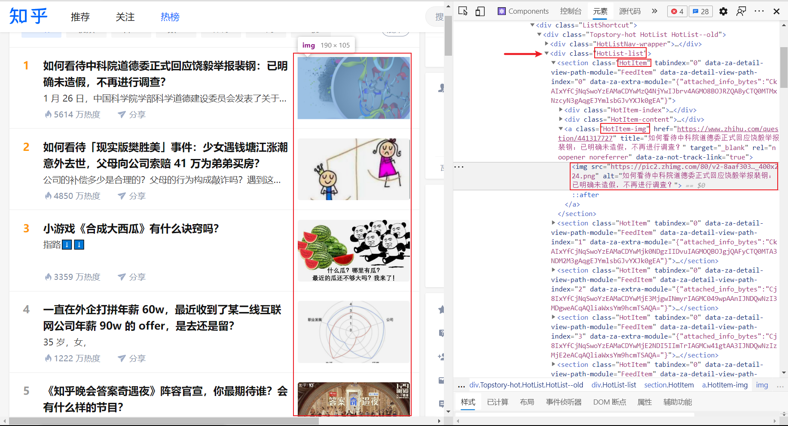

<h1 id="Java实用编程" align="center">Java 实用编程</h1>
<!-- @import "[TOC]" {cmd="toc"} -->

<!-- code_chunk_output -->

- [1. 爬虫](#1-爬虫)
  - [1.1. 示例一：获取知乎热榜图片](#11-示例一获取知乎热榜图片)

<!-- /code_chunk_output -->

# 1. 爬虫

## 1.1. 示例一：获取知乎热榜图片

1. **首先分析知乎热榜的文档结构：**



可以发现热榜都是放在一个类名为 `HotList-list` 的 `div` 中。
每一条热榜对应一个类名为 `HotItem` 的 `section` 标签（这糟糕的类名命名）。
每条热榜由左边的标号、中间的标题、右边的图片组成。
`<a class="HotItem-img">` 中的 `img` 标签便是我们需要的。
```html
<div class="HotList-list">
  <section class="HotItem" tabindex="0" >
    <div class="HotItem-index"></div>
    <div class="HotItem-content"></div>
    <a class="HotItem-img">
      
    </a>
  </section>
  <section class="HotItem" tabindex="1" >
  </section>
  <!-- section .... -->
</div>
```

2. **获取 Cookie 以便登录**
在浏览器登录后，登录信息会记录在 Cookie 中以便下次访问时免密登录。
知乎的登录信息对应值为 `z_c0` 的 Cookie。
打开浏览器控制台 Application -> Cookie -> http://www.zhihu.com，将 `z_c0` 那一项复制出来。
（对于如何找到哪一项是登录的 Cookie，可以一项一项删除 Cookie，每删除一次刷新页面。看删掉哪一项后跳转到登录页面，所删除的那一项就记录着登录信息。如果 Cookie 太多，可以考虑二分法。）


3. **编码**

- 引入 jsop
jsoup 是一款 Java 的 HTML 解析器，可直接解析某个URL地址、HTML文本内容。
```xml
<dependency>
    <groupId>org.jsoup</groupId>
    <artifactId>jsoup</artifactId>
    <version>1.13.1</version>
</dependency>
```

- 获取每项热榜的 `img` 标签，并下载图片
```java
import org.jsoup.Connection;
import org.jsoup.Jsoup;
import org.jsoup.nodes.Document;
import org.jsoup.nodes.Element;
import org.jsoup.select.Elements;
import java.io.BufferedInputStream;
import java.io.BufferedOutputStream;
import java.io.FileOutputStream;
import java.io.IOException;
import java.util.ArrayList;
import java.util.List;

public class GetImage {
    public static void main(String[] args) {
        try {
            // 1. 请求 url, 得到 document 对象
            Document document =
                // URL
                Jsoup.connect("https://www.zhihu.com/hot")
                    // 以 KV 的方式带 Cookie
                    // xxxxxx 换为自己的
                    .cookie("z_c0", "xxxxxx")
                    // 请求超时时间 10000 毫秒, 即 10 秒
                    .timeout(10000)
                    // 发送 GET 请求
                    .get();

            // 2. 获取每项热榜的 img 标签
            // 获取热榜的 .HotList-list DIV
            // 通过类名获取到的是一个标签数组, get(0) 表示获取数组的第一项
            Element divHotListList = document.getElementsByClass("HotList-list").get(0);
            // 根据分析我们知道, 热榜的每一项都只有一张图片
            // 所以之间获取所有 img 标签
            Elements imgs = divHotListList.getElementsByTag("img");
            // 打印看看
            //System.out.println(imgs);
            //
            //
            //

            // 3. 遍历 img 标签
            List<String> srcs = new ArrayList<>(imgs.size());
            for (Element img : imgs) {
                // 获取标签属性
                String src = img.attr("src");
                srcs.add(src);
            }

            // 4. 下载图片
            int i = 0;
            for (String src : srcs) {
                // 4.1. 获取图片输入流
                // 获取一个连接对象
                Connection connection = Jsoup.connect(src).timeout(1000);
                // 执行请求, 接收 response
                Connection.Response response = connection
                    // 如果希望在将 Response 解析为 Document 时忽略 content-type，设为 true。
                    .ignoreContentType(true)
                    .execute();

                // 将 响应报文(response) 的 响应主体 转为 InputStream 缓冲流
                BufferedInputStream bufferedInputStream = response.bodyStream();

                // 4.2. 写入文件
                // 创建文件输出流及其缓冲流
                FileOutputStream fileOutputStream = new FileOutputStream("src/main/resources/zhihu/" + (i++) + ".png");
                BufferedOutputStream bufferedOutputStream = new BufferedOutputStream(fileOutputStream);

                // 缓存区
                byte[] buffer = new byte[1024];
                // 实际读取的长度
                // 在最后一次读取时, 若文件剩余内容不足 ,则 buffer.length 不等于 length
                int length;

                // 读取响应主体的输入缓冲流, 写入到文件的输出缓冲流
                while ((length = bufferedInputStream.read(buffer, 0, buffer.length)) != -1){
                    bufferedOutputStream.write(buffer,0,length);
                }

                // 关闭流
                // 这里最好写到 finally 中
                bufferedOutputStream.close();
                fileOutputStream.close();
                bufferedInputStream.close();
            }
        } catch (IOException e) {
            e.printStackTrace();
        }
    }
}
```

结果：


4. **并发下载**
```java
public class GetImageConcurrent {
    public static void main(String[] args) {
        try {
            // 1. 请求 url, 得到 document 对象
            Document document = Jsoup
                    .connect("https://www.zhihu.com/hot")
                    // xxxxxx 换为自己的
                    .cookie("z_c0", "xxxxxx")
                    .timeout(10000)
                    .get();
            // 2. 获取每项热榜的 img 标签
            Element divHotListList = document.getElementsByClass("HotList-list").get(0);
            Elements imgs = divHotListList.getElementsByTag("img");
            // 3. 遍历 img 标签
            List<String> srcs = new ArrayList<>(imgs.size());
            for (Element img : imgs) {
                String src = img.attr("src");
                srcs.add(src);
            }
            
            /* 计算程序运行时间 */
            long startTime = System.currentTimeMillis();

            // 4. 下载图片
            int i = 0;
            for(String src : srcs) {
                new Thread(new DownloadImage(src, i++)).start();
            }

            // 当前线程数量大于 2 个时, 说明还有下载线程 DownloadImage 在执行
            // 有两个一直存在线程: main 线程 和 gc 线程
            while (Thread.activeCount() > 2) {
                // 线程让步: 使线程从执行状态变为就绪状态, 释放当前CPU的使用权
                Thread.yield();
            }
            // 当所有下载线程执行完毕, main 继续执行

            /* 计算程序运行时间 */
            long endTime = System.currentTimeMillis();
            System.out.println("程序运行时间：" + (endTime - startTime) + "ms");

        } catch (IOException e) {
            e.printStackTrace();
        }
    }
}

class DownloadImage implements Runnable {
    /** 图片 url */
    private String src;
    /** 图片保存文件名 */
    private int i;
    public DownloadImage(String src, int i) {
        this.src = src;
        this.i = i;
    }

    @Override
    public void run() {
        try {
            // 4.1. 获取图片输入流
            Connection connection = Jsoup.connect(src).timeout(1000);
            Connection.Response response = null;
            response = connection
                    .ignoreContentType(true)
                    .execute();
            BufferedInputStream bufferedInputStream = response.bodyStream();

            // 4.2. 写入文件
            FileOutputStream fileOutputStream = new FileOutputStream("src/main/resources/zhihu/" + (i) + ".png");
            BufferedOutputStream bufferedOutputStream = new BufferedOutputStream(fileOutputStream);

            byte[] buffer = new byte[1024];
            int length;
            while ((length = bufferedInputStream.read(buffer,0,buffer.length)) != -1){
                bufferedOutputStream.write(buffer,0,length);
            }

            System.out.println(i+".png 下载完成");
            bufferedOutputStream.close();
            fileOutputStream.close();
            bufferedInputStream.close();
        } catch (IOException e) {
            e.printStackTrace();
        }
    }
}
```

结果
```
并发下载（执行三次）：
程序运行时间：853ms 556ms 771ms

非并发下载（执行三次）：
程序运行时间：3034ms 3102ms 1958ms
```
由此可见：多线程并发在 IO 密集型任务中的效率是要比串行高的。