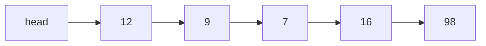
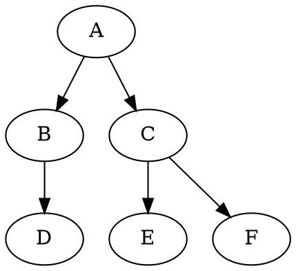
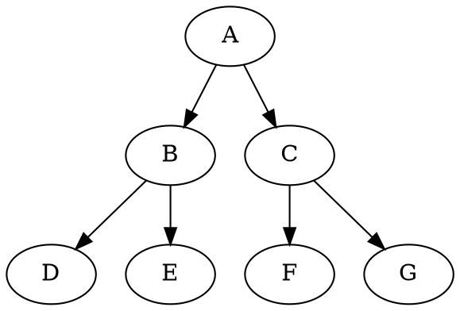
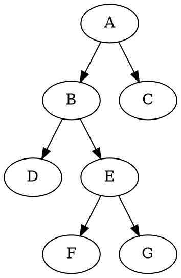
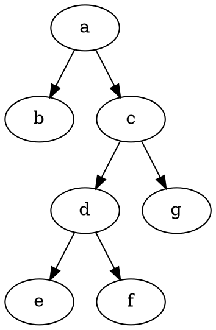
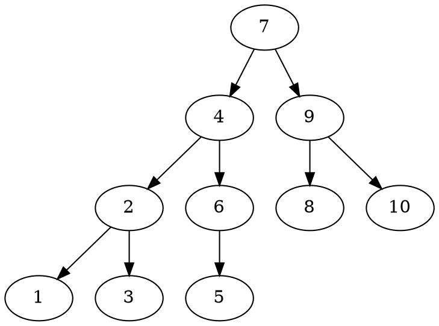
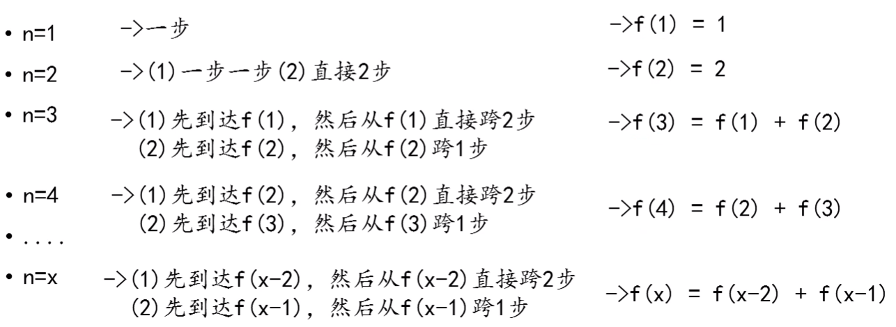
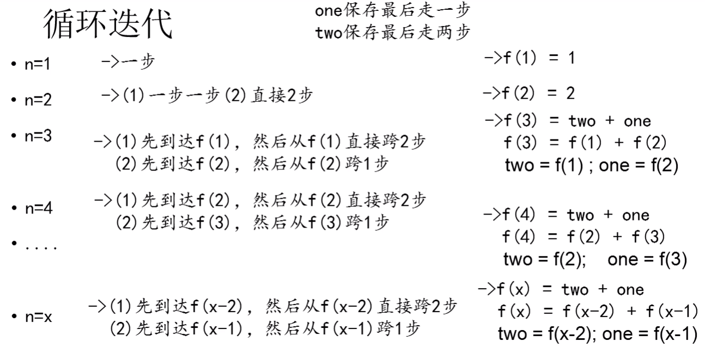
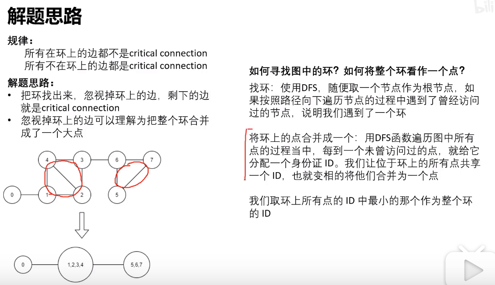

<h1 align="center">数据结构与算法</h1>
<!-- @import "[TOC]" {cmd="toc"} -->

<!-- code_chunk_output -->

- [1. 基础数据结构](#1-基础数据结构)
  - [1.1. 栈](#11-栈)
    - [1.1.1. 最小栈](#111-最小栈httpsleetcode-cncomproblemsmin-stack)
  - [1.2. 队列](#12-队列)
    - [1.2.1. 最大队列](#121-最大队列httpsleetcode-cncomproblemsdui-lie-de-zui-da-zhi-lcof)
  - [1.3. 链表](#13-链表)
    - [1.3.1. 跳表](#131-跳表)
  - [1.4. 二叉树](#14-二叉树)
    - [1.4.1. 二叉树的遍历](#141-二叉树的遍历)
    - [1.4.2. BST树 (Binary Search Tree 又叫：二叉排序树、二叉查找树、二叉搜索树)](#142-bst树-binary-search-tree-又叫二叉排序树-二叉查找树-二叉搜索树)
    - [1.4.3. AVL树 (平衡二叉树)](#143-avl树-平衡二叉树)
    - [1.4.4. 红黑树（RB树）](#144-红黑树rb树)
    - [1.4.5. B树 (平衡树、B-树)](#145-b树-平衡树-b-树)
    - [1.4.6. B+树](#146-b树)
  - [1.5. 散列表](#15-散列表)
  - [1.6. 位图](#16-位图)
- [2. 基础算法](#2-基础算法)
  - [2.1. 顺序查找](#21-顺序查找)
    - [2.1.1. 查找算法](#211-查找算法)
    - [2.1.2. 二分查找](#212-二分查找)
    - [2.1.3. 插值查找](#213-插值查找)
    - [2.1.4. 斐波那契查找](#214-斐波那契查找)
    - [2.1.5. 树表查找](#215-树表查找)
    - [2.1.6. 分块查找](#216-分块查找)
    - [2.1.7. 哈希查找](#217-哈希查找)
  - [2.2. 排序算法](#22-排序算法)
    - [2.2.1. 冒泡排序](#221-冒泡排序)
    - [2.2.2. 插入排序](#222-插入排序)
    - [2.2.3. 选择排序](#223-选择排序)
    - [2.2.4. 快速排序](#224-快速排序)
  - [2.3. 递归](#23-递归)
- [3. 基础例题](#3-基础例题)
- [4. 经典好题](#4-经典好题)
  - [4.1. 1192. 查找集群内的「关键连接」](#41-1192-查找集群内的关键连接httpsleetcode-cncomproblemscritical-connections-in-a-network)

<!-- /code_chunk_output -->


# 1. 基础数据结构

## 1.1. 栈

特点：先进后出
操作：入栈 push、出栈 pop

java.util 包中的 Stack 类继承自 Vector。它是线程安全的，它的方法都是同步方法
```java
package java.util;
public class Stack<E> extends Vector<E> {
    // 构造器: 只有一个空参构造器
    // 调用其父类Vector的空参构造，设置初始大小为 10
    // public Vector() {
    //     this(10);
    // }
    public Stack() {
    }

    // 入栈
    // 返回: 刚刚入栈的元素
    E push(E item);

    // 出栈
    // 返回: 刚刚出栈的元素
    // 异常: 如果栈为空, java.util.EmptyStackException
    E pop();

    // 获取栈顶元素
    // 返回: 栈顶元素
    // 异常: 如果栈为空, java.util.EmptyStackException
    E peek();

    // 判断栈是否为空
    boolean empty();

    // 从栈顶往下找目标元素 o
    // 返回: 第一个 o 在第几个位置上（栈顶元素为 1 号，往下依次 2,3,4...）
    //       如果没找到 o, 返回 -1
    // 例如： 目前栈中有：（栈底）1,2,3,1,2,3,4（栈顶）。search(2) == 3
    int search(Object o) {
        int i = lastIndexOf(o);
        if (i >= 0) {
            return size() - i;
        }
        return -1;
    }
}
```

### 1.1.1. [最小栈](https://leetcode-cn.com/problems/min-stack)
设计一个支持 push ，pop ，top 操作，并能在常数时间内检索到最小元素的栈。
- push(x) —— 将元素 x 推入栈中。
- pop() —— 删除栈顶的元素。
- top() —— 获取栈顶元素。
- getMin() —— 检索栈中的最小元素。

用空间换时间

2 3 5 1 -1

data 2 3 5 
 min 2 

data 2 3 5 2
 min 2 2
     0 1 2  3

```java
class MinStack {
    // 数据栈
    Stack<Integer> data = new Stack<Integer>();
    // 存储当前最小值的栈
    Stack<Integer> min = new Stack<Integer>();

    public MinStack() {
    }
    
    public void push(int x) {
        data.push(x);
        // 计算当前最小值
        // 栈为空时直接插入
        if (min.isEmpty()) {
            min.push(x);
        } else {
            int old = min.peek();
            min.push(x < old ? x : old);
        }
    }
    
    public void pop() {
        if (data.isEmpty()) {
            return;
        }
        data.pop();
        min.pop();
    }
    
    public int top() {
        return data.peek();
    }
    
    public int getMin() {
        return min.peek();
    }
}
class Main {
    public static void main(String[] args) {
        MinStack minStack = new MinStack();
        minStack.push(-2);
        minStack.push(0);
        minStack.push(-3);
        minStack.getMin();   // 返回 -3.
        minStack.pop();
        minStack.top();      // 返回 0.
        minStack.getMin();   // 返回 -2.
    }
}
// data: -2
//  min: -2

// data: -2  0
//  min: -2 -2

// data: -2  0 -3
//  min: -2 -2 -3

// data: -2  0
//  min: -2 -2
```

上述代码min栈会重复存两个 -2，还可以优化
```java
class MinStack {
    // 数据栈
    Stack<Integer> data = new Stack<Integer>();
    // 存储当前最小值的栈
    Stack<Integer> min = new Stack<Integer>();

    public MinStack() {
    }
    
    public void push(int x) {
        data.push(x);

        // 栈为空时直接插入
        if (min.isEmpty()) {
            min.push(x);
        } 
        // 当入栈元素小于或者等于旧的最小值时
        // 最小值才会发生改变
        // 必须有等于
        else if (x <= min.peek()) {
            min.push(x);
        }
    }
    
    public void pop() {
        if (data.isEmpty()) {
            return;
        }

        int out = data.pop();
        // 出栈元素是当前最小值时，最小值才会改变
        if (out == min.peek()) {
            min.pop();
        }
    }
    
    public int top() {
        return data.peek();
    }
    
    public int getMin() {
        return min.peek();
    }
}
// data: -2
//  min: -2

// data: -2 0
//  min: -2

// data: -2 0 -3
//  min: -2 -3

// data: -2 0
//  min: -2
```

## 1.2. 队列

特点：先进先出
操作：入队 offer，出队 poll

```java
package java.util;
public interface Queue<E> extends Collection<E> {
    // 入队，向队尾添加元素
    // 返回: 插入成功返回 true
    // 异常：如果队列已满，java.lang.IllegalArgumentException
    boolean add(E e);

    // 入队，向队尾添加元素
    // 返回: 插入成功返回 true；否则返回false
    boolean offer(E e);

    // 出队，删除队头元素
    // 返回: 刚刚出队的元素
    // 异常：如果队列为空，java.util.NoSuchElementException
    E remove();

    // 出队，删除队头元素
    // 返回: 刚刚出队的元素；如果队列为空，返回 null
    E poll();

    // 获取队头元素
    // 返回: 对头元素
    // 异常：如果队列为空，java.util.NoSuchElementException
    E element();

    // 获取队头元素
    // 返回: 对头元素，如果队列为空，返回 null
    E peek();
}
```
队列是一个接口，有一个实现类 LinkedList。

### 1.2.1. [最大队列](https://leetcode-cn.com/problems/dui-lie-de-zui-da-zhi-lcof)
请定义一个队列并实现函数 max_value 得到队列里的最大值，要求函数max_value、push_back 和 pop_front 的均摊时间复杂度都是O(1)。
若队列为空，pop_front 和 max_value 需要返回 -1

入 5 2 3 -1 4 
出 5 2 3 -1 4
 
data: 5 4 3 2 1 6
 max: 5 4 3 2 1

data: 5 4 3 2 1 6
 max: 6 （5次）

5 0 0 0 0 0 0 0 （均摊时间复杂度为 o(1)）
data: 5 4 3 2 1 6 6 6 6 6 6 6 
 max: 6 （5次）

max 始终递减
入队 x -> data；出队 max 前面比 x 小的；x -> max
出队 x 如果 x==max.top max.top出去

```java
class MaxQueue {
    // 数据队列
    private Queue<Integer> data = new LinkedList<Integer>();
    // 最大值的双端队列
    private Deque<Integer> max = new LinkedList<Integer>();

    public MaxQueue() {
    }
    
    // 最大值
    public int max_value() {
        if (data.isEmpty()) {
            // throw new java.util.NoSuchElementException();
            return -1;
        }
        // 查看队头元素
        return max.peekFirst();
    }
    
    // 入队
    // o(i) 均摊 o(1)
    public void push_back(int value) {
        data.offer(value);
        
        // 维护递减队列 max，从队列尾部往前找，当值小于value是将其移除
        
        // 获取队列尾部元素,队列为空时返回null
        // 查看队尾元素
        // o(i) i <= n
        Integer el = max.peekLast();
        while (el != null && el < value) {
            // 弹出队列尾部的元素
            max.pollLast();
            el = max.peekLast();
        }
        // 将value加入队列尾部
        max.offerLast(value);
    }
    
    public int pop_front() {
        if (data.isEmpty()) {
            return -1;
        }

        int res = data.poll();
        if (res == max.peekFirst()) {
            max.pollFirst();
        }
        return res;
    }
}
// push_back 1
// push_back 2
// max_value
// pop_front
// max_value

// data: 1
//  max: 1

// data: 1 2
//  max: 2

// data: 2
//  max: 2

// 输出：2, 1, 2
```

## 1.3. 链表
链表每个节点分为两个部分：数据域和指针域
```java
public class ListNode {
    int val;
    ListNode next;
    ListNode(int x) {
        val = x; 
    }
}
```


### 1.3.1. 跳表
- 由多层链表组成，每一层都是有序链表
- 最底层(Level 1)的链表包含所有的数据，上层链表则是索引
- 如果一个元素在 Level i 曾出现过，那么它在 Level j 层都会出现 $(1 \le j \le i)$
- 每个节点包含两个指针，一个指向后一个元素，一个指向下层元素
```text
            top (head)
            |
            v
(Level 3)   14 --------------------> 50
            |                        |
            v                        v
(Level 2)   14 -------> 34 --------> 50
            |           |            |
            v           v            v
(Level 1)   14 -> 23 -> 34 -> 43 --> 50 -> 59 -> 66 -> 72
```

## 1.4. 二叉树

> https://www.cnblogs.com/idorax/p/6441043.html
> 
> https://blog.csdn.net/wanderlustLee/article/details/81297253?utm_medium=distribute.pc_feed_404.none-task-blog-BlogCommendFromBaidu-3.nonecase&depth_1-utm_source=distribute.pc_feed_404.none-task-blog-BlogCommendFromBaidu-3.nonecas

- 二叉树第 i 层上的节点数目最多为 $2^{i-1} (i \geq 1)$
- 深度为 k 的二叉树至多拥有节点数为 $2^{k}-1 (k \geq 1)$
- 包含 n 个节点的二叉树的高度至少为 $log_2(n+1)$
- 在任意一棵二叉树中，若终端节点的个数为 $n_0$ ，度为2的节点数为 $n_2$，则$n_0=n_2+1$

推导：二叉树中只会有度为 0,1,2 的节点。设数量分别为 $n_0, n_1, n_2$。
则可知二叉树总节点数 $ n = n_0+n_1+n_2$
又根据 0 度节点没有孩子，1 度节点一个孩子，2 度节点两个孩子，再加一个根节点，可知二叉树总节点数 $ n = n_1 + 2n_2 + 1$
所以，$n_0=n_2+1$


**完美二叉树(Perfect Binary Tree、满二叉树)**
一个深度为 k 且有 $2^{k}-1$ 个结点的二叉树称为完美二叉树 $(k \geq 1)$


**完全二叉树(Complete Binary Tree)**
一个深度为 k 的二叉树，前 k-1 层是满二叉树，最后一层可以不完全填充，其叶子结点都靠左对齐。


**完满二叉树(Full Binary Tree)**
所有非叶子节点的度都是2。要么没有孩子，要么有两个孩子


### 1.4.1. 二叉树的遍历
```java
class BinTreeNode {
    char data;
    BinTreeNode LeftChild;
    BinTreeNode RightChild;

    public BinTreeNode(char data){
        this.data = data;
    }
}
```
```java
public BinTreeNode createTree(){
    BinTreeNode a = new BinTreeNode('a');
    BinTreeNode b = new BinTreeNode('b');
    BinTreeNode c = new BinTreeNode('c');
    BinTreeNode d = new BinTreeNode('d');
    BinTreeNode e = new BinTreeNode('e');
    BinTreeNode f = new BinTreeNode('f');
    BinTreeNode g = new BinTreeNode('g');
    a.LeftChild = b;
    a.RightChild = c;
    c.LeftChild = d;
    c.RightChild = g;
    d.LeftChild = e;
    d.RightChild = f;
    return a;
}
```

前序遍历(中左右): a b c d e f g 
中序遍历(左中右): b a e d f c g 
后序遍历(左右中: b e f d g c a 
层次遍历: a b c d g e f 


```java
// 前序遍历
public void pre(BinTreeNode root){
    if(root == null){
        return;
    }

    Stack<BinTreeNode> stack = new Stack<>();
    // 根节点入栈
    stack.push(root);
    while(!stack.empty()){
        // 出栈 并打印
        root = stack.pop();
        System.out.print(root.data + " ");

        // 将右孩子入栈
        if(root.RightChild != null) {
            stack.push(root.RightChild);
        }
        // 将左孩子入栈
        if(root.LeftChild != null) {
            stack.push(root.LeftChild);
        }
    }
}
```
```java
// 中序遍历
public void mid(BinTreeNode root) {
    Stack<BinTreeNode> stack = new Stack<>();
    while(true){
        // 当前节点不为空时
        // 入栈, 并指向左孩子
        if(root != null){
            stack.push(root);
            root = root.LeftChild;
        }
        // 已经探测到最下边的左孩子
        // 如果栈不为空
        else if(!stack.empty()){
            // 出栈并打印
            root = stack.pop();
            System.out.print(root.data + " ");
            // 访问右孩子
            root = root.RightChild;
        }
        // 栈为空, 遍历完成, 退出
        else{
            break;
        }
    }
}
```
```java
// 后序遍历
public void back(BinTreeNode root) {
    if(root == null){
        return;
    }

    BinTreeNode preNode = null;
    Stack<BinTreeNode> stack = new Stack<>();
    // 根节点入栈
    stack.push(root);
    while(!stack.empty()){
        // 看一眼栈顶
        root = stack.peek();
        // 如果没有左右孩子
        if(root.LeftChild == null && root.RightChild == null){
            // 出栈 并打印
            root = stack.pop();
            System.out.print(root.data + " ");
            // 记下出栈的节点
            preNode = root;
        }
        // 如果有孩子, 但是孩子已经出栈了
        else if((preNode != null) && (preNode == root.LeftChild || preNode == root.RightChild)){
            // 出栈 并打印
            root = stack.pop();
            System.out.print(root.data + " ");
            // 记下出栈的节点
            preNode = root;
        }
        // 将孩子入栈
        else {
            // 将右孩子入栈
            if (root.RightChild != null) {
                stack.push(root.RightChild);
            }
            // 将左孩子入栈
            if (root.LeftChild != null) {
                stack.push(root.LeftChild);
            }
        }
    }
}
```
```java
// 层次遍历
public void line(BinTreeNode root) {
    if(root == null){
        return;
    }

    Queue<BinTreeNode> queue = new LinkedList();
    // 根节点 进队列
    queue.offer(root);
    while(!queue.isEmpty()){
        // 根节点 出队列
        root = queue.poll();
        System.out.print(root.data + " ");

        // 左右孩子依次进队列
        if(root.LeftChild != null){
            queue.offer(root.LeftChild);
        }
        if(root.RightChild != null){
            queue.offer(root.RightChild);
        }
    }
}
```

### 1.4.2. BST树 (Binary Search Tree 又叫：二叉排序树、二叉查找树、二叉搜索树)

- 二叉查找树中，左孩子的值总是小于父亲的值，右孩子的值总是大于父亲的值。`left < root < right`
- 任意一个节点的左右子树也是二叉查找树。
- 不存在值相同的节点。

二叉查找树可能会不平衡，变成链表。



### 1.4.3. AVL树 (平衡二叉树)

- 符合二叉查找树
- 必须满足任何节点的两个子树的高度之差小于等于1

维护一棵平衡二叉树，需要经常性的旋转操作，开销较大。

### 1.4.4. 红黑树（RB树）

0. 满足二叉查找树
1. 节点是红色或者黑色
2. 根节点是黑色
3. 每个叶子节点都是黑色的空节点（NIL 节点）
4. 每个红色节点的两个子节点都是黑色（从每个叶子到根的路径不能有两个连续的红色节点）
5. 从任何一个节点到其每个叶子节点的所用路径包含相同数目的黑色节点


这些规则的限定，保证了红黑树的自平衡。红黑树从根节点到叶子的最长路径不会超过最短路径的 2 倍。

**调整** https://juejin.im/post/5a27c6946fb9a04509096248
1. 变色
2. 旋转
   - 左旋转
   - 右旋转

### 1.4.5. B树 (平衡树、B-树)

AVL树每一个节点只能存放一个元素；

而 B 树是一种多路平衡树。
一个 m 阶的 B 树规定了：
1. 根结点至少有两个子女。
2. 每个中间节点都包含k-1个元素和k个孩子，其中 $\frac{m}{2} \leq k \leq m$。
3. 每一个叶子节点都包含k-1个元素，其中 $\frac{m}{2} \leq k \leq m$。
4. 所有的叶子结点都位于同一层。
5. 每个节点中的元素从小到大排列，节点当中k-1个元素正好是k个孩子包含的元素的值域分划。

### 1.4.6. B+树

B+树每个非叶子结点存放的元素只用于索引作用，所有数据保存在叶子结点。

一个m阶的B+树规定了：
1. 有k个子树的中间节点包含有k个元素（B树中是k-1个元素），每个元素不保存数据，只用来索引，所有数据都保存在叶子节点。
2. 所有的叶子结点中包含了全部元素的信息，及指向含这些元素记录的指针，且叶子结点本身依关键字的大小自小而大顺序链接。
3. 所有的中间节点元素都同时存在于子节点，在子节点元素中是最大（或最小）元素。

## 1.5. 散列表

## 1.6. 位图


# 2. 基础算法

## 2.1. 顺序查找

### 2.1.1. 查找算法
```java
//顺序查找
int sequenceSearch(int[] arr, int value)
{
    for(int i=0; i<n; i++) {
        if(a[i] == value) {
            return i;
        }
    }
    return -1;
}
```

### 2.1.2. 二分查找

```java
public int binarySearch(int[] arr, int data) {
    int min = 0;
    int max = arr.length - 1;
    int mid = -1;

    // 当min和max相等时，mid == min == max
    while (min <= max) {
        // 防止溢出
        mid =  min + (max - min) / 2;
        if (arr[mid] > data) {
            max = mid - 1;
        } else if (arr[mid] < data) {
            min = mid + 1;
        } else {
            return mid;
        }
    }
    return -1;
}
```

### 2.1.3. 插值查找

### 2.1.4. 斐波那契查找

### 2.1.5. 树表查找

### 2.1.6. 分块查找

### 2.1.7. 哈希查找


## 2.2. 排序算法

### 2.2.1. 冒泡排序

每趟排序，比较前后相邻的两个数，将较大的数往后移动。一趟完成之后，最大的数就沉到后面去了。

时间复杂度：$o(n^2) = (n-1) + (n-2) + ··· + 1 =  \frac{(1 + (n-1))·(n-1)}{2} = \frac{1}{2}n^2 - \frac{1}{2}n$ 
空间复杂度：$o(1)$

```java
public class BubbleSort {
    public static void main(String[] args) {
        int[] arr = {9, 8, 7, 6, 5, 4, 3, 2 ,1, 0, 1, -2};
        System.out.println("初始: "+Arrays.toString(arr));
        bubbleSort(arr);
    }

    public static void bubbleSort(int[] arr) {
        // i 表示当前是第 i 躺排序
        for (int i = 0; i < arr.length; i++) {
            // 从 0（j-1） 开始将较大的数往后移动
            for (int j = 1; j < arr.length - i; j++) {
                if (arr[j-1] > arr[j]) {
                    int temp = arr[j-1];
                    arr[j-1] = arr[j];
                    arr[j] = temp;
                }
            }
            System.out.println("第"+(i+1)+"趟: "+Arrays.toString(arr));
        }
    }
}
```

### 2.2.2. 插入排序

通过构建有序序列，对于未排序数据，在已排序序列中从后向前扫描，找到相应的位置并插入。
插入排序非常类似于整扑克牌。在开始摸牌时，左手是空的，牌面朝下放在桌上。接着，一次从桌上摸起一张牌，并将它插入到左手一把牌中的正确位置上。为了找到这张牌的正确位置，要将它与手中已有的牌从右到左地进行比较。无论什么时候，左手中的牌都是排好序的。

时间复杂度：$o(n^2)$
空间复杂度：$o(1)$

```java
public class InsertSort {
    public static void main(String[] args) {
        int[] arr = {9, 48, 7, 6, 15, 4, 33, 2 ,1, 0, 1, -2};
        System.out.println("初始: "+ Arrays.toString(arr));
        insertSort(arr);
    }

    public static void insertSort(int[] arr) {
        // 从第二和数开始，把arr[i]插入到前面排好的数组中
        for (int i = 1; i < arr.length; i++) {
            // temp 是待插入的数
            int temp = arr[i];
            // 0 到 i-1 是已经排好的数组
            int j;
            // 从后往前比较，将比temp大的数往后移动一位
            // 当temp比当前位置大时，上一个位置就是temp要插入进去的位置啦
            for (j = i-1; j >= 0; j--) {
                if (arr[j] > temp) {
                    arr[j+1] = arr[j];
                } else {
                    break;
                }
            }
            arr[j+1] = temp;
            System.out.println("第"+(i)+"趟: "+Arrays.toString(arr));
        }
    }
}
```

### 2.2.3. 选择排序

每趟排序遍历一遍未排序的部分，记录下最小数的下标。将最小数交换到小标为 i 的位置。

时间复杂度：$$o(n^2)$$
空间复杂度：$$o(1)$$

```java
public class SelectionSort {
    public static void main(String[] args) {
        int[] arr = {9, 48, 7, 6, 15, 4, 33, 2 ,1, 0, 1, -2};
        System.out.println("初始: "+ Arrays.toString(arr));
        selectionSort(arr);
    }

    public static void selectionSort(int[] arr) {
        // 每趟将最小的数调到前面去 调到位置为 i 处
        for (int i = 0; i < arr.length-1; i++) {
            // min 是当前这一趟最小元素的下标
            int min = i;
            for (int j = i + 1; j < arr.length; j++) {
                // 更新最小数的下标
                if (arr[j] < arr[min]) {
                    min = j;
                }
            }
            // 如果最小元素下标不是 i，就需要将交换
            if (i != min) {
                int temp = arr[min];
                arr[min] = arr[i];
                arr[i] = temp;
            }
            System.out.println("第"+(i+1)+"趟: "+Arrays.toString(arr));
        }
    }
}
```

### 2.2.4. 快速排序

每次排序确定当前部分最左边元素的最终位置。然后分别递归左右两边。

时间复杂度：$$o(nlog(n))$$
空间复杂度：$$o(log(n))$$

```java
public class QuickSort {
    public static void main(String[] args) {
        int[] arr = {9, 8, 7, 6, 5, 4, 3, 2 ,1, 0, 1, -2};
        quickSort(arr, 0, arr.length-1);

        System.out.println(Arrays.toString(arr));
    }

    static void quickSort(int[] arr, int left, int right){
        if(left < right){
            int mid = part(arr, left, right);
            quickSort(arr, left, mid-1);
            quickSort(arr, mid+1, right);
        }
    }

    static int part(int[] arr, int left, int right){
        // 基准数
        int base = arr[left];
        // 当 left == right 时退出
        while(left < right){
            // 从右往左找比 base 小的
            while(left < right && base <= arr[right]){
                right--;
            }
            arr[left] = arr[right];
            // 从左往右找比 base 大的
            while(left < right && base >= arr[left]){
                left++;
            }
            arr[right] = arr[left];
        }
        arr[left] = base;
        return left;
    }
}
```

## 2.3. 递归

有 n 步台阶，一次只能上 1 步或 2 步，共有多少种走法？

递归


$$
f(x) = 
    \begin{cases}
        x, (x = 1,2)\\
        f(x-2) + f(x-1), (x > 2)
    \end{cases}
$$

```java
int f(int n) {
    if (n <= 0) {
        return -1;
    }
    if (n == 1 || n == 2) {
        return n;
    }
    return f(n-1) + f(n-2);
}
```

迭代

从 3 - n 迭代：可以发现每次只需要用到前两个值，可以把它们保存起来。

| i | a | b | res |
|:-:|:-:|:-:|:---:|
| 3 | 1 | 2 |  3  |
| 4 | 2 | 3 |  5  |
| 5 | 3 | 5 |  8  |
| 6 | 5 | 8 |  13  |

```java
int f(int n) {
    if (n <= 0) {
        return -1;
    }
    if (n == 1 || n == 2) {
        return n;
    }
    int a = 1;
    int b = 2;
    for (int i = 3; i <= n; i++) {
        int temp = a + b;
        a = b;
        b = temp;
    }
    return b;
}
```


# 3. 基础例题


# 4. 经典好题

## 4.1. [1192. 查找集群内的「关键连接」](https://leetcode-cn.com/problems/critical-connections-in-a-network/)

力扣数据中心有 n 台服务器，分别按从 0 到 n-1 的方式进行了编号。
它们之间以「服务器到服务器」点对点的形式相互连接组成了一个内部集群，其中连接 connections 是无向的。
从形式上讲，connections[i] = [a, b] 表示服务器 a 和 b 之间形成连接。任何服务器都可以直接或者间接地通过网络到达任何其他服务器。
「关键连接」是在该集群中的重要连接，也就是说，假如我们将它移除，便会导致某些服务器无法访问其他服务器。
请你以任意顺序返回该集群内的所有「关键连接」。

示例一：

```
输入：n = 4, connections = [[0,1],[1,2],[2,0],[1,3]]
输出：[[1,3]]
解释：[[3,1]] 也是正确的。
```

题解：https://www.bilibili.com/video/BV15t4y197eq/

规律：
- 所有在环上的边都不是关键连接
- 所有不在环上的边都是关键连接

