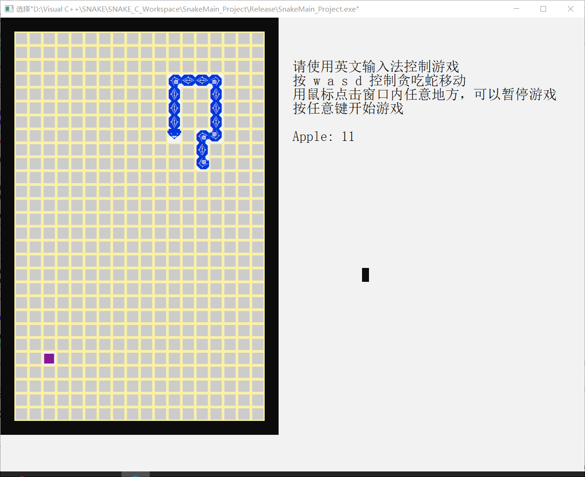
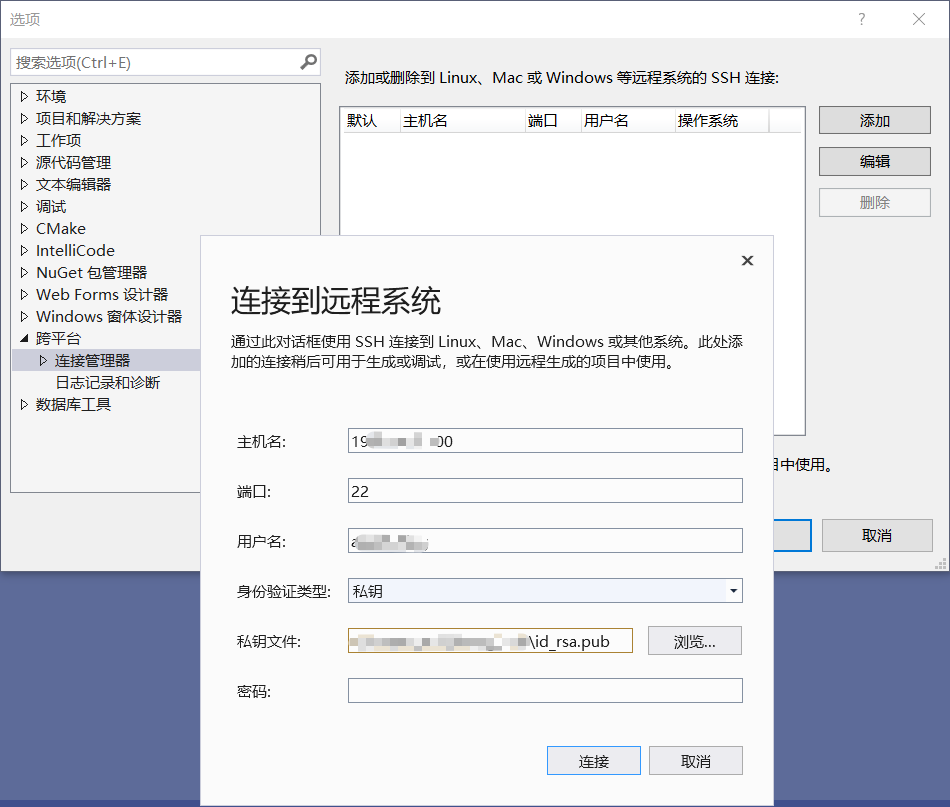

<h1 id="C语言基础编程" align="center">C 语言基础编程</h1>
<!-- @import "[TOC]" {cmd="toc"} -->

<!-- code_chunk_output -->

- [1. 贪吃蛇](#1-贪吃蛇)
- [2. 开发环境搭建：Visual Studio + Ubuntu](#2-开发环境搭建visual-studio-ubuntu)
  - [2.1. 下载工具](#21-下载工具)
  - [2.2. 配置 Visual Studio 的远程连接](#22-配置-visual-studio-的远程连接)
  - [2.3. Hello Linux C++](#23-hello-linux-c)

<!-- /code_chunk_output -->

# 1. 贪吃蛇

先来一个贪吃蛇程序镇楼：
<table>
  <tr>
    <td></td>
    <td></td>
  </tr>
  <tr>
    <td></td>
    <td></td>
  </tr>
</table>

> C 语言是笔者的编程启蒙语言，当初也是因为被 C 语言所吸引才入了开发这一大坑。这个控制台版本的贪吃蛇程序是笔者学习 C 语言后独立编写的第一个比较完整和完善的应用程序。应该可以说是 **【梦开始的地方】**，望自己不忘初心，在开发的路上一直走下去。
> <p align="right"> —— 2020年11月23日<p>

```c
/*-------------------------------------

  *********小游戏：贪吃蛇 C源文件********
  
    开   发   者--------- aBadString
    版 本 信 息 --------- 2.2.0
    完 成 时 间 --------- 2018-02-09
    编 程 语 言 --------- C 语言
    操 作 系 统 --------- Windows 10
    集成开发环境--------- Microsoft Visual C++ 6.0
    
-------------------------------------*/


/*头文件使用|||||||||||||||||||||||||||||||||||||||||||||||||||||||||||||||||||||||||||||||||||||||||||||||||||||||||||||||||||||||||*/
#include <stdio.h>        /*标  准输入输出函数库*/
#include <conio.h>        /*控制台输入输出函数库*/
#include <time.h>        /*日期和时间头文件*/
#include <windows.h>    /*Windows API 函数*/
#pragma comment(lib, "winmm.lib")    /*导入winmm.lib库,有了它才可以支持对windows 多媒体的编程.*/

/*宏定义|||||||||||||||||||||||||||||||||||||||||||||||||||||||||||||||||||||||||||||||||||||||||||||||||||||||||||||||||||||||||||||*/


/*结构体类型定义|||||||||||||||||||||||||||||||||||||||||||||||||||||||||||||||||||||||||||||||||||||||||||||||||||||||||||||||||||||*/
struct snake    /*贪吃蛇*/
{
    int x;                /*贪吃蛇横坐标*/
    int y;                /*贪吃蛇纵坐标*/
    struct snake *next;    /*链表中指向下一节点的指针*/
};

struct Apple    /*苹果*/
{
    int apple_x;    /*苹果横坐标*/
    int apple_y;    /*苹果纵坐标*/
};

/*内部函数声明和定义|||||||||||||||||||||||||||||||||||||||||||||||||||||||||||||||||||||||||||||||||||||||||||||||||||||||||||||||||*/
/*隐藏光标================================================================================================*/
static void HideCursor(void)
{
    CONSOLE_CURSOR_INFO cursor_info = {1, 0}; 
    SetConsoleCursorInfo(GetStdHandle(STD_OUTPUT_HANDLE), &cursor_info);
}

/*定位光标================================================================================================*/
/*功  能：将光标定于输入的坐标*/
/*参  数：两个整数，表示一个坐标*/
static void pos(int x, int y)
{    
    COORD coord = {x, y};
    SetConsoleCursorPosition(GetStdHandle(STD_OUTPUT_HANDLE), coord);
}

/*打印地图================================================================================================改变光标位置打印地图*/
static void DrawMap(void)
{
    int i;
    
    SetConsoleTextAttribute(GetStdHandle(STD_OUTPUT_HANDLE), 0x00);    /*边框为黑色*/
    for(i = 0; i <= 29; i++)
    {
        pos(0 , i);    printf("  ");
        pos(38, i);    printf("  ");
    }
    for(i = 2 ; i <= 36 ; i += 2)
    {
        pos(i,  0);    printf("  ");
        pos(i, 29);    printf("  ");
    }
    SetConsoleTextAttribute(GetStdHandle(STD_OUTPUT_HANDLE), 0xE7);
    for(i = 1; i <= 28; i++)
    {
        pos(2, i);printf("�┆┆┆┆┆┆┆┆┆┆┆┆┆┆┆┆┆�");
    }
}

/*释放贪吃蛇链表的内存=====================================================================================删除链表*/
/*参  数：贪吃蛇链表头指针*/
static void DeleteSnake(struct snake *head)
{
    struct snake *pnode = NULL;
    struct snake *pfind = head;
    
    while(pfind != NULL)
    {
        pnode = pfind->next;
        free(pfind);
        pfind = pnode;
    }
}
/*初始化贪吃蛇============================================================================================新建链表*/
/*参  数：贪吃蛇颜色*/
/*返  回：贪吃蛇链表头指针*/
static struct snake *InitiSnake(unsigned char snake_color)
{
    int i;
    struct snake *head = NULL;        /*贪吃蛇链表头指针*/
    struct snake *pnode = NULL;        /*用于指向新建节点*/
    /*-----------------------------------------------------------------------先设定贪吃蛇的第一节*/    
    head = (struct snake*)malloc(sizeof(struct snake));
    if(head == NULL) {goto Exit1;}    //#####################如果初始化贪吃蛇时申请内存失败,退出程序    
    head->x = 20;
    head->y = 25;
    head->next = NULL;
    /*-----------------------------------------------------------------------设定贪吃蛇的剩下三节*/
    for(i = 1; i < 4; i++)
    {
        pnode = head;
        while(pnode->next != NULL)    /*如果此节点不是表尾*/
        {
            pnode = pnode->next;    /*让pnode指向下一节点地址*/
        }                            /*若找到表尾则退出循环*/
        pnode->next = (struct snake*)malloc(sizeof(struct snake));    /*将表尾指针的NULL改为新建节点的地址*/
        if(pnode->next == NULL) {goto Exit1;}    /*#####################如果初始化贪吃蛇时申请内存失败,退出程序*/
        pnode = pnode->next;
        pnode->x = 20;
        pnode->y = 25 + i;
        pnode->next = NULL;            /*将新建节点置为表尾*/
    }
    /*-----------------------------------------------------------------------打印贪吃蛇*/
    pnode = head->next;
    SetConsoleTextAttribute(GetStdHandle(STD_OUTPUT_HANDLE), snake_color);
    pos(head->x, head->y);
    printf("��");
    while(pnode != NULL)
    {
        pos(pnode->x, pnode->y);
        printf("��");
        pnode = pnode->next;
    }
    
    return head;
Exit1:
    DeleteSnake(head);
    exit(0);
} 
/*蛇生长==================================================================================================在已有链表后增加一个节点*/
/*参  数：贪吃蛇链表头指针，贪吃蛇颜色*/
static void Grow(struct snake *head, unsigned char snake_color)
{
    int a = 0, b = 0;
    struct snake *pnode = NULL;        /*用于指向新建节点*/
    struct snake *pfind = head;        /*用于从头开始寻找表尾*/
    /*-----------------------------------------------------------------------寻找贪吃蛇尾*/    
    while(pfind->next->next != NULL)/*如果此节点不是表尾*/
    {
        pfind = pfind->next;    /*让pfind指向下一节点地址*/
    }                            /*若找到表尾则退出循环*/
    /*-----------------------------------------------------------------------设置贪吃蛇尾坐标*/
    a = pfind->next->x - pfind->x;
    b = pfind->next->y - pfind->y;
    pnode = (struct snake*)malloc(sizeof(struct snake));
    if(pnode == NULL) {goto Exit2;}    /*#####################如果贪吃蛇生长时申请内存失败,退出程序*/
    pfind->next->next = pnode;    /*将表尾指针的NULL改为新建节点的地址*/
    pnode->x = pfind->x + a;
    pnode->y = pfind->y + b;
    pnode->next = NULL;            /*将新建节点置为表尾*/
    /*-----------------------------------------------------------------------打印贪吃蛇尾*/
    SetConsoleTextAttribute(GetStdHandle(STD_OUTPUT_HANDLE), snake_color);
    pos(pnode->x, pnode->y);
    if(0 == a)    printf("��");
    if(0 == b)    printf("��");
    
    return;
Exit2:
    DeleteSnake(head);
    exit(0);
}
/*蛇运动==================================================================================================在链表头部加上一个节点，并删除链表尾部节点*/
/*参  数：用户游戏控制输入，贪吃蛇链表头指针，贪吃蛇颜色*/
/*返  回：贪吃蛇链表头指针*/
static struct snake *Move(char ch, struct snake *head, unsigned char snake_color)
{
    int a = 0, b = 0, c = 0, d = 0;
    struct snake *pnode = NULL;
    struct snake *ptwo  = NULL;
    /*-----------------------------------------------------------------------有操作控制*/
    switch(ch)
    {
    case 'w':
        a = 0;    b = 1;
        break;
    case 'a':
        a = 2;    b = 0;
        break;
    case 's':
        a = 0;    b = -1;
        break;
    case 'd':
        a = -2;    b = 0;
        break;
    }
    /*----------------------------------------------------------------------无操作控制*/
    ptwo = head->next;
    if((a==0) && (b==0))        /*如果没有改变方向，则保持当前方向前进*/
    {
        a = ptwo->x - head->x;    /*通过两点确定一条直线*/
        b = ptwo->y - head->y;
    }
    else if(((a != 0) && (-a == ptwo->x - head->x)) || ((b != 0) && (-b == ptwo->y - head->y)))
    {            /*判断是否输入往回走，若输入往回走则保持当前方向前进*/
        a = -a;
        b = -b;
    }
    /*----------------------------------------------------------------------第二第三节点的关系*/
    c = ptwo->x - head->x;
    d = ptwo->y - head->y;
    /*----------------------------------------------------------------------增加贪吃蛇头*/
    pnode = (struct snake*)malloc(sizeof(struct snake));
    if(pnode == NULL) {goto Exit3;}    /*#####################如果贪吃蛇运动时申请内存失败,退出程序*/
    pnode->next = head;
    pnode->x = head->x - a;
    pnode->y = head->y - b;
    head = pnode;
    /*----------------------------------------------------------------------删除贪吃蛇尾*/
    while(pnode->next != NULL)
    {
        ptwo = pnode;
        pnode = pnode->next;
    }
    ptwo->next = NULL;
    /*----------------------------------------------------------------------去尾加头*/
    pos(pnode->x, pnode->y);
    SetConsoleTextAttribute(GetStdHandle(STD_OUTPUT_HANDLE), 0xE7);
    printf("��");    /*去尾*/
    free(pnode);
    
    pos(head->x, head->y);
    SetConsoleTextAttribute(GetStdHandle(STD_OUTPUT_HANDLE), snake_color);
    if((a ==  0) && (b ==  1))    printf("��");    /*�� �� �� ��*/
    if((a ==  2) && (b ==  0))    printf("��");
    if((a ==  0) && (b == -1))    printf("��");
    if((a == -2) && (b ==  0))    printf("��");
    
    
    pos(head->next->x, head->next->y);
    if((a == c) && (b == d))    /*没有转弯，第二节点不变*/
    {
        if(a == 0)    printf("��");
        if(b == 0)    printf("��");
    }    
    else                        /*转弯了，第二节点改变*/    /*�� �� �� �� �� ��*/
    {
        if((a == -2) && (b ==  0) && (c ==  0) && (d ==  1))    printf("��");        /*上右*/
        if((a ==  0) && (b == -1) && (c ==  2) && (d ==  0))    printf("��");        /*左下*/
        
        if((a ==  2) && (b ==  0) && (c ==  0) && (d ==  1))    printf("��");        /*上左*/
        if((a ==  0) && (b == -1) && (c == -2) && (d ==  0))    printf("��");        /*右下*/
        
        if((a == -2) && (b ==  0) && (c ==  0) && (d == -1))    printf("��");        /*下右*/
        if((a ==  0) && (b ==  1) && (c ==  2) && (d ==  0))    printf("��");        /*左上*/
        
        if((a ==  2) && (b ==  0) && (c ==  0) && (d == -1))    printf("��");        /*下左*/
        if((a ==  0) && (b ==  1) && (c == -2) && (d ==  0))    printf("��");        /*右上*/
    }
    
    return head;
Exit3:
    DeleteSnake(head);
    exit(0);
}


/*随机生成苹果=============================================================================================随机数的生成，以系统日历时间为种子*/
/*参  数：贪吃蛇链表头指针*/
/*返  回：苹果坐标*/
static struct Apple CreateApple(struct snake *head)
{
    unsigned char apple_color;    //苹果颜色 (1 -- 14) + 240
    struct Apple apple;
    struct snake *pnode = head;
    while(1)
    {
        srand(time(NULL));            /*设置随机数种子*/
        apple.apple_x = (rand() % 18 + 1) * 2;
        apple.apple_y =  rand() % 28 + 1;
        apple_color = (rand() % 14 + 1) + 240;    /*240 == 1111 0000*/
        
        while(pnode != NULL)        /*如果苹果生成在贪吃蛇身上，则重新生成*/
        {
            if((pnode->x == apple.apple_x) && (pnode->y == apple.apple_y))
                break;
            else
                pnode = pnode->next;
        }
        if(pnode == NULL)
            break;
    }
    
    pos(apple.apple_x, apple.apple_y);
    SetConsoleTextAttribute(GetStdHandle(STD_OUTPUT_HANDLE), apple_color);
    printf("■");    /*ALT + 41462*/
    
    return apple;
}
/*
由于上一算法会导致游戏卡顿，所以进行一下算法修改。
但上一算法并没有摈弃，仍然可以在第一次生成苹果时使用。
以下算法中，如果苹果生成在贪吃蛇身上，不重新生成。而是让程序继续运行，到下次再生成一次。
返回值略有改变，如果苹果生成在贪吃蛇身上，apple = 0
*/
static struct Apple CreateApple_B(struct snake *head)
{
    unsigned char apple_color;    //苹果颜色
    struct Apple apple;
    struct snake *pnode = head;
    
    srand(time(NULL));            /*设置随机数种子*/
    apple.apple_x = (rand() % 18 + 1) * 2;
    apple.apple_y =  rand() % 28 + 1;
    apple_color = (rand() % 14 + 1) + 240;
    
    while(pnode != NULL)        /*如果苹果生成在贪吃蛇身上，则此次生成作废*/
    {
        if((pnode->x == apple.apple_x) && (pnode->y == apple.apple_y))
        {
            apple.apple_x = 0;
            apple.apple_y = 0;
            break;
        }
        else
            pnode = pnode->next;
    }
    
    if((apple.apple_x != 0) && (apple.apple_y != 0))
    {
        pos(apple.apple_x, apple.apple_y);
        SetConsoleTextAttribute(GetStdHandle(STD_OUTPUT_HANDLE), apple_color);
        printf("■");
    }
    
    return apple;
}


/*是否触墙=================================================================================================贪吃蛇头坐标是否和墙壁坐标相同*/
/*参  数：贪吃蛇链表头指针*/
/*返 回 值：如果触墙，返回1；否则，返回0。*/
static int Wall(struct snake *head)
{
    if((head->x == 0) || (head->x == 38) || (head->y == 0) || (head->y == 29))
        return 1;
    else
        return 0;
}
/*是否咬到自己=============================================================================================贪吃蛇头坐标是否和任一身体坐标相同*/
/*参  数：贪吃蛇链表头指针*/
/*返 回 值：如果咬到自己，返回1；否则，返回0。*/
static int Eat(struct snake *head)
{
    struct snake *pnode = head->next;
    
    while(pnode != NULL)
    {
        if((pnode->x == head->x) && (pnode->y == head->y))
            return 1;
        else
        {
            pnode = pnode->next;
        }
    }
    return 0;
}


/*==============================================================================================================================================================
=====主调函数===================================================================================================================================================
================================================================================================================================================================*/
int main(void)
{
    char ch;                        /*用户游戏控制输入*/
    struct snake *head = NULL;        /*贪吃蛇链表头指针*/
    unsigned char snake_color;        /*贪吃蛇颜色*/
    struct Apple apple = {0,0};        /*苹果*/
    int apple_n = 0;                /*已吃苹果数*/
    
    do{/*游戏大循环*/
        /*----------------------------------------------------------------------------------窗口和光标设置*/
        system("mode con cols=84 lines=33");        /*设置批处理窗口大小*/
        system("color F0");                            /*设置批处理窗口颜色*/
        HideCursor();                                /*隐藏光标*/
        /*----------------------------------------------------------------------------------游戏初始化*/
        PlaySound(TEXT("snake.wav"), NULL, SND_FILENAME|SND_ASYNC|SND_LOOP);/*播放背景音乐*/
        
        DrawMap();                                    /*打印地图*/
        
        SetConsoleTextAttribute(GetStdHandle(STD_OUTPUT_HANDLE), 0xF0);
        pos(42,3);    printf("请使用英文输入法控制游戏");
        pos(42,4);    printf("按 w a s d 控制贪吃蛇移动");
        pos(42,5);    printf("用鼠标点击窗口内任意地方，可以暂停游戏");
        pos(42,6);    printf("按任意键开始游戏");
        pos(42,8);    printf("Apple: %d", apple_n);    /*显示分数*/
        
        srand(time(NULL));                            /*设置随机数种子*/
        snake_color = (rand() % 14 + 1) + 240;        /*初始化贪吃蛇颜色*/
        head = InitiSnake(snake_color);                /*初始化贪吃蛇*/
        apple = CreateApple(head);                    /*初始化苹果*/
        
        getch();            /*等待输入以开始游戏*/
        /*----------------------------------------------------------------------------------游戏运行*/
        while(1)
        {
            if(apple_n <= 60)
                Sleep(200 - 2*apple_n);
            else
                Sleep(80);        /*暂停80毫秒*/
            
            if(_kbhit())        /*检查当前是否有键盘输入，若有则返回一个非0值，否则返回0*/
            {
                ch = getch();    /*获取输入*/
            }
            head = Move(ch, head, snake_color);    /*蛇运动*/
            /*-------------------------------------------------------------------------游戏判定*/
            if((head->x == apple.apple_x) && (head->y == apple.apple_y))    /*苹果是否被吃掉*/
            {
                apple_n++;
                pos(42,8);    
                SetConsoleTextAttribute(GetStdHandle(STD_OUTPUT_HANDLE), 0xF0);
                printf("Apple: %d", apple_n);
                Grow(head, snake_color);        /*蛇生长*/
                apple = CreateApple_B(head);    /*随机生成苹果*/
            }
            if((apple.apple_x == 0) && (apple.apple_y == 0))                /*如果苹果生成在贪吃蛇身上*/
            {
                apple = CreateApple_B(head);    /*随机生成苹果*/
            }
            
            if(Wall(head))        /*是否触墙*/
            {
                pos(head->x, head->y);
                SetConsoleTextAttribute(GetStdHandle(STD_OUTPUT_HANDLE), 0x00);
                printf("  ");
                break;
            }
            if(Eat(head))        /*是否咬到自己*/
                break;
        }
        /*---------------------------------------------------------------------------------游戏结束*/
        SetConsoleTextAttribute(GetStdHandle(STD_OUTPUT_HANDLE), 0xF0);
        pos(42,10);    printf("贪吃蛇死亡，游戏结束");
        pos(42,12);    printf("按 1 重新开始");
        pos(42,13);    printf("按 0 退出");
        DeleteSnake(head);    /*删除贪吃蛇*/
        do
        {
            ch = getchar();
        }while((ch != '0') && (ch != '1') && (ch != 's'));
        if(ch != 's')    {apple_n = 0;}
        if(ch == '0')    break;

    }while(1);/*游戏大循环*/

    return 0;
}


/*|||||||||||||||||||||||||||||||||||||||||||||||||||||||||||||||||||||||||||||||||||||||||||||||||||||||||||||||||||||||||*/
/*贪吃蛇头        �� �� �� �� */

/*贪吃蛇身体    �� �� �� �� �� �� */

/*地图空地        ��*/

/*颜色设置 <windows.h>

全窗口
system("color AE");        //背景 字体（十六进制）
  
部分
SetConsoleTextAttribute(GetStdHandle(STD_OUTPUT_HANDLE), d)        d是一个十进制数字，一个字节的低四位控制前景色，高四位来控制背景色。
SetConsoleTextAttribute(GetStdHandle(STD_OUTPUT_HANDLE), 0xhh)    hh是两位十六进制数字，前一位控制背景色，后一位来控制背景色。
    
0=黑色        1=蓝色        2=绿色        3=湖蓝色
0000 0000    0001 0000    0010 0000    0011 0000
      
4=红色        5=紫色        6=黄色        7=白色
0100 0000    0101 0000    0110 0000    0111 0000
        
8=灰色        9=淡蓝色    A=淡绿色    B=淡浅绿色
1000 0000    1001 0000    1010 0000    1011 0000
          
C=淡红色    D=淡紫色    E=淡黄色    F=亮白色
1100 0000    1101 0000    1110 0000    1111 0000
            
              
非阻塞地响应键盘输入事件 <windows.h>
                
_kbhit()
kbhit是一个C++函数，用于非阻塞地响应键盘输入事件。
函数名：kbhit()
功能及返回值： 检查当前是否有键盘输入，若有则返回一个非0值，否则返回0
用 法：int kbhit(void);
                  
包含头文件： include <conio.h>
在VC++6.0下为_kbhit()
功能及返回值同上；
                    
                      
无缓冲不回显输入 <conio.h>
                        
getch()：
所在头文件：conio.h
函数用途：从控制台读取一个字符，但不显示在屏幕上（无需按下Enter即可读取）
函数原型：int getch(void)
返回值：读取的字符
                          
例如：
char ch;或int ch;
getch();或ch=getch();
用getch();会等待你按下任意键，再继续执行下面的语句；
用ch=getch();会等待你按下任意键之后，把该键字符所对应的ASCII码赋给ch,再执行下面的语句。
                            
                              
                                
背景音乐 <windows.h>    #pragma comment(lib, "winmm.lib")
                                  
PlaySound(TEXT("canno.wav"), NULL, SND_FILENAME|SND_ASYNC|SND_LOOP);
                                    
SND_ASYNC：用异步方式播放声音，PlaySound函数在开始播放后立即返回。
SND_FILENAME：pszSound参数指定了WAVE文件名。
SND_LOOP：    重复播放声音，必须与SND_ASYNC标志一块使用
                                      
https://baike.baidu.com/item/PlaySound/5280948?fr=aladdin
*/
```

# 2. 开发环境搭建：Visual Studio + Ubuntu

> https://docs.microsoft.com/en-us/cpp/linux/download-install-and-setup-the-linux-development-workload?view=msvc-160&viewFallbackFrom=vs-2019

## 2.1. 下载工具

1. 下载 Visual Studio，选择工作负载【使用 C++ 的 Linux 开发】
2. Ubuntu 安装以下软件 `sudo apt-get install openssh-server g++ gdb make ninja-build rsync zip`
查看已安装的软件 `dpkg -l`，使用 grep 进行检索 `dpkg -l | grep openssh-server`

## 2.2. 配置 Visual Studio 的远程连接

1. 打开  Visual Studio 上方菜单栏 【工具 > 选项 > 跨平台 > 连接管理器】
点击【添加】按钮添加一个远程连接，输入好信息后点击【连接】。

2. 可以在【工具 > 选项 > 跨平台 > 日志记录和诊断】处打开日志记录，日志打印到输出窗口即可。

## 2.3. Hello Linux C++

1. 新建一个控制台应用程序（C++ Linux 控制台）
2. 项目名上右键【属性】，在【配置属性 > 常规】中可以配置一些输出目录、编译等信息
3. F5 开始调试


在Linux上查看部署文件：
```shell
abadstring@ubuntu:~$ tree projects/
projects/
└── HelloLinux
    ├── bin
    │   └── x64
    │       └── Debug
    │           └── HelloLinux.out
    ├── main.cpp
    └── obj
        └── x64
            └── Debug
                └── main.o

7 directories, 3 files
abadstring@ubuntu:~$ ./projects/HelloLinux/bin/x64/Debug/HelloLinux.out
HelloLinux 向你问好!
a
```