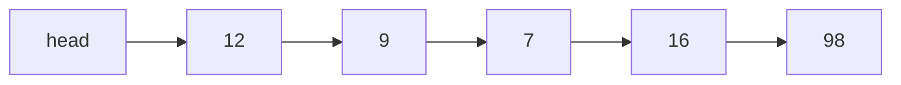
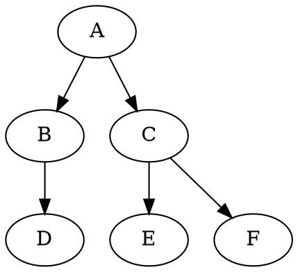
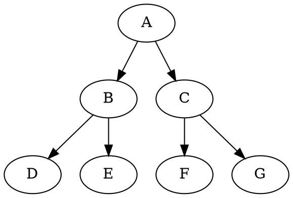
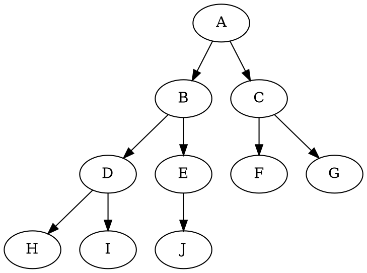
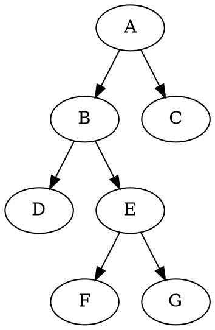
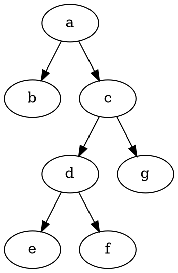
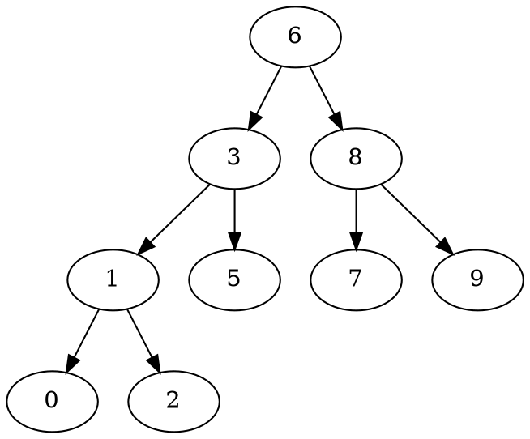

<h1 id="数据结构与算法" align="center">数据结构与算法</h1>
<!-- @import "[TOC]" {cmd="toc"} -->

<!-- code_chunk_output -->

- [1. 基础数据结构](#1-基础数据结构)
  - [1.1. 栈](#11-栈)
  - [1.2. 队列](#12-队列)
  - [1.3. 链表](#13-链表)
    - [1.3.1. 跳表](#131-跳表)
  - [1.4. 树与二叉树](#14-树与二叉树)
    - [1.4.1. 二叉树的遍历](#141-二叉树的遍历)
    - [1.4.2. BST树 (Binary Search Tree 又叫：二叉排序树、二叉查找树、二叉搜索树)](#142-bst树-binary-search-tree-又叫二叉排序树-二叉查找树-二叉搜索树)
    - [1.4.3. AVL树 (平衡二叉树)](#143-avl树-平衡二叉树)
    - [1.4.4. 红黑树（RB树）](#144-红黑树rb树)
    - [1.4.5. B树 (平衡树、B-树)](#145-b树-平衡树-b-树)
    - [1.4.6. B+树](#146-b树)
  - [1.5. 散列表](#15-散列表)
    - [1.5.1. 哈希冲突的解决方法](#151-哈希冲突的解决方法)
  - [1.6. 图](#16-图)
    - [1.6.1. 图的存储数据结构](#161-图的存储数据结构)
    - [1.6.2. 深度优先遍历（DFS）](#162-深度优先遍历dfs)
    - [1.6.3. 广度优先遍历（BFS）](#163-广度优先遍历bfs)
    - [1.6.4. 最小生成树（Prim算法和Kruskal算法）](#164-最小生成树prim算法和kruskal算法)
    - [1.6.5. 单源最短路径（Dijkstra 算法）](#165-单源最短路径dijkstra-算法)
    - [1.6.6. 多源最短路径（Floyd 算法）](#166-多源最短路径floyd-算法)
- [2. 基础算法](#2-基础算法)
  - [2.1. 查找算法](#21-查找算法)
    - [2.1.1. 顺序查找](#211-顺序查找)
    - [2.1.2. 二分查找](#212-二分查找)
    - [2.1.3. 插值查找](#213-插值查找)
    - [2.1.4. 斐波那契查找](#214-斐波那契查找)
    - [2.1.5. 树表查找](#215-树表查找)
    - [2.1.6. 分块查找](#216-分块查找)
    - [2.1.7. 哈希查找](#217-哈希查找)
  - [2.2. 排序算法](#22-排序算法)
    - [2.2.1. 冒泡排序（交换排序）](#221-冒泡排序交换排序)
    - [2.2.2. 直接插入排序（插入排序）](#222-直接插入排序插入排序)
    - [2.2.3. 直接选择排序（选择排序）](#223-直接选择排序选择排序)
    - [2.2.4. 快速排序（交换排序）](#224-快速排序交换排序)
    - [2.2.5. 希尔排序（插入排序）](#225-希尔排序插入排序)
    - [2.2.6. 堆排序（选择排序）](#226-堆排序选择排序)
    - [2.2.7. 归并排序](#227-归并排序)
  - [2.3. 递归](#23-递归)
  - [2.4. 动态规划](#24-动态规划)
    - [2.4.1. 青蛙跳台阶](#241-青蛙跳台阶)
    - [2.4.2. 62.不同路径](#242-62不同路径httpsleetcode-cncomproblemsunique-paths)
    - [2.4.3. 63.不同路径II](#243-63不同路径iihttpsleetcode-cncomproblemsunique-paths-ii)
- [3. 基础例题](#3-基础例题)
  - [3.1. 最小栈](#31-最小栈httpsleetcode-cncomproblemsmin-stack)
  - [3.2. 最大队列](#32-最大队列httpsleetcode-cncomproblemsdui-lie-de-zui-da-zhi-lcof)
  - [3.3. 辗转相除法](#33-辗转相除法)
  - [3.4. 两数之和（一次遍历+HashMap）](#34-两数之和一次遍历hashmaphttpsleetcode-cncomproblemstwo-sum)

<!-- /code_chunk_output -->


# 1. 基础数据结构

## 1.1. 栈

特点：先进后出
操作：入栈 push、出栈 pop

java.util 包中的 Stack 类继承自 Vector。它是线程安全的，它的方法都是同步方法
```java
package java.util;
public class Stack<E> extends Vector<E> {
    // 构造器: 只有一个空参构造器
    // 调用其父类Vector的空参构造，设置初始大小为 10
    // public Vector() {
    //     this(10);
    // }
    public Stack() {
    }

    // 入栈
    // 返回: 刚刚入栈的元素
    E push(E item);

    // 出栈
    // 返回: 刚刚出栈的元素
    // 异常: 如果栈为空, java.util.EmptyStackException
    E pop();

    // 获取栈顶元素
    // 返回: 栈顶元素
    // 异常: 如果栈为空, java.util.EmptyStackException
    E peek();

    // 判断栈是否为空
    boolean empty();

    // 从栈顶往下找目标元素 o
    // 返回: 第一个 o 在第几个位置上（栈顶元素为 1 号，往下依次 2,3,4...）
    //       如果没找到 o, 返回 -1
    // 例如： 目前栈中有：（栈底）1,2,3,1,2,3,4（栈顶）。search(2) == 3
    int search(Object o) {
        int i = lastIndexOf(o);
        if (i >= 0) {
            return size() - i;
        }
        return -1;
    }
}
```

## 1.2. 队列

特点：先进先出
操作：入队 offer，出队 poll

| 方法类型 | 抛出异常 | 返回特殊值 |
|:-------:|:--------:|:---------:|
| 插入    | add(e)    | offer(e) |
| 移除    | remove()  | poll()   |
| 查看    | element() | peek()   |
```java
package java.util;
public interface Queue<E> extends Collection<E> {
    // 入队，向队尾添加元素
    // 返回: 插入成功返回 true
    // 异常：如果队列已满，java.lang.IllegalArgumentException
    boolean add(E e);

    // 入队，向队尾添加元素
    // 返回: 插入成功返回 true；否则返回false
    boolean offer(E e);

    // 出队，删除队头元素
    // 返回: 刚刚出队的元素
    // 异常：如果队列为空，java.util.NoSuchElementException
    E remove();

    // 出队，删除队头元素
    // 返回: 刚刚出队的元素；如果队列为空，返回 null
    E poll();

    // 获取队头元素
    // 返回: 对头元素
    // 异常：如果队列为空，java.util.NoSuchElementException
    E element();

    // 获取队头元素
    // 返回: 对头元素，如果队列为空，返回 null
    E peek();
}
```
队列是一个接口，有一个实现类 LinkedList。


## 1.3. 链表
链表每个节点分为两个部分：数据域和指针域
```java
public class ListNode {
    int val;
    ListNode next;
    ListNode(int x) {
        val = x; 
    }
}
```


### 1.3.1. 跳表
- 由多层链表组成，每一层都是有序链表
- 最底层(Level 1)的链表包含所有的数据，上层链表则是索引
- 如果一个元素在 Level i 曾出现过，那么它在 Level j 层都会出现 $(1 \le j \le i)$
- 每个节点包含两个指针，一个指向后一个元素，一个指向下层元素
```text
            top (head)
            |
            v
(Level 3)   14 --------------------> 50
            |                        |
            v                        v
(Level 2)   14 -------> 34 --------> 50
            |           |            |
            v           v            v
(Level 1)   14 -> 23 -> 34 -> 43 --> 50 -> 59 -> 66 -> 72
```

## 1.4. 树与二叉树

> https://www.cnblogs.com/idorax/p/6441043.html
> 
> https://blog.csdn.net/wanderlustLee/article/details/81297253?utm_medium=distribute.pc_feed_404.none-task-blog-BlogCommendFromBaidu-3.nonecase&depth_1-utm_source=distribute.pc_feed_404.none-task-blog-BlogCommendFromBaidu-3.nonecas

**二叉树**
- 二叉树第 i 层上的节点数目最多为 $2^{i-1} (i \geq 1)$
- 深度为 k 的二叉树至多拥有节点数为 $2^{k}-1 (k \geq 1)$
- 包含 n 个节点的二叉树的高度至少为 $log_2(n+1)$
- 在任意一棵二叉树中，若终端节点的个数为 $n_0$ ，度为2的节点数为 $n_2$，则$n_0=n_2+1$

推导：二叉树中只会有度为 0,1,2 的节点。设数量分别为 $n_0, n_1, n_2$。
则可知二叉树总节点数 $ n = n_0+n_1+n_2$
又根据 0 度节点没有孩子，1 度节点一个孩子，2 度节点两个孩子，再加一个根节点，可知二叉树总节点数 $ n = n_1 + 2n_2 + 1$
所以，$n_0=n_2+1$


**完美二叉树(Perfect Binary Tree、满二叉树)**
一个深度为 k 且有 $2^{k}-1$ 个结点的二叉树称为完美二叉树 $(k \geq 1)$


**完全二叉树(Complete Binary Tree)**
一个深度为 k 的二叉树，前 k-1 层是满二叉树，最后一层可以不完全填充，其叶子结点都靠左对齐。

已知二叉树节点数量关系：$n_0=n_2+1$，$n = 2*n_2 + n_1 + 1$

因为完全二叉树倒数第二层以上是满二叉树，节点数量为奇数：
如果完全二叉树总结点数为奇数，则$n_1=0$；为偶数，则$n_1=1$；

所以，完全二叉树叶子节点数$$n_0 = \frac{n + 1 - n_1}{2}$$

**完满二叉树(Full Binary Tree)**
所有非叶子节点的度都是2。要么没有孩子，要么有两个孩子
哈夫曼树是一个完全树


### 1.4.1. 二叉树的遍历
```java
class TreeNode {
    char data;
    TreeNode left;
    TreeNode right;

    public TreeNode(char data){
        this.data = data;
    }
}
```
```java
public TreeNode createTree(){
    TreeNode a = new TreeNode('a');
    TreeNode b = new TreeNode('b');
    TreeNode c = new TreeNode('c');
    TreeNode d = new TreeNode('d');
    TreeNode e = new TreeNode('e');
    TreeNode f = new TreeNode('f');
    TreeNode g = new TreeNode('g');
    a.left = b;
    a.right = c;
    c.left = d;
    c.right = g;
    d.left = e;
    d.right = f;
    return a;
}
```

前序遍历(中左右): a b c d e f g 
中序遍历(左中右): b a e d f c g 
后序遍历(左右中: b e f d g c a 
层次遍历: a b c d g e f 


```java
// 前序遍历（递归版）
public void pre(TreeNode root){
    // 递归终止条件!!!!
    if (root == null){
        return;
    }

    // 输出当前节点
    System.out.print(root.data + " ");
    // 左孩子
    pre(root.left);
    // 右孩子
    pre(root.right);
}
// 前序遍历（非递归版）
public void pre(TreeNode root){
    if(root == null){
        return;
    }

    Stack<TreeNode> stack = new Stack<>();
    // 根节点入栈
    stack.push(root);
    while(!stack.empty()){
        // 出栈 并打印
        root = stack.pop();
        System.out.print(root.data + " ");

        // 将右孩子入栈
        if(root.right != null) {
            stack.push(root.right);
        }
        // 将左孩子入栈
        if(root.left != null) {
            stack.push(root.left);
        }
    }
}
```
```java
// 中序遍历（递归版）
public void mid(TreeNode root) {
    // 递归终止条件!!!!
    if (root == null){
        return;
    }

    // 左孩子
    pre(root.left);
    // 输出当前节点
    System.out.print(root.data + " ");
    // 右孩子
    pre(root.right);
}
// 中序遍历（非递归版）
public void mid(TreeNode root) {
    Stack<TreeNode> stack = new Stack<>();
    while(true){
        // 当前节点不为空时
        // 入栈, 并指向左孩子
        if(root != null){
            stack.push(root);
            root = root.left;
        }
        // 已经探测到最下边的左孩子
        // 如果栈不为空
        else if(!stack.empty()){
            // 出栈并打印
            root = stack.pop();
            System.out.print(root.data + " ");
            // 访问右孩子
            root = root.right;
        }
        // 栈为空, 遍历完成, 退出
        else{
            break;
        }
    }
}
```
```java
// 后序遍历（递归版）
public void back(TreeNode root) {
    // 递归终止条件!!!!
    if (root == null){
        return;
    }

    // 左孩子
    pre(root.left);
    // 右孩子
    pre(root.right);
    // 输出当前节点
    System.out.print(root.data + " ");
}
// 后序遍历（非递归版）
public void back(TreeNode root) {
    if(root == null){
        return;
    }

    TreeNode preNode = null;
    Stack<TreeNode> stack = new Stack<>();
    // 根节点入栈
    stack.push(root);
    while(!stack.empty()){
        // 看一眼栈顶
        root = stack.peek();
        // 如果没有左右孩子
        if(root.left == null && root.right == null){
            // 出栈 并打印
            root = stack.pop();
            System.out.print(root.data + " ");
            // 记下出栈的节点
            preNode = root;
        }
        // 如果有孩子, 但是孩子已经出栈了
        else if((preNode != null) && (preNode == root.left || preNode == root.right)){
            // 出栈 并打印
            root = stack.pop();
            System.out.print(root.data + " ");
            // 记下出栈的节点
            preNode = root;
        }
        // 将孩子入栈
        else {
            // 将右孩子入栈
            if (root.right != null) {
                stack.push(root.right);
            }
            // 将左孩子入栈
            if (root.left != null) {
                stack.push(root.left);
            }
        }
    }
}
```
```java
// 层次遍历
public void line(TreeNode root) {
    if(root == null){
        return;
    }

    Queue<TreeNode> queue = new LinkedList();
    // 根节点 进队列
    queue.offer(root);
    while(!queue.isEmpty()){
        // 根节点 出队列
        root = queue.poll();
        System.out.print(root.data + " ");

        // 左右孩子依次进队列
        if(root.left != null){
            queue.offer(root.left);
        }
        if(root.right != null){
            queue.offer(root.right);
        }
    }
}
```

**补充： JS 代码**
```js
function TreeNode(data, left, right) {
    this.data = (data === undefined ? 0 : data)
    this.left = (left === undefined ? null : left)
    this.right = (right === undefined ? null : right)
}

function createTree() {
    const a = new TreeNode('a');
    const b = new TreeNode('b');
    const c = new TreeNode('c');
    const d = new TreeNode('d');
    const e = new TreeNode('e');
    const f = new TreeNode('f');
    const g = new TreeNode('g');
    a.left = b;
    a.right = c;
    c.left = d;
    c.right = g;
    d.left = e;
    d.right = f;
    return a;
}

// 前序遍历（非递归版）
function pre(root){
    if(root == null){
        return;
    }

    var res = "";
    var stack = [];
    // 根节点入栈
    stack.push(root);
    while(stack.length != 0){
        // 出栈 并打印
        root = stack.pop();
        res += (root.data + " ");

        // 将右孩子入栈
        if(root.right != null) {
            stack.push(root.right);
        }
        // 将左孩子入栈
        if(root.left != null) {
            stack.push(root.left);
        }
    }
    return res;
}

// 中序遍历（非递归版）
function mid(root) {
    var res = "";
    var stack = [];
    while(true){
        // 当前节点不为空时
        // 入栈, 并指向左孩子
        if(root != null){
            stack.push(root);
            root = root.left;
        }
            // 已经探测到最下边的左孩子
        // 如果栈不为空
        else if(stack.length != 0){
            // 出栈并打印
            root = stack.pop();
            res += (root.data + " ");
            // 访问右孩子
            root = root.right;
        }
        // 栈为空, 遍历完成, 退出
        else{
            break;
        }
    }
    return res;
}

// 后序遍历（非递归版）
function back(root) {
    if(root == null){
        return;
    }

    var preNode = null;
    var res = "";
    var stack = [];
    // 根节点入栈
    stack.push(root);
    while(stack.length != 0){
        // 看一眼栈顶
        root = stack[stack.length-1];
        // 如果没有左右孩子
        if(root.left == null && root.right == null){
            // 出栈 并打印
            root = stack.pop();
            res += (root.data + " ");
            // 记下出栈的节点
            preNode = root;
        }
        // 如果有孩子, 但是孩子已经出栈了
        else if((preNode != null) && (preNode == root.left || preNode == root.right)){
            // 出栈 并打印
            root = stack.pop();
            res += (root.data + " ");
            // 记下出栈的节点
            preNode = root;
        }
        // 将孩子入栈
        else {
            // 将右孩子入栈
            if (root.right != null) {
                stack.push(root.right);
            }
            // 将左孩子入栈
            if (root.left != null) {
                stack.push(root.left);
            }
        }
    }
    return res;
}

// 层次遍历
function line(root) {
    if(root == null){
        return;
    }

    var res = "";
    var queue = [];
    // 根节点 进队列
    queue.push(root);
    while(queue.length != 0){
        // 根节点 出队列
        root = queue.shift();
        res += (root.data + " ");

        // 左右孩子依次进队列
        if(root.left != null){
            queue.push(root.left);
        }
        if(root.right != null){
            queue.push(root.right);
        }
    }
    return res;
}

export default () => {
    var root = createTree();
    return (
        <div>
            <div>前序遍历: {pre(root)}</div>
            <div>中序遍历: {mid(root)}</div>
            <div>后序遍历: {back(root)}</div>
            <div>层次遍历: {line(root)}</div>
        </div>
    );
};
```


### 1.4.2. BST树 (Binary Search Tree 又叫：二叉排序树、二叉查找树、二叉搜索树)

- 二叉查找树中，左孩子的值总是小于父亲的值，右孩子的值总是大于父亲的值。`left < root < right`
- 任意一个节点的左右子树也是二叉查找树。
- 不存在值相同的节点。
- 搜索二叉树的中序遍历是递增的。

二叉查找树可能会不平衡，变成链表。


中序遍历：0 1 2 3 5 6 7 8 9

### 1.4.3. AVL树 (平衡二叉树)

- 符合二叉查找树
- 必须满足任何节点的两个子树的高度之差小于等于1

维护一棵平衡二叉树，需要经常性的旋转操作，开销较大。

### 1.4.4. 红黑树（RB树）

0. 满足二叉查找树
1. 节点是红色或者黑色
2. 根节点是黑色
3. 每个叶子节点都是黑色的空节点（NIL 节点）
4. 每个红色节点的两个子节点都是黑色（从每个叶子到根的路径不能有两个连续的红色节点）
5. 从任何一个节点到其每个叶子节点的所用路径包含相同数目的黑色节点


这些规则的限定，保证了红黑树的自平衡。红黑树从根节点到叶子的最长路径不会超过最短路径的 2 倍。

**调整** https://juejin.im/post/5a27c6946fb9a04509096248
1. 变色
2. 旋转
   - 左旋转
   - 右旋转

### 1.4.5. B树 (平衡树、B-树)

AVL树每一个节点只能存放一个元素；
而 B 树是一种多路平衡树。

一个 m 阶的 B 树规定了：
1. 根结点至少有两个子女。
2. 每个中间节点都包含k-1个元素和k个孩子，其中 $\frac{m}{2} \leq k \leq m$。
3. 每一个叶子节点都包含k-1个元素，其中 $\frac{m}{2} \leq k \leq m$。
4. 所有的叶子结点都位于同一层。
5. 每个节点中的元素从小到大排列，节点当中k-1个元素正好是k个孩子包含的元素的值域分划。

### 1.4.6. B+树

B+树每个非叶子结点存放的元素只用于索引作用，所有数据保存在叶子结点。

一个m阶的B+树规定了：
1. 有k个子树的中间节点包含有k个元素（B树中是k-1个元素），每个元素不保存数据，只用来索引，所有数据都保存在叶子节点。
2. 所有的叶子结点中包含了全部元素的信息，及指向含这些元素记录的指针，且叶子结点本身依关键字的大小自小而大顺序链接。
3. 所有的中间节点元素都同时存在于子节点，在子节点元素中是最大（或最小）元素。

## 1.5. 散列表

使用一个下标范围比较大的数组来存储元素。
设计一个函数 $f$（哈希函数，散列函数），使得可以通过元素的值找到元素存储位置的下标，即 $元素下标值 = f(元素值)$

数组大小 5
        12 15 37 64 42 52
Hash(x) = x % n
对5取余  2  0  2  4  2  2
|0|1|2|3|4|
|-|-|-|-|-|
|15| |12/37||64|

开放定址法：g(x) = (x+1) % n
|0|1|2|3|4|
|-|-|-|-|-|
|15|42|12|37|64|

get(62)

```
get(k) {
    p0 = hash(k); // k % n

    if (arr[p0] == k) {
        return p0;
    }

    for (int p = g(p0);;p = g(p)){
        if(arr[p] == k) {
            return p;
        }else if(arr[p] == null || p == p0) {
            未找到
            break;
        }
    }
}
```


### 1.5.1. 哈希冲突的解决方法

**1、开放定址法**
当关键字 $key$ 的哈希地址 $p = Hash(key)$ 出现冲突时，以 $p$ 为基础，产生另一个哈希地址 $p_1$ ，如果 $p_1$ 仍然冲突，再以 $p_1$ 为基础，产生另一个哈希地址 $p_2$，...，直到找出一个不冲突的哈希地址 $p_i$ ，将相应元素存入其中。

再散列函数形式：
$H_i = (Hash(key) + d_i) \% m$，其中 $i=1, 2, ..., n$

其中 Hash(key) 为哈希函数，m 为表长，$d_i$ 称为增量序列。
增量序列的取值方式不同，相应的再散列方式也不同。主要有以下三种:

- 线性探查：冲突发生时，顺序查看表中下一单元，直到找出一个空单元或查遍全表。
$$d_i=1, 2, 3, ..., m-1$$

<s>
- 二次探测再散列：冲突发生时，在表的左右进行跳跃式探测，比较灵活。
$$d_i=1^2, -1^2, 2^2, -2^2, ..., k^2, -k^2 (k \leq \frac{m}{2})$$

- 伪随机探测再散列 $d_i=$ 伪随机数序列。
</s>


**2、再哈希法（再散列法）**
同时构造多个不同的哈希函数。当产生冲突时，换另一个哈希函数计算。

**3、链地址法**
当多个元素的存储地址相同时，在数组对应位置添加一个单链表，元素存储到链表中。

**4、建立公共溢出区**
这种方法的基本思想是：将哈希表分为基本表和溢出表两部分，凡是和基本表发生冲突的元素，一律填入溢出表。


## 1.6. 图

定义：由有限数量的顶点和边的集合构成。

### 1.6.1. 图的存储数据结构

**邻接矩阵**
有 n 个节点的图，需要使用一个 n·n 的二维数组来存储。
graph[i][j] 

### 1.6.2. 深度优先遍历（DFS）

### 1.6.3. 广度优先遍历（BFS）

### 1.6.4. 最小生成树（Prim算法和Kruskal算法）
**最小生成树（Spanning Tree）**：一个**无向连通图**的生成树是它的**包含所有顶点**的**极小连通子图**，这里所谓的极小就是边的数目极小。

**Prim算法：**
1. 从图上选择任意一个节点，作为开始节点，并加入内界中
2. 选择一条能够沟通外界任意一个点的，且权值最小的边
3. 将上一步所沟通到的点加入内界中

```text
start: A
add: AD(5), AD
add: DF(6), ADF
add: AB(7), ADFB
add: BE(7), ADFBE
add: EC(5), ADFBEC
add: EG(9), ADFBECG
权值 39
```


**Kruskal算法：**
1. 选择权值较小的边，将其两端的节点加入内界中
2. 选择一条能够为内界新增节点的，且权值最小的边
3. 将上一步边两端的节点加入内界中

```text
add: AD(5), AD
add: CE(5), ADCE
add: DF(6), ADCEF
add: AB(7), ADCEFB
add: BE(7), ADCEFBE
add: EG(9), ADCEFBEG
权值 39
```


### 1.6.5. 单源最短路径（Dijkstra 算法）


### 1.6.6. 多源最短路径（Floyd 算法）


# 2. 基础算法

## 2.1. 查找算法

> https://www.cnblogs.com/maybe2030/p/4715035.html

**查找定义**：根据给定的某个值，在查找表中确定一个其关键字等于给定值的数据元素（或记录）。

**查找算法分类**：
1. 静态查找和动态查找；
    - 静态或者动态都是针对查找表而言的。
    - 动态表指查找表中有删除和插入操作的表。
2. 无序查找和有序查找。
    - 无序查找：被查找数列有序无序均可；
    - 有序查找：被查找数列必须为有序数列。

**平均查找长度**（Average Search Length，ASL）：需和指定key进行比较的关键字的个数的期望值，称为查找算法在查找成功时的平均查找长度。
对于含有n个数据元素的查找表，查找成功的平均查找长度为：$ASL = \sum{(P_i*C_i)}$。
$P_i$：查找表中第i个数据元素的概率。
$C_i$：找到第i个数据元素时已经比较过的次数。

### 2.1.1. 顺序查找
无序查找算法
适合：顺序存储或链接存储的线性表
时间复杂度：$O(n) = \frac{1+2+3+...+n}{2} = \frac{n+1}{2}$

```java
// 顺序查找（数组）
int sequenceSearch(int[] arr, int value)
{
    for(int i=0; i<n; i++) {
        if(a[i] == value) {
            return i;
        }
    }
    return -1;
}
// 顺序查找（单向链表）
ListNode sequenceSearch(ListNode head, int value)
{
    while (head != null) {
        if(head.val == value) {
            return head;
        }
        head = head.next;
    }
    return null;
}
```


### 2.1.2. 二分查找
有序查找算法
适合：顺序存储的有序表，适合静态表，不适合动态表
时间复杂度：$O(log(n))$；最坏情况下，比较次数为 $log_2(n+1)$

- 最大比较次数为 $log_2(n) + 1$ 向下取整
 
```java
// 二分查找（递归版）
public int binarySearch(int[] arr, int data, int min, int max) {
    int mid = min + (max - min) / 2; // middle = (max+min) >> 2
    if (arr[mid] == data) {
        return mid;
    }
    if(a[mid] > value) {
        return binarySearch(a, data, min, mid-1);
    }
    if(a[mid] < value) {
        return binarySearch(a, data, mid+1, max);
    }
}
// 二分查找（循环版）
public int binarySearch(int[] arr, int data) {
    int min = 0;
    int max = arr.length - 1;
    int mid = -1;

    // 当min和max相等时，mid == min == max
    while (min <= max) {
        // 防止溢出
        mid =  min + (max - min) / 2;
        if (arr[mid] > data) {
            max = mid - 1;
        } else if (arr[mid] < data) {
            min = mid + 1;
        } else {
            return mid;
        }
    }
    return -1;
}
```

### 2.1.3. 插值查找
自适应的二分查找。
观察二分查找的插值公式：$mid = min + \frac{1}{2}*(max - min)$。每次都是检索二分之一。
为了更快找到目标值，可以将参数的指定进行自适应，修改插值公式为：
$$mid = min + \frac{data-arr[min]}{arr[max]-arr[min]}*(max - min)$$
根据关键字在整个有序表中所处的位置，让mid值的变化更靠近关键字key，这样也就间接地减少了比较次数。

有序查找算法
适合：对于表长较大，而关键字分布又比较均匀的查找表来说，插值查找算法的平均性能比折半查找要好的多。
反之，数组中如果分布非常不均匀，那么插值查找未必是很合适的选择。
时间复杂度：查找成功或者失败的时间复杂度均为 $O(log(log(n)))$

### 2.1.4. 斐波那契查找
有序查找算法
时间复杂度：$O(log(n))$；最坏情况下，比较次数为 $log_2(n)$

将二分查找的插值公式改为了斐波那契数列。

**黄金比例**又称黄金分割，将整体一分为二，较大部分与较小部分之比等于整体与较大部分之比，其比值约为 $1:0.618$。
**斐波那契数列**：$（0）, 1, 1, 2, 3, 5, 8, 13, 21, 34, 55, 89 ...$。随着斐波那契数列的递增，前后两个数的比值会越来越接近0.618。

插值公式根据斐波那契数列来拆分，设数组长度为 Fibonacci[k]，则拆为长度为 Fibonacci[k-1] 和 Fibonacci[k-2] 两部分。
$$mid = min + Fibonacci[k-1]-1$$

假设一个长度为 8 的数组，因为 8 <= Fibonacci[6] = 8
那么拆为 5 + 3 两部分
mid = 0 + 5 - 1 = 4
|min||||mid|||max|
|-|-|-|-|-|-|-|-|
|0|1|2|3|==4==|5|6|7|
| | | | | | | | |

TODO: 代码

### 2.1.5. 树表查找
二叉查找树、平衡查找树（2-3查找树、红黑树）、B-树,B+树

### 2.1.6. 分块查找
将n个数据元素"按块有序"划分为m块（m ≤ n）。
每一块中的结点不必有序，但块与块之间必须"按块有序"（即第1块中任一元素的关键字都必须小于第2块中任一元素的关键字；而第2块中任一元素又都必须小于第3块中的任一元素...）

### 2.1.7. 哈希查找
典型以空间换时间的算法
时间复杂度：对于无冲突的Hash表而言，查找复杂度为 $O(1)$ （不包括哈希表的建立）

## 2.2. 排序算法


稳定的排序：冒泡、直接插入、归并
$O(n^2)$：冒泡、直接插入、直接选择

### 2.2.1. 冒泡排序（交换排序）

每趟排序，比较前后相邻的两个数，将较大的数往后移动。一趟完成之后，最大的数就沉到后面去了。

时间复杂度：$O(n^2) = (n-1) + (n-2) + ··· + 1 =  \frac{(1 + (n-1))·(n-1)}{2} = \frac{1}{2}n^2 - \frac{1}{2}n$ 
空间复杂度：$O(1)$

```java
public class BubbleSort {

    public static void main(String[] args) {
        {
            int[] arr = {9, 8, 7, 6, 5, 4, 3, 2, 1, 0, 1, -2};
            System.out.println("初始: " + Arrays.toString(arr));
            bubbleSort(arr);
        }
        //System.out.println(Arrays.toString(arr));
        System.out.println("----------------");
        {
            int[] arr = {9, 8, 7, 6, 5, 4, 3, 2, 1, 0, 1, -2};
            System.out.println("初始: " + Arrays.toString(arr));
            bubbleSortV2(arr);
        }
    }

    public static void bubbleSort(int[] arr) {
        // i 表示当前是第 i 躺排序
        for (int i = 0; i < arr.length; i++) {
            // 从 0（j-1） 开始将较大的数往后移动
            for (int j = 1; j < arr.length - i; j++) {
                if (arr[j-1] > arr[j]) {
                    int temp = arr[j-1];
                    arr[j-1] = arr[j];
                    arr[j] = temp;
                }
            }
            System.out.println("第"+(i+1)+"趟: "+Arrays.toString(arr));
        }
    }

    // 优化，检查数组当前是否已经有序。如果已经有序则直接退出
    public static void bubbleSortV2(int[] arr) {
        // i 表示当前是第 i 躺排序
        for (int i = 0; i < arr.length; i++) {
            boolean flag = true;
            // 从 0（j-1） 开始将较大的数往后移动
            for (int j = 1; j < arr.length - i; j++) {
                if (arr[j-1] > arr[j]) {
                    int temp = arr[j-1];
                    arr[j-1] = arr[j];
                    arr[j] = temp;
                    flag = false;
                }
            }
            // 如果没有发生过交换，说明数组已经有序
            if (flag){
                return;
            }
            System.out.println("第"+(i+1)+"趟: "+Arrays.toString(arr));
        }
    }
}
// 初始: [9, 8, 7, 6, 5, 4, 3, 2, 1, 0, 1, -2]
// 第1趟: [8, 7, 6, 5, 4, 3, 2, 1, 0, 1, -2, 9]
// 第2趟: [7, 6, 5, 4, 3, 2, 1, 0, 1, -2, 8, 9]
// 第3趟: [6, 5, 4, 3, 2, 1, 0, 1, -2, 7, 8, 9]
// 第4趟: [5, 4, 3, 2, 1, 0, 1, -2, 6, 7, 8, 9]
// 第5趟: [4, 3, 2, 1, 0, 1, -2, 5, 6, 7, 8, 9]
// 第6趟: [3, 2, 1, 0, 1, -2, 4, 5, 6, 7, 8, 9]
// 第7趟: [2, 1, 0, 1, -2, 3, 4, 5, 6, 7, 8, 9]
// 第8趟: [1, 0, 1, -2, 2, 3, 4, 5, 6, 7, 8, 9]
// 第9趟: [0, 1, -2, 1, 2, 3, 4, 5, 6, 7, 8, 9]
// 第10趟: [0, -2, 1, 1, 2, 3, 4, 5, 6, 7, 8, 9]
// 第11趟: [-2, 0, 1, 1, 2, 3, 4, 5, 6, 7, 8, 9]
// 第12趟: [-2, 0, 1, 1, 2, 3, 4, 5, 6, 7, 8, 9]
// ----------------
// 初始: [9, 8, 7, 6, 5, 4, 3, 2, 1, 0, 1, -2]
// 第1趟: [8, 7, 6, 5, 4, 3, 2, 1, 0, 1, -2, 9]
// 第2趟: [7, 6, 5, 4, 3, 2, 1, 0, 1, -2, 8, 9]
// 第3趟: [6, 5, 4, 3, 2, 1, 0, 1, -2, 7, 8, 9]
// 第4趟: [5, 4, 3, 2, 1, 0, 1, -2, 6, 7, 8, 9]
// 第5趟: [4, 3, 2, 1, 0, 1, -2, 5, 6, 7, 8, 9]
// 第6趟: [3, 2, 1, 0, 1, -2, 4, 5, 6, 7, 8, 9]
// 第7趟: [2, 1, 0, 1, -2, 3, 4, 5, 6, 7, 8, 9]
// 第8趟: [1, 0, 1, -2, 2, 3, 4, 5, 6, 7, 8, 9]
// 第9趟: [0, 1, -2, 1, 2, 3, 4, 5, 6, 7, 8, 9]
// 第10趟: [0, -2, 1, 1, 2, 3, 4, 5, 6, 7, 8, 9]
// 第11趟: [-2, 0, 1, 1, 2, 3, 4, 5, 6, 7, 8, 9]
```

### 2.2.2. 直接插入排序（插入排序）

通过构建有序序列，对于未排序数据，在已排序序列中从后向前扫描，找到相应的位置并插入。
插入排序非常类似于整扑克牌。在开始摸牌时，左手是空的，牌面朝下放在桌上。接着，一次从桌上摸起一张牌，并将它插入到左手一把牌中的正确位置上。为了找到这张牌的正确位置，要将它与手中已有的牌从右到左地进行比较。无论什么时候，左手中的牌都是排好序的。

时间复杂度：$O(n^2)$
空间复杂度：$O(1)$

```java
public class InsertSort {
    public static void main(String[] args) {
        int[] arr = {9, 48, 7, 6, 15, 4, 33, 2 ,1, 0, 1, -2};
        System.out.println("初始: "+ Arrays.toString(arr));
        insertSort(arr);
    }

    public static void insertSort(int[] arr) {
        // 从第二和数开始，把arr[i]插入到前面排好的数组中
        for (int i = 1; i < arr.length; i++) {
            // temp 是待插入的数
            int temp = arr[i];
            // 0 到 i-1 是已经排好的数组
            int j;
            // 从后往前比较，将比temp大的数往后移动一位
            // 当temp比当前位置大时，上一个位置就是temp要插入进去的位置啦
            for (j = i-1; j >= 0; j--) {
                if (arr[j] > temp) {
                    arr[j+1] = arr[j];
                } else {
                    break;
                }
            }
            arr[j+1] = temp;
            System.out.println("第"+(i)+"趟: "+Arrays.toString(arr));
        }
    }
}
// 初始: [9, 48, 7, 6, 15, 4, 33, 2, 1, 0, 1, -2]
// 第1趟: [9, 48, 7, 6, 15, 4, 33, 2, 1, 0, 1, -2]
// 第2趟: [7, 9, 48, 6, 15, 4, 33, 2, 1, 0, 1, -2]
// 第3趟: [6, 7, 9, 48, 15, 4, 33, 2, 1, 0, 1, -2]
// 第4趟: [6, 7, 9, 15, 48, 4, 33, 2, 1, 0, 1, -2]
// 第5趟: [4, 6, 7, 9, 15, 48, 33, 2, 1, 0, 1, -2]
// 第6趟: [4, 6, 7, 9, 15, 33, 48, 2, 1, 0, 1, -2]
// 第7趟: [2, 4, 6, 7, 9, 15, 33, 48, 1, 0, 1, -2]
// 第8趟: [1, 2, 4, 6, 7, 9, 15, 33, 48, 0, 1, -2]
// 第9趟: [0, 1, 2, 4, 6, 7, 9, 15, 33, 48, 1, -2]
// 第10趟: [0, 1, 1, 2, 4, 6, 7, 9, 15, 33, 48, -2]
// 第11趟: [-2, 0, 1, 1, 2, 4, 6, 7, 9, 15, 33, 48]
```

### 2.2.3. 直接选择排序（选择排序）

每趟排序遍历一遍未排序的部分，记录下最小数的下标。将最小数交换到小标为 i 的位置。

时间复杂度：$O(n^2)$
空间复杂度：$O(1)$

不稳定：举个例子，序列5 8 5 2 9，我们知道第一遍选择第1个元素5会和2交换，那么原序列中2个5的相对前后顺序就被破坏了，所以选择排序不是一个稳定的排序算法。

```java
public class SelectionSort {
    public static void main(String[] args) {
        int[] arr = {9, 48, 7, 6, 15, 4, 33, 2 ,1, 0, 1, -2};
        System.out.println("初始: "+ Arrays.toString(arr));
        selectionSort(arr);
    }

    public static void selectionSort(int[] arr) {
        // 每趟将最小的数调到前面去 调到位置为 i 处
        for (int i = 0; i < arr.length-1; i++) {
            // min 是当前这一趟最小元素的下标
            int min = i;
            for (int j = i + 1; j < arr.length; j++) {
                // 更新最小数的下标
                if (arr[j] < arr[min]) {
                    min = j;
                }
            }
            // 如果最小元素下标不是 i，就需要将交换
            if (i != min) {
                int temp = arr[min];
                arr[min] = arr[i];
                arr[i] = temp;
            }
            System.out.println("第"+(i+1)+"趟: "+Arrays.toString(arr));
        }
    }
}
// 初始: [9, 48, 7, 6, 15, 4, 33, 2, 1, 0, 1, -2]
// 第1趟: [-2, 48, 7, 6, 15, 4, 33, 2, 1, 0, 1, 9]
// 第2趟: [-2, 0, 7, 6, 15, 4, 33, 2, 1, 48, 1, 9]
// 第3趟: [-2, 0, 1, 6, 15, 4, 33, 2, 7, 48, 1, 9]
// 第4趟: [-2, 0, 1, 1, 15, 4, 33, 2, 7, 48, 6, 9]
// 第5趟: [-2, 0, 1, 1, 2, 4, 33, 15, 7, 48, 6, 9]
// 第6趟: [-2, 0, 1, 1, 2, 4, 33, 15, 7, 48, 6, 9]
// 第7趟: [-2, 0, 1, 1, 2, 4, 6, 15, 7, 48, 33, 9]
// 第8趟: [-2, 0, 1, 1, 2, 4, 6, 7, 15, 48, 33, 9]
// 第9趟: [-2, 0, 1, 1, 2, 4, 6, 7, 9, 48, 33, 15]
// 第10趟: [-2, 0, 1, 1, 2, 4, 6, 7, 9, 15, 33, 48]
// 第11趟: [-2, 0, 1, 1, 2, 4, 6, 7, 9, 15, 33, 48]
```

### 2.2.4. 快速排序（交换排序）

每次排序确定当前部分最左边元素的最终位置。然后分别递归左右两边。

时间复杂度：$O(n·log(n))$
空间复杂度：$O(log(n))$

```java
public class QuickSort {
    public static void main(String[] args) {
        int[] arr = {9, 8, 7, 6, 5, 4, 3, 2 ,1, 0, 1, -2};
        quickSort(arr, 0, arr.length-1);

        System.out.println(Arrays.toString(arr));
    }

    public static void quickSort(int[] arr, int left, int right){
        if(left < right){
            // 定 base 的位置 = mid
            int mid = part(arr, left, right);
            // 排序左边
            quickSort(arr, left, mid-1);
            // 排序右边
            quickSort(arr, mid+1, right);
        }
    }

    static int part(int[] arr, int left, int right){
        // 基准数
        int base = arr[left];
        // 当 left == right 时退出
        while(left < right){
            // 从右往左找比 base 小的
            while(left < right && base <= arr[right]){
                right--;
            }
            arr[left] = arr[right];
            // 从左往右找比 base 大的
            while(left < right && base >= arr[left]){
                left++;
            }
            arr[right] = arr[left];
        }
        // left == right
        arr[left] = base;
        return left;
    }
}
// 初始: [9, 48, 7, 6, 15, 4, 33, 2, 1, 0, 1, -2]
// [-2, 1, 7, 6, 0, 4, 1, 2, 9, 33, 15, 48]
// [-2, 1, 7, 6, 0, 4, 1, 2, 9, 33, 15, 48]
// [-2, 0, 1, 6, 7, 4, 1, 2, 9, 33, 15, 48]
// [-2, 0, 1, 2, 1, 4, 6, 7, 9, 33, 15, 48]
// [-2, 0, 1, 1, 2, 4, 6, 7, 9, 33, 15, 48]
// [-2, 0, 1, 1, 2, 4, 6, 7, 9, 15, 33, 48]
```

排序前： 3, 9, 6, 8, -10, 7, -11, 19, 30, 12, 23
排序后：-11, -10, 3, 6, 7, 8, 9, 12, 19, 23, 30

base = 3;
-11, -10, X, 8, 6, 7, 9, 19, 30, 12, 23

### 2.2.5. 希尔排序（插入排序）
时间复杂度：$O(n·log(n))$　
最佳情况：$O(n·log(n))$ 最坏情况：$O(n·log(n))$

```java
public class ShellSort {
    public static void main(String[] args) {
        int[] arr = {9, 48, 7, 6, 15, 4, 33, 2 ,1, 0, 1, -2};
        System.out.println("初始: "+ Arrays.toString(arr));
        shellSort(arr);
    }

    public static void shellSort(int[] arr) {
        for (int gap = arr.length / 2; gap > 0; gap /= 2) {
            // ===== 这一段就是直接插入排序的部分（将 1 改为了 gap） ===
            for (int i = gap; i < arr.length; i++) {
                int temp = arr[i];
                int j;
                for (j = i-gap; j >= 0; j -= gap) {
                    if (arr[j] > temp) {
                        arr[j+gap] = arr[j];
                    } else {
                        break;
                    }
                }
                arr[j+gap] = temp;
            }
            // === 这一段就是直接插入排序的部分 ===
            System.out.println("gap="+gap+" "+Arrays.toString(arr));
        }
    }
}
// 初始: [9, 48, 7, 6, 15, 4, 33, 2, 1, 0, 1, -2]
// gap=6 [9, 2, 1, 0, 1, -2, 33, 48, 7, 6, 15, 4]
// gap=3 [0, 1, -2, 6, 2, 1, 9, 15, 4, 33, 48, 7]
// gap=1 [-2, 0, 1, 1, 2, 4, 6, 7, 9, 15, 33, 48]
```

### 2.2.6. 堆排序（选择排序）

### 2.2.7. 归并排序


## 2.3. 递归

有 n 步台阶，一次只能上 1 步或 2 步，共有多少种走法？

递归


$$
f(x) = 
    \begin{cases}
        x, (x = 1,2)\\
        f(x-2) + f(x-1), (x > 2)
    \end{cases}
$$

```java
int f(int n) {
    if (n <= 0) {
        return -1;
    }
    if (n == 1 || n == 2) {
        return n;
    }
    return f(n-1) + f(n-2);
}
```

迭代

从 3 - n 迭代：可以发现每次只需要用到前两个值，可以把它们保存起来。

| i | a | b | res |
|:-:|:-:|:-:|:---:|
| 3 | 1 | 2 |  3  |
| 4 | 2 | 3 |  5  |
| 5 | 3 | 5 |  8  |
| 6 | 5 | 8 |  13  |

```java
int f(int n) {
    if (n <= 0) {
        return -1;
    }
    if (n == 1 || n == 2) {
        return n;
    }
    int a = 1;
    int b = 2;
    for (int i = 3; i <= n; i++) {
        int temp = a + b;
        a = b;
        b = temp;
    }
    return b;
}
```

## 2.4. 动态规划

### 2.4.1. 青蛙跳台阶

有 n 步台阶，一次只能上 1 步或 2 步，共有多少种走法？

最终问题：n 步台阶的走法
1、立足最后，倒推一步：n-1时走一步；n-2时走两步
2、状态转移方程：f(n) = f(n-1) + f(n-2)
3、从前往后，定初始：f(1) = 1, f(2) = 2


n: 1 2 3 4 5 6  7  8 9
f: 1 2 3 5 8 13 21 
```java
public class Main {
    public static void main(String[] agrs) {
        int n = 10;

        int[] dp = new int[n];

        // 定初始
        dp[0] = 1;
        dp[1] = 2;

        for (int i = 2; i < n; i++) {
            // 状态转移方程
            dp[i] = dp[i-1] + dp[i-2];
        }

        System.out.println(dp[n-1]);
    }
}
```


其实上一节的青蛙跳台阶的最终解法就是一个动态规划的思想。
再看看下面这些题目

### 2.4.2. [62.不同路径](https://leetcode-cn.com/problems/unique-paths/)

**题目：**
> 一个机器人位于一个 m x n 网格的左上角 （起始点在下图中标记为“Start” ）。
> 
> 机器人每次只能向下或者向右移动一步。机器人试图达到网格的右下角（在下图中标记为“Finish”）。
> 
> 问总共有多少条不同的路径？
> 
> 

**思路：**
到终点的上一步有两种：从左边格子往右一步 或者 从上方格子往下一步。即 $k(6, 2) = k(5, 2) + k(6, 1)$。
（最优子结构 get）

由上我们可以得到到达任意一个格子的路线种数 $k(i, j) = k(i-1, j) + k(i, j-1)$，其中 $i >= 1, j >= 1$。
（状态转移方程 get）

k(0,0) = 1 （这个不纠结）
当 i = 0 时，只能从上方格子往下一步，$k(0, j) = k(0, j-1)$。
j = 0 时，同理。
（边界/初始数据 get）

|     |0|1|2|3|4|5|6|
|-|-|-|-|-|-|-|-|-|
|**0**|==1==|1|1|1|1|1|1|
|**1**|1|2|3|4|5|6|7|
|**2**|1|3|6|10|15|21|==28==|

**代码：**
```java
public class LC62 {
    public static void main(String[] args) {
        System.out.println(new LC62().uniquePaths(7, 3));
    }

    public int uniquePaths(int m, int n) {
        int[][] dp = new int[m][n];

        // 初始数据
        for (int i = 0; i < m; i++) {
            dp[i][0] = 1;
        }
        for (int j = 0; j < n; j++) {
            dp[0][j] = 1;
        }

        for (int i = 1; i < m; i++) {
            for (int j = 1; j < n; j++) {
                // 状态转移方程
                dp[i][j] = dp[i-1][j] + dp[i][j-1];
            }
        }
        // 结果
        return dp[m-1][n-1];
    }
}
```

时间复杂度：所有语句频度之和。
一条语句的频度：该条语句再算法执行时被调用的次数。
O()：所有语句频度之和。取最高阶的项

**时空分析：**
空间复杂度：$O(m·n)$，需要一个 m·n 的二维数组。
时间复杂度：$O(m·n) = m + n + m·n$

**空间优化**
可以发现，每一行数据的计算需要依赖上一行数据的值，当计算完一个元素后，上一行元素就不需要了。
因此无须保留整个二维数组，只需要一行的一维数组即可。

|     |0|1|2|3|4|5|6|
|-|-|-|-|-|-|-|-|-|
|**0**|1|3|6|10|15|21|28|

优化后空间复杂度：$O(n)$ 或者 $O(m)$
```java
public int uniquePathsV2(int m, int n) {
    int[] dp = new int[n];

    for (int j = 0; j < n; j++) {
        dp[j] = 1;
    }
    System.out.println(Arrays.toString(dp));

    for (int i = 1; i < m; i++) {
        for (int j = 1; j < n; j++) {
            dp[j] = dp[j] + dp[j-1];
        }
        System.out.println(Arrays.toString(dp));
    }

    return dp[n-1];
}
// [1, 1, 1, 1, 1, 1, 1]
// [1, 2, 3, 4, 5, 6, 7]
// [1, 3, 6, 10, 15, 21, 28]
// 28
```

### 2.4.3. [63.不同路径II](https://leetcode-cn.com/problems/unique-paths-ii/)
**题目：**
> 一个机器人位于一个 m x n 网格的左上角 （起始点在下图中标记为“Start” ）。
> 
> 机器人每次只能向下或者向右移动一步。机器人试图达到网格的右下角（在下图中标记为“Finish”）。
> 
> **现在考虑网格中有障碍物。那么从左上角到右下角将会有多少条不同的路径？**
> 
> 

**思路：**
和上题第一种方法一样，障碍物所在的格子的可达路径数量为 0.
- $k(i, j) = k(i-1, j) + k(i, j-1)$，其中 $i >= 1, j >= 1, obstacleGrid(i, j) = 0$
- $k(i, j) = 0$，其中 $i >= 1, j >= 1, obstacleGrid(i, j) = 1$

**代码：**
```java
public class LC63 {
    public static void main(String[] args) {
        System.out.println(
                new LC63().uniquePathsWithObstacles(new int[][]{
                        {0,0,0},
                        {0,1,0},
                        {0,0,0}
                }
            )
        );
    }
    public int uniquePathsWithObstacles(int[][] obstacleGrid) {
        int m = obstacleGrid.length;
        int n = obstacleGrid[0].length;
        int[][] dp = new int[m][n];

        // 初始数据
        for (int i = 0; i < m; i++) {
            // 障碍物所在格子及其后面格子均不可达
            // 路径数量为 0
            if (obstacleGrid[i][0] == 1){
                break;
            }
            dp[i][0] = 1;
        }
        for (int j = 0; j < n; j++) {
            if (obstacleGrid[0][j] == 1){
                break;
            }
            dp[0][j] = 1;
        }

        for (int i = 1; i < m; i++) {
            for (int j = 1; j < n; j++) {
                // 障碍物所在格子不可达
                // 路径数量为 0
                if (obstacleGrid[i][j] == 1){
                    dp[i][j] = 0;
                    continue;
                }
                dp[i][j] = dp[i-1][j] + dp[i][j-1];
            }
        }
        
        for (int i = 0; i < m; i++) {
            for (int j = 0; j < n; j++) {
                System.out.print(dp[i][j]+" ");
            }
            System.out.println();
        }

        return dp[m-1][n-1];
    }
}
// 1 1 1 
// 1 0 1 
// 1 1 2 
// 2
```
# 3. 基础例题
- 判断一颗二叉树是否是排序二叉树
- 判断一颗二叉树是否是完全二叉树

## 3.1. [最小栈](https://leetcode-cn.com/problems/min-stack)
设计一个支持 push ，pop ，top 操作，并能在常数时间内检索到最小元素的栈。
- push(x) —— 将元素 x 推入栈中。
- pop() —— 删除栈顶的元素。
- top() —— 获取栈顶元素。
- getMin() —— 检索栈中的最小元素。

用空间换时间

2 3 5 1 -1

data 2 3 5 
 min 2 

data 2 3 5 2
 min 2 2
     0 1 2  3

```java
class MinStack {
    // 数据栈
    Stack<Integer> data = new Stack<Integer>();
    // 存储当前最小值的栈
    Stack<Integer> min = new Stack<Integer>();

    public MinStack() {
    }
    
    public void push(int x) {
        data.push(x);
        // 计算当前最小值
        // 栈为空时直接插入
        if (min.isEmpty()) {
            min.push(x);
        } else {
            int old = min.peek();
            min.push(x < old ? x : old);
        }
    }
    
    public void pop() {
        if (data.isEmpty()) {
            return;
        }
        data.pop();
        min.pop();
    }
    
    public int top() {
        return data.peek();
    }
    
    public int getMin() {
        return min.peek();
    }
}
class Main {
    public static void main(String[] args) {
        MinStack minStack = new MinStack();
        minStack.push(-2);
        minStack.push(0);
        minStack.push(-3);
        minStack.getMin();   // 返回 -3.
        minStack.pop();
        minStack.top();      // 返回 0.
        minStack.getMin();   // 返回 -2.
    }
}
// data: -2
//  min: -2

// data: -2  0
//  min: -2 -2

// data: -2  0 -3
//  min: -2 -2 -3

// data: -2  0
//  min: -2 -2
```

上述代码min栈会重复存两个 -2，还可以优化
```java
class MinStack {
    // 数据栈
    Stack<Integer> data = new Stack<Integer>();
    // 存储当前最小值的栈
    Stack<Integer> min = new Stack<Integer>();

    public MinStack() {
    }
    
    public void push(int x) {
        data.push(x);

        // 栈为空时直接插入
        if (min.isEmpty()) {
            min.push(x);
        } 
        // 当入栈元素小于或者等于旧的最小值时
        // 最小值才会发生改变
        // 必须有等于
        else if (x <= min.peek()) {
            min.push(x);
        }
    }
    
    public void pop() {
        if (data.isEmpty()) {
            return;
        }

        int out = data.pop();
        // 出栈元素是当前最小值时，最小值才会改变
        if (out == min.peek()) {
            min.pop();
        }
    }
    
    public int top() {
        return data.peek();
    }
    
    public int getMin() {
        return min.peek();
    }
}
// data: -2
//  min: -2

// data: -2 0
//  min: -2

// data: -2 0 -3
//  min: -2 -3

// data: -2 0
//  min: -2
```

## 3.2. [最大队列](https://leetcode-cn.com/problems/dui-lie-de-zui-da-zhi-lcof)
请定义一个队列并实现函数 max_value 得到队列里的最大值，要求函数max_value、push_back 和 pop_front 的均摊时间复杂度都是O(1)。
若队列为空，pop_front 和 max_value 需要返回 -1

入 5 2 3 -1 4 
出 5 2 3 -1 4
 
data: 5 4 3 2 1 6
 max: 5 4 3 2 1

data: 5 4 3 2 1 6
 max: 6 （5次）

5 0 0 0 0 0 0 0 （均摊时间复杂度为 O(1)）
data: 5 4 3 2 1 6 6 6 6 6 6 6 
 max: 6 （5次）

max 始终递减
入队 x -> data；出队 max 前面比 x 小的；x -> max
出队 x 如果 x==max.top max.top出去

```java
class MaxQueue {
    // 数据队列
    private Queue<Integer> data = new LinkedList<Integer>();
    // 最大值的双端队列
    private Deque<Integer> max = new LinkedList<Integer>();

    public MaxQueue() {
    }
    
    // 最大值
    public int max_value() {
        if (data.isEmpty()) {
            // throw new java.util.NoSuchElementException();
            return -1;
        }
        // 查看队头元素
        return max.peekFirst();
    }
    
    // 入队
    // O(i) 均摊 O(1)
    public void push_back(int value) {
        data.offer(value);
        
        // 维护递减队列 max，从队列尾部往前找，当值小于value是将其移除
        
        // 获取队列尾部元素,队列为空时返回null
        // 查看队尾元素
        // O(i) i <= n
        Integer el = max.peekLast();
        while (el != null && el < value) {
            // 弹出队列尾部的元素
            max.pollLast();
            el = max.peekLast();
        }
        // 将value加入队列尾部
        max.offerLast(value);
    }
    
    public int pop_front() {
        if (data.isEmpty()) {
            return -1;
        }

        int res = data.poll();
        if (res == max.peekFirst()) {
            max.pollFirst();
        }
        return res;
    }
}
// push_back 1
// push_back 2
// max_value
// pop_front
// max_value

// data: 1
//  max: 1

// data: 1 2
//  max: 2

// data: 2
//  max: 2

// 输出：2, 1, 2
```


## 3.3. 辗转相除法

辗转相除法， 又名欧几里德算法（Euclidean algorithm），是求最大公约数的一种方法。
它的具体做法是：
    用较大数除以较小数，再用出现的余数（第一余数）去除除数，
    再用出现的余数（第二余数）去除第一余数，如此反复...
    直到最后余数是0为止，最后的除数就是这两个数的最大公约数。

```java
public class Euclidean {
    public static void main(String[] args) {
        System.out.println(euclidean(6, 8));
        System.out.println(euclidean(36, 48));
        System.out.println(euclidean(45, 81));
        System.out.println(euclidean(66, 110));
    }
    /**
     * 辗转相除法
     * @param min 较小的数
     * @param max 较大的数
     * @return 最大公约数
     */
    public static int euclidean(int min, int max) {
        int rem = min % max;
        while (rem != 0) {
            min = max;
            max = rem;
            rem = min % max;
        }
        return max;
    }
}
// 2
// 12
// 9
// 22
```

**阿里笔试（2020-9-22）第一题**


```java
import java.util.Scanner;
public class Main01 {
    public static void main(String[] args) {
        Scanner sc = new Scanner(System.in);
        int t = sc.nextInt();

        for (int i = 0; i < t; i++) {
            long n = sc.nextLong();
            long m = sc.nextLong();
            run(n, m);
        }

        sc.close();
    }

    private static void run(long n, long m) {
        // [1-n] 区间内的奇数个数
        long a = (n+1)/2;
        // [1-m] 区间内的偶数个数
        long b = m/2;

        // 分子
        // 小强买牛排的组合种数
        // 1、小强抽到奇数，小丽抽到偶数
        // 2、小强抽到偶数，小丽抽到奇数
        long k = a*b + (n-a)*(m-b);

        // 分母
        // 总组合数
        long s = m*n;


        // 接下来就是将分子分母约分到最简。

        // 分子分母相等，则为 1/1
        if (k == s) {
            System.out.println("1/1");
        }

        // 辗转相除法求最大公约数
        long rem = euclidean(k, s);
        k /= rem;
        s /= rem;

        System.out.println(k +"/" + s);
    }

    /**
     * 辗转相除法
     * @param min 较小的数
     * @param max 较大的数
     * @return 最大公约数
     */
    public static long euclidean(long min, long max) {
        long rem = min % max;
        while (rem != 0) {
            min = max;
            max = rem;
            rem = min % max;
        }
        return max;
    }
}
```

## 3.4. [两数之和（一次遍历+HashMap）](https://leetcode-cn.com/problems/two-sum/)
> 给定一个整数数组 nums 和一个目标值 target，请你在该数组中找出和为目标值的那 两个 整数，并返回他们的数组下标。
> 你可以假设每种输入只会对应一个答案。但是，数组中同一个元素不能使用两遍。
>
>示例:
>给定 nums = [2, 7, 11, 15], target = 9
>因为 nums[0] + nums[1] = 2 + 7 = 9
>所以返回 [0, 1]

方法一：枚举数组中的每一个数 x，寻找数组中是否存在 target - x。
```java
class Solution {
    public int[] twoSum(int[] nums, int target) {
        for (int i = 0; i < nums.length; i++) {
            for (int j = i + 1; j < nums.length; j++) {
                if (nums[i] + nums[j] == target) {
                    return new int[]{i, j};
                }
            }
        }
        throw new IllegalArgumentException("No two sum solution");
    }
}
```
时间复杂度：$O(n^2)$，n是数组中的元素数量。最坏情况下数组中任意两个数都要被匹配一次。
空间复杂度：$O(1)$。

方法二：一次遍历+HashMap
方法一的时间复杂度较高的原因是寻找 target - x 的时间复杂度过高。使用哈希表，可以将时间复杂度降低到从 $O(n)$ 降低到 $O(1)$。

```
n = nums.length;
arr[n];
for (int i = 0; i < nums.length; i++) {
    数组 nums 中是否存在一个元素 x = target - nums[i];
    if true: return;
    else arr[nums[i] % n] = nums[i];
}

[2, 7, 11, 15], target = 9

2 7
Hash(x=2)
arr 0 1 2 3
        2
```

```java
class Solution {
    public int[] twoSum(int[] nums, int target) {
        Map<Integer, Integer> map = new HashMap<Integer, Integer>();
        for (int i = 0; i < nums.length; i++) {
            // 数组 nums 中是否存在一个元素 x = target - nums[i];
            int x = target - nums[i];
            if (map.containsKey(x)) {
                return new int[] {map.get(x), i};
            }
            map.put(nums[i], i);
        }
        throw new IllegalArgumentException("No two sum solution");
    }
}
```