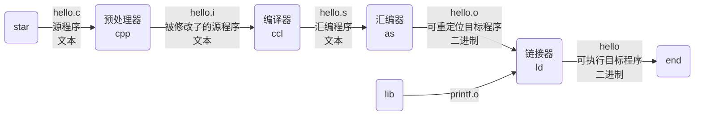

<h1 id="深入理解计算机系统" align="center">深入理解计算机系统</h1>

<!-- @import "[TOC]" {cmd="toc"} -->
<!-- code_chunk_output -->

- [1. 计算机系统漫游](#1-计算机系统漫游)
  - [1.1. 程序的编译过程：](#11-程序的编译过程)
  - [1.2. 系统硬件组成](#12-系统硬件组成)

<!-- /code_chunk_output -->


# 1. 计算机系统漫游

计算机系统是由硬件和系统软件组成的。
信息 = 位 + 上下文。
只由 ASCII 字符构成的文件称为文本文件，所有其他文件都称为二进制文件。

## 1.1. 程序的编译过程：

1. 预处理：将源程序中的 #include 替换为相应的头文件文本，生成以 .i 为后缀的程序文本文件。
2. 编译：将 C 语言程序文本文件翻译成汇编语言程序文本文件。
3. 汇编：将汇编语言程序文本文件翻译成机器语言指令，并打包为可重定位目标程序。
4. 链接：将使用到的外部库与目标程序合并，生成可执行目标文件。

**GCC 编译阶段**

| 选项 | 描述 |
| -    | -   |
| -E   | 预处理，开发过程中想快速确定某个宏可以使用 "-E -dM" |
| -S   | 预处理、编译 |
| -c   | 预处理、编译、汇编 |
| -o   | 指定输出文件 |
| -I   | 指定头文件目录(大写 i) |
| -l   | 指定链接到哪一个库文件(小写 L) |
| -L   | 指定链接时库文件目录 |

1. 编辑 hello.c 源文件 `vi hello.c`
```c
#include <stdio.h>

int main()
{
    printf("hello, world\n");
    return 0;
}
```

2. 预处理 `gcc -E hello.c -o hello.i`
```c
// 省略...
# 873 "/usr/include/stdio.h" 3 4

# 2 "hello.c" 2

# 3 "hello.c"
int main()
{
    printf("hello, world\n");
    return 0;
}
```

3. 编译 `gcc -S hello.i -o hello.s`
```assembly
        .file   "hello.c"
        .text
        .section        .rodata
.LC0:
        .string "hello, world"
        .text
        .globl  main
        .type   main, @function
main:
.LFB0:
        .cfi_startproc
        endbr64
        pushq   %rbp
        .cfi_def_cfa_offset 16
        .cfi_offset 6, -16
        movq    %rsp, %rbp
        .cfi_def_cfa_register 6
        leaq    .LC0(%rip), %rdi
        call    puts@PLT
        movl    $0, %eax
        popq    %rbp
        .cfi_def_cfa 7, 8
        ret
        .cfi_endproc
.LFE0:
        .size   main, .-main
        .ident  "GCC: (Ubuntu 9.3.0-17ubuntu1~20.04) 9.3.0"
        .section        .note.GNU-stack,"",@progbits
        .section        .note.gnu.property,"a"
        .align 8
        .long    1f - 0f
        .long    4f - 1f
        .long    5
0:
        .string  "GNU"
1:
        .align 8
        .long    0xc0000002
        .long    3f - 2f
2:
        .long    0x3
3:
        .align 8
4:
```

4. 汇编 `gcc -c hello.s -o hello.o`

5. 链接 `gcc hello.o -o hello`

6. 运行 `./hello`
```shell
hello, world
```

## 1.2. 系统硬件组成

- 总线
- I/O 设备
- 主存
- 处理器