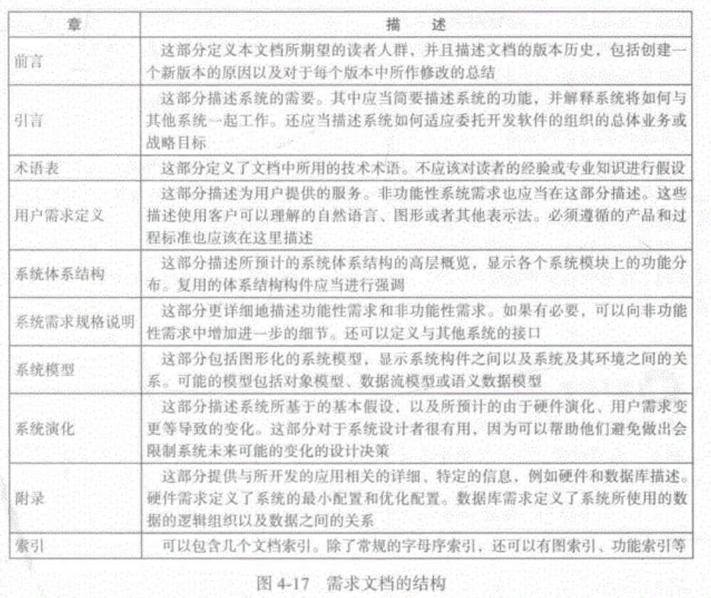

<h1 id="软件工程" align="center">软件工程</h1>
<!-- @import "[TOC]" {cmd="toc"} -->

<!-- code_chunk_output -->

- [1. 软件过程](#1-软件过程)
  - [1.1. 过程活动](#11-过程活动)
  - [1.2. 软件过程模型](#12-软件过程模型)
  - [1.3. 敏捷软件开发](#13-敏捷软件开发)
- [2. 需求工程](#2-需求工程)
  - [2.1. 可行性研究](#21-可行性研究)
  - [2.2. 用户需求与系统需求](#22-用户需求与系统需求)
  - [2.3. 功能性需求和与功能性需求](#23-功能性需求和与功能性需求)
  - [2.4. 需求工程过程](#24-需求工程过程)
  - [2.5. 需求规格说明](#25-需求规格说明)
- [3. 系统设计](#3-系统设计)
  - [3.1. 领域驱动设计 DDD: 读《使用 JPA 全面实现 DDD 持久化》有记](#31-领域驱动设计-ddd-读使用-jpa-全面实现-ddd-持久化有记)
    - [3.1.1. 对象的世界](#311-对象的世界)

<!-- /code_chunk_output -->

# 1. 软件过程

软件过程：软件产品生产的一组相互关联的活动。

## 1.1. 过程活动

1. 软件规格说明：软件的功能以及对于软件运行的约束必须在这里进行定义。
2. 软件开发：必须开发出符合规格说明的软件。
3. 软件确认：软件必须通过确认来确保软件所做的是客户所想要的。
4. 软件演化：软件必须通过演化来满足不断变化的客户需要。

## 1.2. 软件过程模型

**1. 瀑布模型**

```ditaa {cmd=true args=["-E"]}
+---------+
+ 需求定义 +----+
+---------+    |
   ^           |
   |           v
   |   +---------------+
   |   + 系统和软件设计 +-------+
   |   +---------------+       |
   |           ^               |
   |           |               v
   |           |        +---------------+
   |           |        + 实现与单元测试 +-----+
   |           |        +---------------+     |
   |           |               ^              |
   |           |               |              v
   |           |               |      +---------------+
   |           |               |      + 集成与系统测试 +----+
   |           |               |      +---------------+    |
   |           |               |              ^            |
   |           |               |              |            v
   |           |               |              |       +-----------+
   +-----------+---------------+--------------+-------+ 运行与维护 +
                                                      +-----------+
```

**2. 增量式开发**

**3. 集成与配置**


## 1.3. 敏捷软件开发

敏捷开发的核心是迭代开发。敏捷一定是采用迭代开发的方式。增量开发加上迭代开发，才算真正的敏捷开发。

**迭代开发（iterative development）**  
迭代开发将一个大任务，分解成多次连续的开发，本质就是逐步改进。  
每一次迭代都包含规划、设计、编码、测试、评估五个步骤。

**增量开发（incremental development）**  
增量开发指的是软件的每个版本，都会新增一个用户可以感知的完整功能。也就是说，按照新增功能来划分迭代。

**好处**  
- 早期交付，从而大大降低成本
- 降低风险，及时了解市场需求，降低产品不适用的风险

每个迭代大约持续2~6周。完成以下五个步骤：  
1. 需求分析（requirements analysis）
2. 设计（design）
3. 编码（coding）
4. 测试（testing）
5. 部署和评估（deployment / evaluation）

**《敏捷软件开发宣言》里面提到四个价值观。**  
- 程序员的主观能动性，以及程序员之间的互动，优于既定流程和工具。
- 软件能够运行，优于详尽的文档。
- 跟客户的密切协作，优于合同和谈判。
- 能够响应变化，优于遵循计划。

**该宣言还提出十二条敏捷开发的原则。**  
- 通过早期和持续交付有价值的软件，实现客户满意度。
- 欢迎不断变化的需求，即使是在项目开发的后期。要善于利用需求变更，帮助客户获得竞争优势。
- 不断交付可用的软件，周期通常是几周，越短越好。
- 项目过程中，业务人员与开发人员必须在一起工作。
- 项目必须围绕那些有内在动力的个人而建立，他们应该受到信任。
- 面对面交谈是最好的沟通方式。
- 可用性是衡量进度的主要指标。
- 提倡可持续的开发，保持稳定的进展速度。
- 不断关注技术是否优秀，设计是否良好。
- 简单性至关重要，尽最大可能减少不必要的工作。
- 最好的架构、要求和设计，来自团队内部自发的认识。
- 团队要定期反思如何更有效，并相应地进行调整

**理解**  
持续交付，持续迭代，需求分析和设计才是关键

# 2. 需求工程

## 2.1. 可行性研究

**可行性研究**：是一个应当在需求工程早期进行的简短、聚焦的研究。其应该回答以下问题：
1. 系统是否可以服务于组织的总体目标？
2. 系统是否可以在进度和预算范围内用当前的技术实现？
3. 系统是否可以与所使用的其他系统相集成？

## 2.2. 用户需求与系统需求

用户需求指高层的抽象需求；系统需求指关于系统应当做什么的详细描述：
1. **用户需求**使用自然语言和图形，陈述系统被期望向系统用户提供什么服务以及系统运行必须满足的约束。用户需求可以是对系统特征的大概陈述，也可以是关于系统功能的详细和精确的描述。
2. **系统需求**是对软件系统的功能、服务和运行约束的更详细的描述。系统需求文档（有时候被称为**功能规格说明**）应该精确定义要实现哪些东西。它可以是系统购买方和软件开发者之间合同的一部分。

- 用户需求的读者通常并不关心系统如何实现，可能是对系统的详细实现不感兴趣的管理人员。
- 系统需求的读者需要更精确地了解系统要做什么，因为他们关心系统将如何支持业务过程或者他们本身参与系统实现。

## 2.3. 功能性需求和与功能性需求

1. **功能性需求**。这些需求是对系统应该提供的服务、系统应该如何响应特定的输入、系统在特定的情形中应该如何表现等的陈述。在某些情况下，功能性需求还可以明确地陈述系统不应该做什么。
2. **非功能性需求**。这些需求是对系统提供的服务或功能的约束，包括时间性约束、对于开发过程的约束、标准规范中所施加的约束等。非功能性需求经常适用于系统整体而不是单个的系统特征或服务。

需求不是独立的，一个需求经常会产生其他需求，或对其他需求产生约束。

功能性需求将用户需求展开，是面向系统开发者描述的，应当详细描述系统功能，系统的输入、输出和异常。

非功能性需求类型：  
- 产品需求
  - 易用性需求
  - 效率需求
    - 性能需求
    - 空间需求
  - 可依赖性需求
  - 信息安全需求
- 组织需求
  - 环境需求
  - 运行需求
  - 开发需求
- 外部需求
  - 监管需求
  - 道德需求
  - 法律需求
    - 会计需求
    - 安全性、信息安全需求


## 2.4. 需求工程过程

1. 需求抽取和分析：通过与利益相关者交互发现需求。
2. 需求规格说明：将这些需求转化为标准格式。
3. 需求确认：检查需求是否实际上定义了客户所要的系统。

需求工程过程的输出是一个**系统需求文档**。

```
需求抽取     |    需求规格说明          |  需求确认         |
------------------------------------------------------------
开始         -->  业务需求规格说明        -->  可行性研究  --> 
用户需求抽取  -->  用户需求规格说明        -->  原型       --> 
系统需求抽取  -->  系统需求规格说明和建模  -->   评审       -->  输出：系统需求文档
```

## 2.5. 需求规格说明

需求规格说明是在需求文档中撰写用户和系统需求的过程。
理想情况下，用户和系统需求应当是清晰、无二义、易于理解、完整和一致的。

用户需求总是用自然语言描述的。
系统需求的表示方法有：自然语言、结构化自然语言、图形(UML等)、数学规格说明

- 自然语言
  > 3.2 系统 *必须* 每 10 分钟测量一次血糖，如果需要的话就供应一次胰岛素。(血糖的变化相对慢，因此不需要更频繁的测量；测量间隔时间过长的话会导致不必要的高血糖水平。)
  > 3.6 系统 *必须* 每分钟运行一次例行的自检，测试表 1 定义的条件，并执行表 1 中所定义的相关动作。(例行的自检可以发现硬件和软件问题并警告用户常规操作可能有问题)。

- 结构化自然语言
  > 胰岛素泵/控制软件/SRS/3.3.2
  > 功能 &emsp; 计算胰岛素剂量：安全的血糖水平。
  > 描述 &emsp; 当前测量的血糖水平在安全区间 3 ~ 7 个单位时，计算要供给的胰岛 素  的剂量。
  > 输入 &emsp; 当前血糖读数(r2)，前两个读数(r0 和 rl)。
  > 来源 &emsp; 当前读数来自传感器。其他读数来自存储。
  > 输出 &emsp; CompDose 要供给的胰岛素剂量。
  > 目的地 &emsp; 主控制环。
  > 动作 &emsp; 如果血糖水平稳定或在下降，或者虽然在升高但是上升率在下降，那么  CompDose 为 0。如果血糖水平在升高并且上升率也在增长，那么 CompDose 通过将  当前血糖水与前一血糖水平之差除以 4 并四舍五入来计算。如果结果为 0，那么将  CompDose为可以供应的最小的剂量(见图 4-14)
  > 覆求 &emsp; 有前两个读数、这样可以计算血糖永平的变化率。
  > 前置条件 &emsp; 胰岛索存储存有至少个所允许的最大单剂量胰岛素。
  > 后置条件 &emsp; r0 被 r1 替代面 r1 被 r2 替代
  > 副作用 &emsp; 无




# 3. 系统设计

## 3.1. 领域驱动设计 DDD: 读《使用 JPA 全面实现 DDD 持久化》有记

**三种编程范式**

- 结构化编程 Structured Programming
- 面向对象编程Object-oriented Programming
- 函数式编程 Functional Programming

结构化编程已经是明日黄花，函数式编程是后起之秀，而面向对象编程范式仍然是当今占统治地位的编程范式。


**四种业务逻辑组织模式**

- 事务脚本Transaction Script：面向过程的
- 表模块 Table Module：面向数据的
- 活动记录 Active Record：面向数据的
- 领域模型 Domain Model：面向对象的

任何企业软件的核心都是业务逻辑的组织和实现。
Martin Fowler 在著名的《企业应用架构模式》一书中对于业务逻辑的组织提出了这四种模式。


**两个世界**

面向对象的企业应用以领域模型而不是数据模型为核心进行分析、设计和实现。
领域模型中的领域对象，包括各种实体和值对象，持有企业数据并实现业务逻辑。
面向对象的核心特征是继承、封装和多态，而对象之间可以有依赖、关联、泛化、聚合和组合等关系，领域模型支持所有这些特征和关系。

面向对象的编程语言只有和面向对象的数据库才能配合无间。但是目前占统治地位的仍然是关系数据库系统。因此，面向对象的编程语言与关系数据库仍然是最优组合。

对象模型和关系模型是根据不同的理论，面向不同的意图设计的，两者在很多方面方凿圆枘，并不适配，这就是所谓的**对象-关系阻抗失配**（object/relational impedance mismatch）。

领域对象之间有四种关系：关联、泛化（继承）、聚合和组合；
而数据库核心对象是二维数据表，表与表之间只有一种关联关系。
在对象模型和关系模型之间存在**阻抗失配**。要将实体对象持久化到关系数据库中，需要编写大量的转换代码。


**Java 中数据持久化的发展**

在我们的软件应用中，数据持久化是一个不可或缺的、非常关键的部分，关系数据库是一个很好的数据存储标准。

- Java 的所有者 Sun Microsystems 为数据库访问制订过规范：**JDBC**（Java Database Connectivity）。
- 对 Java 持久化进行标准化的第二次尝试是 **EJB** 规范中的实体 Bean。
- 2002 年 Martin Fowler 出版了《Patterns of Enterprise Application Architecture》一书，针对数据持久化提出了**数据映射器模式**，建议通过数据映射器将领域模型映射到关系模型。
- 2001 年 11 月，澳大利亚程序员 Gavin King 开发了一个符合对象关系映射理论的好用的 Java 持久化框架：**Hibernate**。
- Java 的管理组织 JCP 以 Hibernate 为参考推出了 Java Persistence API（简称 **JPA**），正式将对象关系映射这种数据持久化的形式标准化、规范化，成为Java持久化的一个标准。

### 3.1.1. 对象的世界

**对象**

> 一个对象是一个具有状态、行为和标识符的实体。结构和行为类似的对象定义在它们共同的类中。
> Grady Booch《Object-Oriented Analysis and Design with Applications》

对象的**状态**包括这个对象的所有属性及属性的当前值。
系统中的所有对象都封装了某种状态，系统的所有状态都由对象所封装。

**行为**是对象在状态改变和消息传递方面的动作和反应的方式。换言之：对象的行为代表了它外部可见的活动。
对象的行为包括这个对象的所有操作（Operation）。
一个对象的行为是它的状态以及施加在它上面的操作的函数。操作（方法）执行结果由操作的参数值和对象的当前状态（属性值）共同决定。
一个对象的状态代表了它的行为的累积效果。

**标识符**是对象的一个属性，它区分这个对象与其他所有对象。


对象的属性值可以是简单值，也可以是对另一个外部对象的引用。对象的状态可以人为划分为两部分：一部分是由值类型的所有属性组成的内部状态，另一部分是由对象类型的所有属性组成的外部引用。


**数据只是实现业务规则的辅助手段**
从对象的用户的角度来说，我们真正关注的是对象的行为（方法），而不是它持有的数据（属性值）。**与数据相比，行为更加重要。数据存在的目的只是影响方法的执行结果。**

> 从上面的例子来看：我们根本不在乎Account对象中的balance字段的值是多少，甚至不关心Account类中是否存在balance字段，我们真正在乎的是：一个Account对象，无论历经多少次存取，只要未被冻结且取款总额不大于存款总额，就可以取款成功，否则取款失败。我们在Account类中定义balance字段的目的，只是为了实现这个业务规则的辅助手段。如果有其他方式可以达到同样的目标，我们完全可以不用在Account类中定义balance这个字段。

可以说，**以数据库为中心的增删改查开发范式在大多数情况下都是不合适的，以领域模型为中心的领域驱动设计才是更合适的开发范式。数据库是细枝末节，领域模型才是软件开发的核心。**


**领域模型**

领域模型（Domain Model）主要由实体（Entity，又称为引用对象）和值对象（Value Object）组成。
