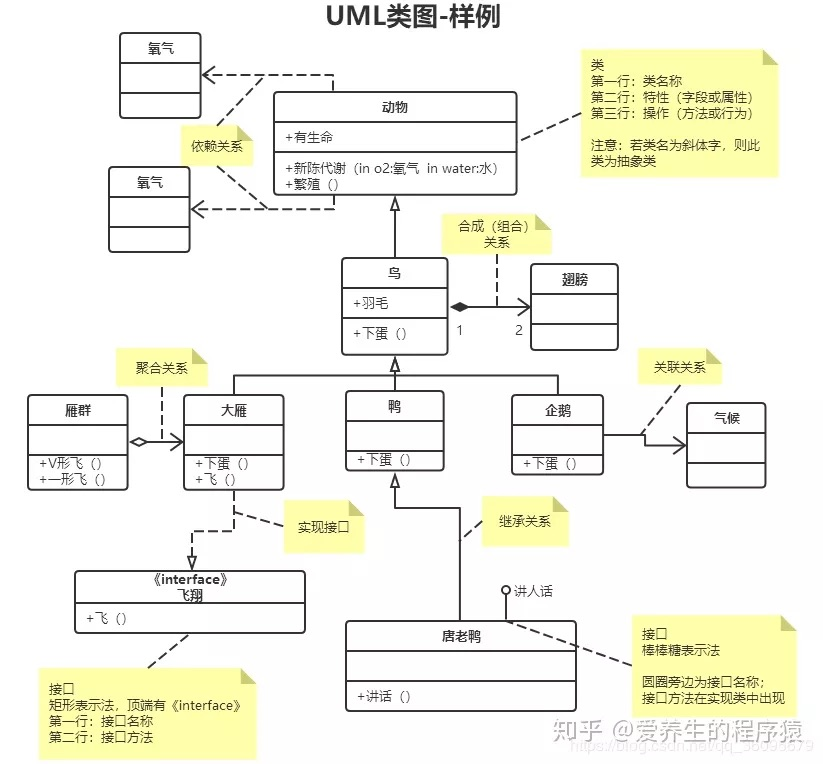
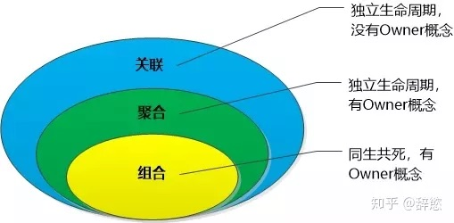
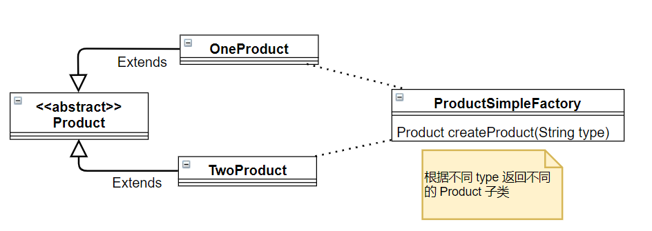
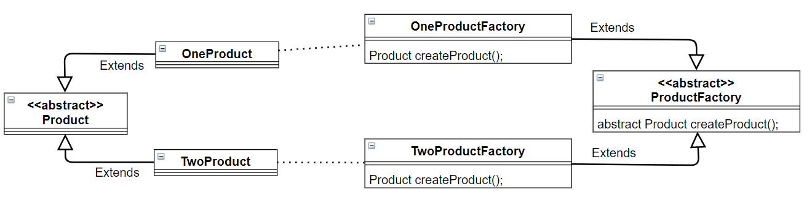
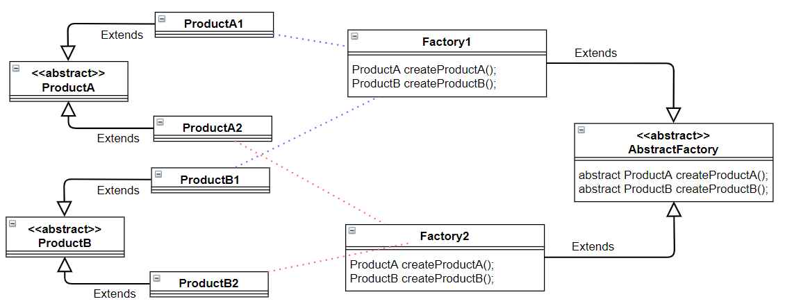
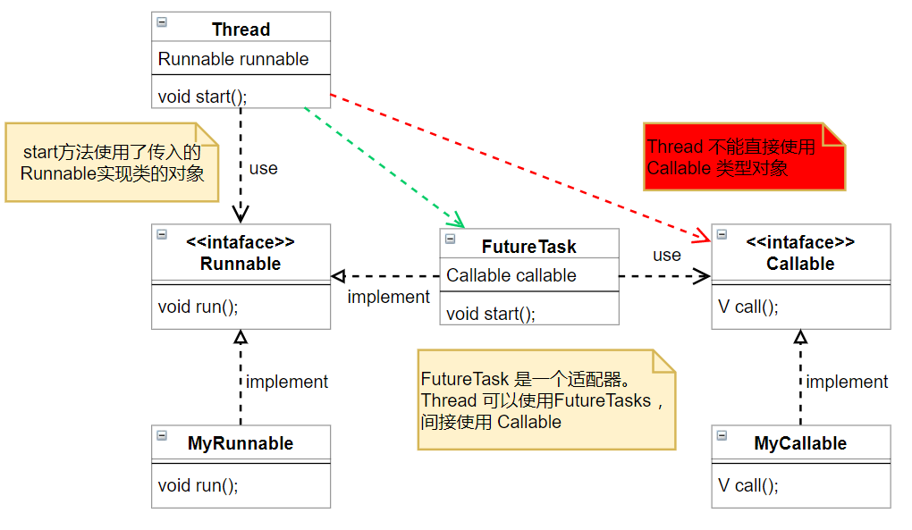
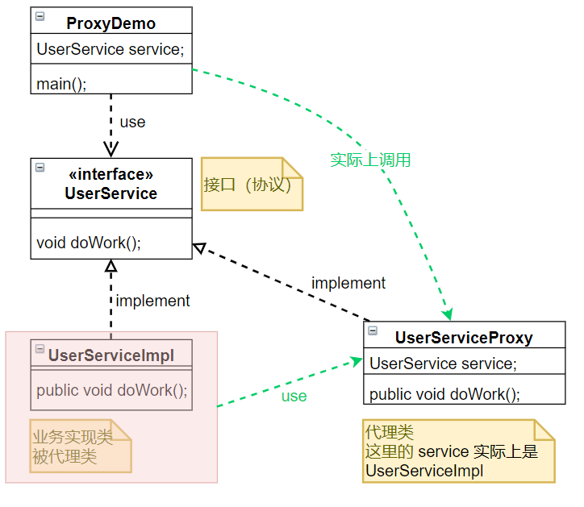

<h1 id="设计模式" align="center">设计模式</h1>
<!-- @import "[TOC]" {cmd="toc"} -->

<!-- code_chunk_output -->

- [1. UML 类图](#1-uml-类图)
- [2. OOP 五(七)大原则 SOLID](#2-oop-五七大原则-solid)
  - [2.1. SRP 单一职责原则](#21-srp-单一职责原则)
  - [2.2. OCP 开放封闭原则（Open Close Principle）](#22-ocp-开放封闭原则open-close-principle)
  - [2.3. LSP 里氏替换原则（Liskov Substitution Principle）](#23-lsp-里氏替换原则liskov-substitution-principle)
  - [2.4. LSP 迪米特法则（最少知道原则）（Demeter Principle）](#24-lsp-迪米特法则最少知道原则demeter-principle)
  - [2.5. ISP 接口隔离原则（Interface Segregation Principle）](#25-isp-接口隔离原则interface-segregation-principle)
  - [2.6. DIP 依赖倒置原则（Dependence Inversion Principle）](#26-dip-依赖倒置原则dependence-inversion-principle)
  - [2.7. CRP 合成复用原则（Composite Reuse Principle）](#27-crp-合成复用原则composite-reuse-principle)
- [3. 二十三种设计模式](#3-二十三种设计模式)
  - [3.1. 创建型模式](#31-创建型模式)
    - [3.1.1. 简单工厂模式（Simple Factory）](#311-简单工厂模式simple-factory)
    - [3.1.2. 工厂方法模式（Factory Method）](#312-工厂方法模式factory-method)
    - [3.1.3. 抽象工厂模式（AbstractFactory）](#313-抽象工厂模式abstractfactory)
    - [3.1.4. 建造者模式（Builder）](#314-建造者模式builder)
    - [3.1.5. 单例模式（Singleton）](#315-单例模式singleton)
      - [3.1.5.1. 单例模式的两种实现](#3151-单例模式的两种实现)
      - [3.1.5.2. 懒汉式线程不安全问题](#3152-懒汉式线程不安全问题)
      - [3.1.5.3. 线程不安全的解决方法](#3153-线程不安全的解决方法)
    - [3.1.6. 原型模式（Prototype）](#316-原型模式prototype)
  - [3.2. 结构型模式](#32-结构型模式)
    - [3.2.1. 适配器模式（Adapter）](#321-适配器模式adapter)
    - [3.2.2. 代理模式（Proxy）](#322-代理模式proxy)
      - [3.2.2.1. 静态代理](#3221-静态代理)
      - [3.2.2.2. 动态代理](#3222-动态代理)
    - [3.2.3. 桥接模式（Bridge）](#323-桥接模式bridge)
    - [3.2.4. 组合模式（Composite）](#324-组合模式composite)
    - [3.2.5. 装饰模式（Decorator）](#325-装饰模式decorator)
    - [3.2.6. 外观模式（Facade）](#326-外观模式facade)
    - [3.2.7. 享元模式（Flyweight）](#327-享元模式flyweight)
  - [3.3. 行为型模式](#33-行为型模式)
    - [3.3.1. 责任链模式（Chain Of Responsibility）](#331-责任链模式chain-of-responsibility)
    - [3.3.2. 命令模式（Command）](#332-命令模式command)
    - [3.3.3. 解释器模式（Interpreter）](#333-解释器模式interpreter)
    - [3.3.4. 迭代器模式（Iterator）](#334-迭代器模式iterator)
    - [3.3.5. 中介者模式（Mediator）](#335-中介者模式mediator)
    - [3.3.6. 备忘录模式（Memento）](#336-备忘录模式memento)
    - [3.3.7. 观察者模式（Observer）](#337-观察者模式observer)
    - [3.3.8. 状态模式（State）](#338-状态模式state)
    - [3.3.9. 策略模式（Strategy）](#339-策略模式strategy)
    - [3.3.10. 模板方法模式（Template Method）](#3310-模板方法模式template-method)
    - [3.3.11. 访问者模式（Visitor）](#3311-访问者模式visitor)
    - [3.3.12. 空对象模式（Null Object）](#3312-空对象模式null-object)

<!-- /code_chunk_output -->

# 1. UML 类图





# 2. OOP 五(七)大原则 SOLID

> http://www.uml.org.cn/sjms/201211023.asp

使用设计模式的目的：
1. 代码可重用性（相同功能的代码，不用多次编写）
2. 代码可读性（编程规范性，便于其他程序员的阅读和理解）
3. 可扩展性（当需要增加新的功能时，非常的方便，也称为可维护）
4. 可靠性（当我们增加新的功能后，对原来的功能没有影响）
5. 使程序高内聚低耦合

**软件编程的总的原则：低耦合，高内聚。**
开闭原则是总纲，它告诉我们要对扩展开放，对修改关闭；
里氏替换原则告诉我们不要破坏继承体系；
依赖倒置原则告诉我们要面向接口编程；
单一职责原则告诉我们实现类要职责单一；
接口隔离原则告诉我们在设计接口的时候要精简单一；
迪米特法则告诉我们要降低耦合度；
合成复用原则告诉我们要优先使用组合或者聚合关系复用，少用继承关系复用。

## 2.1. SRP 单一职责原则
当修改某个类时，有且仅有一个原因。即一个类只承担一种类型的职责，当这个类需要承担其他责任时要去分解这个类。

优点：提高类的内聚性、降低它们之间的耦合性。
- 降低类的复杂度。
- 提高类的可读性。
- 提高系统的可维护性。
- 变更引起的风险降低。

## 2.2. OCP 开放封闭原则（Open Close Principle）
对扩展开放，对修改关闭。在程序需要进行拓展的时候，不能去修改原有的代码，实现一个热插拔的效果。
当应用的需求改变时，在不修改软件实体的源代码或者二进制代码的前提下，可以扩展模块的功能，使其满足新的需求。

## 2.3. LSP 里氏替换原则（Liskov Substitution Principle）
任何基类可以出现的地方，子类一定可以出现。子类继承父类时，除添加新的方法完成新增功能外，尽量不要重写父类的方法。
里氏替换原则是继承复用的基石，不要滥用继承。
里氏代换原则是对开放封闭原则的补充。

## 2.4. LSP 迪米特法则（最少知道原则）（Demeter Principle）
一个实体应当尽量少的与其他实体之间发生相互作用，使得系统功能模块相对独立。

优点：
- 降低了类之间的耦合度，提高了模块的相对独立性。
- 由于亲合度降低，从而提高了类的可复用率和系统的扩展性。

## 2.5. ISP 接口隔离原则（Interface Segregation Principle）
使用多个隔离的接口，比使用单个接口要好。降低类之间的耦合度。

接口隔离原则和单一职责都是为了提高类的内聚性、降低它们之间的耦合性，体现了封装的思想，但两者是不同的：
- 单一职责原则注重的是职责，而接口隔离原则注重的是对接口依赖的隔离。
- 单一职责原则主要是约束类，它针对的是程序中的实现和细节；接口隔离原则主要约束接口，主要针对抽象和程序整体框架的构建。

## 2.6. DIP 依赖倒置原则（Dependence Inversion Principle）
真对接口编程，依赖于抽象而不依赖于具体。
高层模块不应该依赖低层模块，两者都应该依赖其抽象；抽象不应该依赖细节，细节应该依赖抽象。
依赖倒置原则是开闭原则的基础。

依赖倒置原则的主要作用如下：
- 依赖倒置原则可以降低类间的耦合性。
- 依赖倒置原则可以提高系统的稳定性。
- 依赖倒置原则可以减少并行开发引起的风险。
- 依赖倒置原则可以提高代码的可读性和可维护性。

## 2.7. CRP 合成复用原则（Composite Reuse Principle）
要求在软件复用时，要尽量先使用组合或者聚合等关联关系来实现，其次才考虑使用继承关系来实现。


# 3. 二十三种设计模式

创建型模式，共五种：**工厂方法模式**、抽象工厂模式、**单例模式**、**建造者模式**、原型模式。
结构型模式，共七种：**适配器模式**、装饰器模式、**代理模式**、外观模式、**桥接模式**、组合模式、享元模式。
行为型模式，共十一种：**策略模式**、**模板方法模式**、观察者模式、迭代器模式、**责任链模式**、命令模式、备忘录模式、状态模式、访问者模式、中介者模式、解释器模式。

## 3.1. 创建型模式

### 3.1.1. 简单工厂模式（Simple Factory）
如果我们有一系列的类需要创建实例，我们可以使用一个简单工厂，根据传入不同 type 来选择创建哪种类的实例。


```java
public class SimpleFactory {
    public static void main(String[] args) {
        ProductSimpleFactory simpleFactory = new ProductSimpleFactory();
        Product one = simpleFactory.createProduct("ONE");
        System.out.println(one.getName());
    }
}

// 产品公共基类
abstract class Product {
    public abstract String getName();
}
// 一系列的产品
class OneProduct extends Product {
    @Override
    public String getName() {
        return "第一种产品";
    }
}
class TwoProduct extends Product {
    @Override
    public String getName() {
        return "第二种产品";
    }
}
// ....

// 简单工厂
class ProductSimpleFactory {
    Product createProduct(String type) {
        switch (type) {
            case "ONE":
                return new OneProduct();
            case "TWO":
                return new TwoProduct();
        }
        return null;
    }
}
```

### 3.1.2. 工厂方法模式（Factory Method）
定义一个创建产品对象的工厂接口，将产品对象的实际创建工作推迟到具体子工厂类当中，由子类决定生产什么产品。

在简单工厂模式中，一个工厂可以生产多种不同的产品。而在工厂方法模式中，每种工厂只生产一种产品。


```java
public class Factory {
    public static void main(String[] args) {
        ProductFactory factory = new OneProductFactory();
        Product product = factory.createProduct();
        System.out.println(product.getName());
    }
}

// 产品公共基类
abstract class Product {
    public abstract String getName();
}
// 一系列的产品
class OneProduct extends Product {
    @Override
    public String getName() {
        return "第一种产品";
    }
}
class TwoProduct extends Product {
    @Override
    public String getName() {
        return "第二种产品";
    }
}
// ....

// 工厂公共基类
abstract class ProductFactory {
    abstract Product createProduct();
}
// 一系列的工厂
class OneProductFactory extends ProductFactory {
    @Override
    Product createProduct() {
        return new OneProduct();
    }
}
class TwoProductFactory extends ProductFactory {
    @Override
    Product createProduct() {
        return new TwoProduct();
    }
}
// ...
```

**Java 实例：java.util.Calendar**
```java
public abstract class Calendar implements Serializable, Cloneable, Comparable<Calendar> {
    public static Calendar getInstance()
    {
        return createCalendar(TimeZone.getDefault(), Locale.getDefault(Locale.Category.FORMAT));
    }
}
```


### 3.1.3. 抽象工厂模式（AbstractFactory）
是一种为访问类提供一个创建一组相关或相互依赖对象的接口，且访问类无须指定所要产品的具体类就能得到同族的不同等级的产品的模式结构。
结合简单工厂模式和工厂方法模式，现在有 n 系列的产品，每个系列中有 m 种产品，配备 m 种工厂来生产，每个工厂有 n 个创建方法。


```java
// A 系类产品
abstract class ProductA {
    public abstract String getName();
}
class ProductA1 extends ProductA {
    public String getName() {
        return "A1";
    }
}
class ProductA2 extends ProductA {
    public String getName() {
        return "A2";
    }
}
// B 系类产品
abstract class ProductB {
    public abstract Integer getAge();
}
class ProductB1 extends ProductB {
    public Integer getAge() {
        return 1;
    }
}
class ProductB2 extends ProductB {
    public Integer getAge() {
        return 2;
    }
}

// 工厂基类
abstract class AbstractFactory {
    abstract ProductA createProductA();
    abstract ProductB createProductB();
}

class Factory1 extends AbstractFactory {
    @Override
    ProductA createProductA() {
        return new ProductA1();
    }
    @Override
    ProductB createProductB() {
        return new ProductB1();
    }
}
class Factory2 extends AbstractFactory {
    @Override
    ProductA createProductA() {
        return new ProductA2();
    }
    @Override
    ProductB createProductB() {
        return new ProductB2();
    }
}
```

### 3.1.4. 建造者模式（Builder）
指将一个复杂对象的构造与它的表示分离，使同样的构建过程可以创建不同的表示，这样的设计模式被称为建造者模式。它是将一个复杂的对象分解为多个简单的对象，然后一步一步构建而成。它将变与不变相分离，即产品的组成部分是不变的，但每一部分是可以灵活选择的。

**Java 实例：StringBuilder**
这是简化的 StringBuilder，详细实现见 JDK 源码。
```java
public class StringBuilder {
    protected char[] value;
    protected int count;
    // 1. 初始化
    public StringBuilder(int capacity) {
        count = 0;
        value = new char[capacity];
    }
    // 2. 建造中
    public StringBuilder append(char c) {
        value[count++] = c;
        return this;
    }
    // 3. 返回结果
    public String toString() {
        return new String(value, 0, count);
    }
}

// 于是可以这样调用:
public static void main(String[] args) {
    String s = 
        new StringBuilder(5)
            .append('1')
            .append('2')
            .append('3')
            .append('4')
            .append('5')
            .toString();
    System.out.println(s);
}
```

Swagger 配置类：
```java
public class SwaggerConfiguration {
    private String title;
    private String description;
    private String version;
    private String basePackage;

    public Docket createRestFulApiDoc() {
        ApiInfo apiInfo = new ApiInfoBuilder()
                .title(title)
                .description(description)
                .version(version)
                .build();
        return new Docket(DocumentationType.SWAGGER_2)
                .apiInfo(apiInfo)
                .select()
                .apis(RequestHandlerSelectors.basePackage(basePackage))
                .paths(PathSelectors.any())
                .build();
    }
}
```


### 3.1.5. 单例模式（Singleton）

#### 3.1.5.1. 单例模式的两种实现

单例设计模式：在一个项目中某个类自始至终只有一个实例化的对象。
1. 单例类只有一个实例对象；
2. 该单例对象必须由单例类自行创建；
3. 单例类对外提供一个访问该单例的全局访问点；

单例模式设计主要有以下几个要点：
1. 私有化构造器。这是为了防止在类的外部通过 new 来实例化对象，防止多个对象实例出现。
2. 提供一个 public 方法来获取单例对象。如，```getInstance()``` 方法。
3. 类内部提供一个本类的引用。一是为了通过 ```getInstance()```方法 向外部提供单例对象，二是为了防止 GC 清理掉单例对象。

单例模式主要有两种：饿汉式、懒汉式。其中饿汉式是线程安全的；懒汉式是线程不安全的，但是延迟了对象创建时机，一定程度上节省了内存开销。下面通过代码来看一下这两种单例模式：

```java
/* 饿汉式 */
public class Singleton {
    public static final Singleton INSTANCE = new Singleton();
    private Singleton(){
    }
}
public enum Singleton {
    INSTANCE
}
public class Singleton {
    // 1.私有化构造器
    private Singleton () {}
    // 2.类内部创建一个本类的对象
    private static Singleton t = new Singleton();
    // 3.提供一个方法来获取实例对象
    public static Singleton getInstance() {
        return t;
    }
}
```
我们知道，类并不是一开始就在 JVM 的内存中的，只有当我们第一次使用一个类时，这个类才会被加载进内存。
饿汉式的单例模式，当类被加载时，会在 JVM 的方法区中的创建 static 变量，并执行 new 操作，产生单例对象。因为在整个程序运行过程中，一个类的加载只会执行一次，所以 ```new Singleton() ```只会被执行一次，因此饿汉式是线程安全的。

```java
/* 懒汉式（单线程版）  */ 
class Singleton {
    // 1.私有化构造器
    private Singleton() {}
    // 2.类内部创建一个本类的对象
    private static Singleton t = null;
    // 3.提供一个方法来获取实例对象
    public static Singleton getInstance() {
        if(t == null) {
            t = new Singleton();
        }
        return t;
    }
}
```
饿汉式的单例模式是在类被加载时创建单例对象；而懒汉式将对象的创建推迟到了第一次获取单例对象时。这种特性和数据库中的懒加载模式，以及 C# 中 EF 框架的延迟加载一样，都是将特定动作推迟到需要时进行。

#### 3.1.5.2. 懒汉式线程不安全问题

以上懒汉式的代码在第一次创建单例对象时是线程不安全的。当有多个线程同时获取单例对象时，就会发生创建多个实例的情况。看下面的测试代码：
```java
/* 懒汉式 线程不安全测试 */
public class SingletonTest{
    public static void main(String[] args) {
        for (int i = 0; i < 100; i++) {
            new Thread(
                () -> {
                    System.out.println(Singleton.getInstance());
                }    
            ).start();
        }
    }
}
```
运行结果：
 
可以看到，当第一次获取单例对象时，就会出现多个线程同时进入临界区的情况，导致创建了多个实例对象。而在之后便不会发生，因为直接走了`return t`。

#### 3.1.5.3. 线程不安全的解决方法

（1）最直接的解决方法是在方法上加同步关键字 **synchronized** ：
```java
public static synchronized Singleton getInstance() {
    if(t == null) {
        t = new Singleton();
    }
    return t;
}
```

这样虽然解决了线程不安全的问题，但是带来了同步的性能问题。实际上，只有在第一次创建对象时才会有线程不安全的问题，之后获取单例对象并不需要同步。

<!--
（2）也就是说，不是整个方法都是临界区，仅仅是创建对象的那条语句才是临界区。

```java
/* 注意：仅仅这样并不能解决线程不安全 */
public static Singleton getInstance() {
    if(t == null) {
        synchronized (Singleton.class) {  
            singleton = new Singleton(); /* 注意：仅仅这样并不能解决线程不安全 */
        }
    }
    return t;
}
```

那么，给 new 语句加上同步代码块就可以解决线程不安全问题了吗？**答案是：并不能！**

可以想象一些，当第一次有 n 个线程同时要获取单例对象时，这 n 个线程都进入了 if 语句块，之后能够进入 synchronized 语句块的只有第一个线程；其他线程都进入阻塞状态。当第一个线程创建并获取完对象离开后，第二个线程被唤醒，于是它便**进入临界区 (注意：该线程是在进入临界区之前被阻塞的，已经过了 if 判断)**，继续执行创建对象的代码。之后被唤醒的线程都会这样做。

从上面的分析中，不难发现，在临界区中少了一个条件判断，用于区分第一个线程和阻塞队列中的线程。所以在加上一个判断条件就可以了。
-->
（2）DCL 双重检查锁（double checked locking）
```java
class Singleton {
    // 1.私有化构造器
    private Singleton() {}
    // 2.类内部创建一个本类的对象
    // volatile 避免指令重排序
    private static volatile Singleton t = null;
    // 3.提供一个方法来获取实例对象
    public static Singleton getInstance() {
        if(t == null) {
            synchronized (Singleton.class) {  
                if (t == null) {  
                    t = new Singleton(); 
                }  
            }
        }
        return t;
    }
}
```
上述代码中，第一个 if 判断是用来区别第一批获取对象的线程(第一批是单例对象没有被创建，需要执行 new 代码)和之后获取单例对象的线程；第二个 if 判断是用来区别在第一批线程中，第一个线程和之后在阻塞队列中的线程。就是说我们需要保证只有真正意义上的第一个线程才能执行创建对象代码。

（3）还有一种方法来实现线程安全
```java
public class Singleton {  
    private static class Inner {  
       private static final Singleton INSTANCE = new Singleton();  
    }  
    private Singleton (){}  
    public static final Singleton getInstance() {  
       return Inner.INSTANCE;  
    }  
}
```
上面代码里的这种方法，在```Singleton```类中定义了一个内部类```Inner```，内部类和类一样只有在使用的时候才被加载。当第一次使用```Inner.INSTANCE```时创建单例对象。内部类的创建方法则和饿汉式一样是线程安全的，外部类的```getInstance()```方法并不自己创建单例对象，它将这个任务委托给内部类来完成。这种方法没有使用 synchronized 语句，不受同步带来的性能影响。

**Java 实例：java.lang.Runtime**
```java
public class Runtime {
    private static Runtime currentRuntime = new Runtime();
    private Runtime() {}
    public static Runtime getRuntime() {
        return currentRuntime;
    }
}
```


### 3.1.6. 原型模式（Prototype）
用一个已经创建的实例作为原型，通过复制该原型对象来创建一个和原型相同或相似的新对象。
**Java 实例：Object 中的 clone方法。**


## 3.2. 结构型模式

### 3.2.1. 适配器模式（Adapter）
将一个类的接口转换成客户希望的另外一个接口，使得原本由于接口不兼容而不能一起工作的那些类能一起工作。适配器模式分为类结构型模式和对象结构型模式两种，前者类之间的耦合度比后者高，且要求程序员了解现有组件库中的相关组件的内部结构，所以应用相对较少些。

**Java 实例: Runnalbe Callable**

Thread 只能接收 Runnable 接口，利用适配器 FutureTask 将 Callable 接口转换为了 Runnable 接口。


### 3.2.2. 代理模式（Proxy）
由于某些原因需要给某对象提供一个代理以控制对该对象的访问。这时，访问对象不适合或者不能直接引用目标对象，代理对象作为访问对象和目标对象之间的中介。
在不修改目标对象的功能前提下,对目标功能扩展.


#### 3.2.2.1. 静态代理

```java
public class ProxyDemo {
    public static void main(String[] args) {
        UserService userServiceImpl = new UserServiceImpl();
        UserService userServiceProxy = new UserServiceProxy(userServiceImpl);
        userServiceProxy.doWork();
    }
}
/**
 * 业务接口
 */
interface UserService {
    void doWork();
}
/**
 * 业务实现类（被代理类）
 */
class UserServiceImpl implements UserService {
    @Override
    public void doWork() {
        System.out.println("干业务");
    }
}
/**
 * 代理类
 */
class UserServiceProxy implements UserService {
    // 被代理类的实例（通过构造器注入）
    private UserService userService;
    public UserServiceProxy(UserService userService) {
        this.userService = userService;
    }
    // 增强方法
    @Override
    public void doWork() {
        System.out.println("先经手代理类");
        // 调用被代理类
        userService.doWork();
    }
}
```

#### 3.2.2.2. 动态代理

- 基于接口的动态代理  Proxy - JDK
- 基于子类的动态代理  Enhancer - cglib

JDK 代理接口
```java
import java.lang.reflect.Proxy;
/**
 * 被代理接口
 */
interface IProducer {
    void say();
}
public class ProxyDemo {
    public static void main(String[] args) {
        // 获取代理类 producer
        IProducer producer = (IProducer) Proxy.newProxyInstance(
                IProducer.class.getClassLoader(),
                new Class[]{IProducer.class},
                (proxy, method, args1) -> {
                    System.out.println("代理类");
                    return proxy;
                }
        );
        // 执行方法
        producer.say();
    }
}
// 输出：代理类
```

### 3.2.3. 桥接模式（Bridge）

将抽象与实现分离开来，使它们可以独立变化。通过提供抽象化和实现化之间的桥接结构，来实现二者的解耦。
例如我们不直接具体的操作硬件，而是引入操作系统这一抽象层。

```java
public class Bridge {
    public static void main(String[] args) {
        Hardware cpu = new CPU();
        OS windows = new Windows(cpu);
        windows.open();
        windows.runExe();
    }
}

// 操作系统属于抽象层
interface OS {
    // 开机
    void open();
    // 运行程序
    void runExe();
}

class Windows implements OS {
    private Hardware hardware;
    public Windows(Hardware hardware) {
        this.hardware = hardware;
    }
    @Override
    public void open() {
        System.out.println("Windows 开机");
        hardware.startUp();
        hardware.check();
    }
    @Override
    public void runExe() {
        System.out.println("Windows 运行程序");
        hardware.input();
        hardware.output();
    }
}

// 硬件是具体层
interface Hardware {
    // 启动
    void startUp();
    // 自检
    void check();
    // 输入
    void input();
    // 输出
    void output();
}
class CPU implements Hardware {
    @Override
    public void startUp() {
        System.out.println("CPU 启动");
    }
    @Override
    public void check() {
        System.out.println("CPU 自检");
    }
    @Override
    public void input() {
        System.out.println("CPU 输入");
    }
    @Override
    public void output() {
        System.out.println("CPU 输出");
    }
}
```

**Java 实例：JDBC**
JDBC 属于抽象层、具体的数据库是具体层面。Java 应用不直接操作具体数据库，而是面向 JDBC 编程。

### 3.2.4. 组合模式（Composite）

将对象组合成树形结构来表示【整体-部分】的层次关系，允许用户以相同的方式处理单独对象和组合对象。

**Java 实例：**
- java.util.Map 中的 putAll(Map) 和 put(K key, V value)
- java.util.List 中的 addAll(Collection) 和 add(E e)
- java.util.Set 中的 addAll(Collection) 和 add(E e)

### 3.2.5. 装饰模式（Decorator）

装饰器模式允许向一个现有的对象添加新的功能，同时又不改变其结构。它是**作为现有的类的一个包装**。

**Java 实例：**
- java.io.BufferedInputStream(InputStream)
- java.io.DataInputStream(InputStream)

### 3.2.6. 外观模式（Facade）

提供了一个统一的接口，用来访问子系统中的一群接口，从而让子系统更容易使用。

例如：Web 应用由众多模块与中间件组成，例如：数据库、缓存、各种业务模块。但是对外统一暴露 REST 接口。

### 3.2.7. 享元模式（Flyweight）

利用共享的方式来支持大量细粒度的对象，这些对象一部分内部状态是相同的。

**Java 实例：**
- java.lang.Integer
- java.lang.Boolean
- java.lang.Byte
- java.lang.Character
中的 valueOf(xxx)


## 3.3. 行为型模式

### 3.3.1. 责任链模式（Chain Of Responsibility）

将处理请求的对象连成一条链，并沿着这条链发送该请求，使得链上的每个对象都可以处理请求。
对请求的发送者和接收者进行解耦。

**Java 实例：**
- 过滤器 javax.servlet.Filter


### 3.3.2. 命令模式（Command）

将一个请求封装成一个对象，将命令放入队列中进行排队。

**Java 实例：**
- 线程 Thread：封装的对象是 Runnable 实现类对象
- 另外，还有 Redux

### 3.3.3. 解释器模式（Interpreter）


### 3.3.4. 迭代器模式（Iterator）

顺序访问集合对象的元素，而不需要知道集合对象的底层表示

**Java 实例：**
- java.util.Iterator

### 3.3.5. 中介者模式（Mediator）

命令模式中，要操作线程(Thread)，让线程为我们完成工作，还需要自己给具体的一个线程发送命令(Runnable)。
而中介者模式中，我们把命令(Runnable)交给线程池(中介者)，再由线程池交给具体的线程处理任务。

**Java 实例：**
- java.util.concurrent.ExecutorService 的 execute()、submit()

### 3.3.6. 备忘录模式（Memento）

备忘录模式用于保存和恢复对象的状态。


### 3.3.7. 观察者模式（Observer）

当一个对象被修改时，则会自动通知它的依赖对象。

**Java 实例：**
javax.servlet.http.HttpSessionListener


### 3.3.8. 状态模式（State）

允许对象在内部状态改变时改变它的行为，对象看起来好像修改了它所属的类。

### 3.3.9. 策略模式（Strategy）

定义一系列的算法，把它们一个个封装起来，并且使它们可相互替换。

**Java 实例：**
java.util.Comparator#compare()


### 3.3.10. 模板方法模式（Template Method）

定义公共框架，并将一些步骤的实现延迟到子类。

**Java 实例：**
- java.util.AbstractList

### 3.3.11. 访问者模式（Visitor）


### 3.3.12. 空对象模式（Null Object）

使用什么都不做的空对象来代替 null