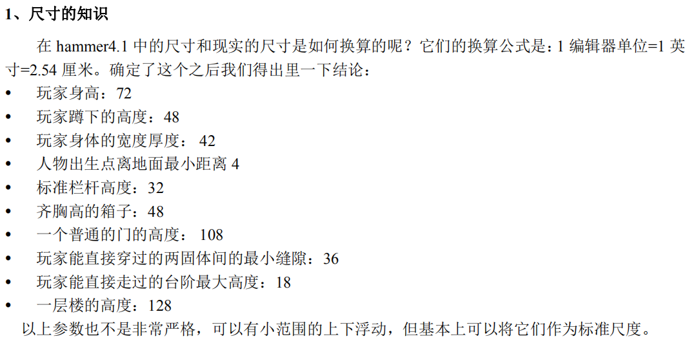

<h1 id="CSMap" align="center">CSGO 地图制作</h1>

# 1. 地图

**开发工具**
在 Steam 上下载 Counter-Strike: Global Offensive - SDK

**地图的基本构成：**
1. 密闭的空间
2. 出生点
3. 购买区域
4. 光线

**常用尺寸**



**如何运行？**
地图编译完成后，会自动将 .bsp 文件拷贝到 CSGO 的地图目录下。
只要进入游戏，输入指令即可进入地图。
```csgo
map <地图名>
map box
```