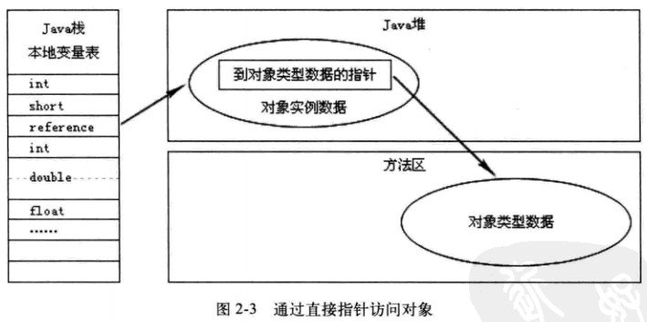
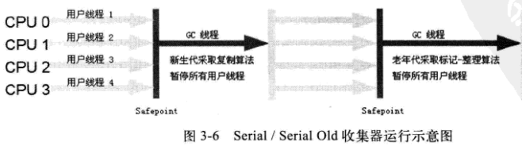
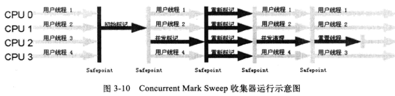
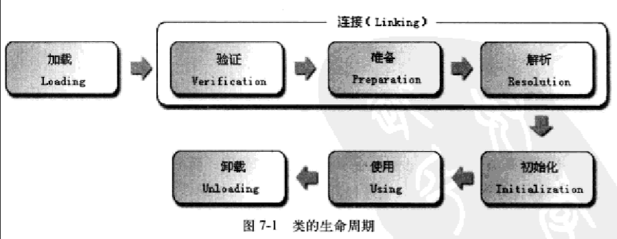
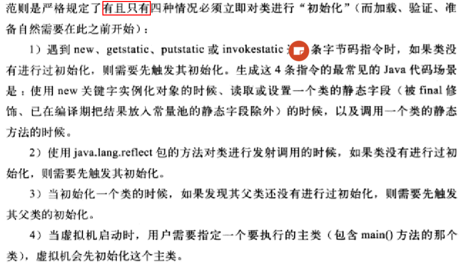
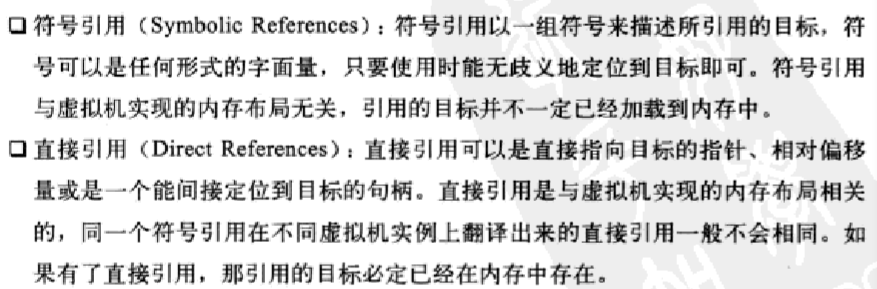
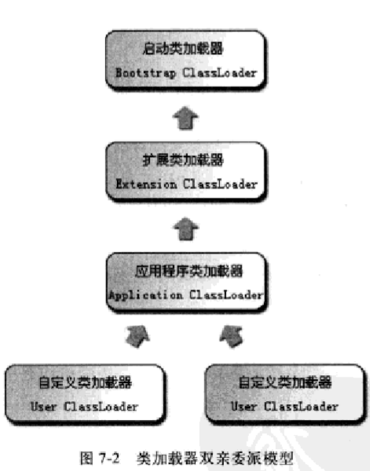
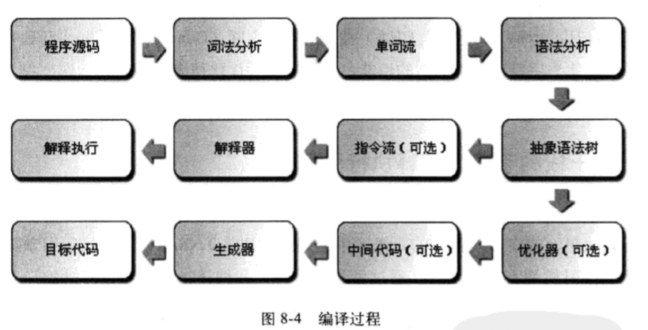

- [1 Java 内存区域](#1-java-内存区域)
    - [1.1 JVM 运行时数据区](#11-jvm-运行时数据区)
        - [1.1.1 程序计数器 Program Counter Register](#111-程序计数器-program-counter-register)
        - [1.1.2 虚拟机栈 Java Virtual Machine Stacks](#112-虚拟机栈-java-virtual-machine-stacks)
        - [1.1.3 本地方法栈 Native Method Stacks](#113-本地方法栈-native-method-stacks)
        - [1.1.4 堆 Heap](#114-堆-heap)
        - [1.1.5 方法区 Method Area](#115-方法区-method-area)
        - [1.1.6 运行时常量池](#116-运行时常量池)
    - [1.2 对象访问](#12-对象访问)
- [2 垃圾回收机制 GC](#2-垃圾回收机制-gc)
    - [2.1 如何判断对象已死](#21-如何判断对象已死)
        - [2.1.1 引用计数法 Reference Counting（Java 并不是）](#211-引用计数法-reference-countingjava-并不是)
        - [2.1.2 根搜索算法 GC Roots Tracing](#212-根搜索算法-gc-roots-tracing)
    - [2.2 引用](#22-引用)
        - [2.2.1 强引用](#221-强引用)
        - [2.2.2 软引用](#222-软引用)
        - [2.2.3 弱引用](#223-弱引用)
        - [2.2.4 虚引用](#224-虚引用)
    - [2.3 GC 是如何回收对象](#23-gc-是如何回收对象)
        - [2.3.1 finalize()方法](#231-finalize方法)
        - [2.3.2 方法区垃圾回收](#232-方法区垃圾回收)
    - [2.4 垃圾收集算法](#24-垃圾收集算法)
        - [2.4.1 标记 — 清除算法](#241-标记--清除算法)
        - [2.4.2 复制算法](#242-复制算法)
        - [2.4.3 标记 — 整理算法](#243-标记--整理算法)
        - [2.4.4 分代收集算法](#244-分代收集算法)
    - [2.5 垃圾收集器](#25-垃圾收集器)
        - [2.5.1 Serial](#251-serial)
        - [2.5.2 ParNew](#252-parnew)
        - [2.5.3 Parallel Scavenge](#253-parallel-scavenge)
        - [2.5.4 Serial Old](#254-serial-old)
        - [2.5.5 Parallel Old](#255-parallel-old)
        - [2.5.6 CMS](#256-cms)
        - [2.5.7 G1](#257-g1)
    - [2.6 内存分配策略](#26-内存分配策略)
- [3 类文件结构](#3-类文件结构)
    - [3.1 Class 类文件结构](#31-class-类文件结构)

# 1 Java 内存区域

## 1.1 JVM 运行时数据区


### 1.1.1 程序计数器 Program Counter Register

类似于计算机组成原理中的程序计数器 PC。它的作用可以看作是当前线程所执行的字节码的行号指示器。唯一一个不会导致内存泄漏的内存区域。

程序计数器是线程私有的，各个线程之间独立拥有一个程序计数器，互不影响。

### 1.1.2 虚拟机栈 Java Virtual Machine Stacks

线程私有的

会产生```StackOverflowError```和```OutOfMemoryError```错误。

设置JVM参数 **-Xss228k**（栈大小为228k）

### 1.1.3 本地方法栈 Native Method Stacks

会产生```StackOverflowError```和```OutOfMemoryError```错误。

程序计数器、虚拟机栈、本地方法栈随线程而生而灭。

本地方法栈是为 JVM 运行 Native 方法准备的空间，由于很多 Native 方法都是用 C 语言实现的，所以它通常又叫 **C 栈**。它与 Java 虚拟机栈实现的功能类似，只不过本地方法栈是描述本地方法运行过程的内存模型。

### 1.1.4 堆 Heap

被所有线程所共享的，再虚拟机启动时被创建。

用于存放对象实例。

堆是垃圾收集器管理的主要区域。也被称为 GC 堆。

可以细分为：新生代和老年代。

**-Xms20M  -Xmx20M**（前者表示初始堆大小20M，后者表示最大堆大小20M）

会产生```OutOfMemoryError```错误。

### 1.1.5 方法区 Method Area

被所有线程所共享的。

用于存储：已被虚拟机加载的类信息、常量、静态变量、即时编译器编译后的代码等。

别名：Non-Heap

会产生```OutOfMemoryError```错误。

### 1.1.6 运行时常量池

属于方法区的一部分，用于存放：编译期生成的各种字面量和符号引用

会产生```OutOfMemoryError```错误。

### 1.1.7 直接内存

直接内存是除 Java 虚拟机之外的内存，但也可能被 Java 使用。

## 1.2 对象访问

1. 句柄
   

2. 直接指针




# 2 垃圾回收机制 GC

## 2.1 如何判断对象已死

### 2.1.1 引用计数法 Reference Counting（Java 并不是）

微软的 COM 是

算法：给对象添加一个引用计数器，每次被引用时，计数器自增；当引用失效时，计数器自减。计数器的值为0的对象不能被再次使用。

无法解决：对象之间相互循环引用的问题。

### 2.1.2 根搜索算法 GC Roots Tracing

Java、C#、Lisp 是

算法：通过一系列名为 "GC Roots" 的对象作为起点，开始向下搜索。当从 GC Roots 到一个对象不可达时，则该对象是不可用的。这就解决了对象之间形成闭环的问题。

GC Roots 包括：

1. 虚拟机栈中的引用的对象
2. 本地方法栈中 JNI 的引用的对象
3. 方法区中类静态属性引用的对象
4. 方法区中常量引用的对象

**【我的思考】：那么对于单例对象呢？自身形成闭环怎么处理的。**

答：单例对象由自身类的静态属性所引用。

## 2.2 引用

### 2.2.1 强引用

像 ```Integer i = new Integer()```这种的。

GC 永远也不会回收强引用的对象。

### 2.2.2 软引用

再系统将要内存溢出时，不会马上回收软引用的对象，只会把软引用的对象列入第二次回收的清单当中。如果第一次回收结束后还是没有足够内存，会进行第二次回收，回收软引用对象。

JDK 1.2 之后，使用 ```SoftReference``` 类来实现

### 2.2.3 弱引用

弱引用的对象会在接下来的一次垃圾回收的时候被清理掉。

JDK 1.2 之后，使用 ```WeakReference``` 类来实现

### 2.2.4 虚引用

**虚引用和上述三者不是并列关系**，前三者和对象的生命周期密切相关。而虚引用的目的是为了在这个对象被回收时得到一个系统消息，不会改变对象的生命周期。

JDK 1.2 之后，使用 ```PhantomReference``` 类来实现


## 2.3 GC 是如何回收对象

### 2.3.1 finalize()方法

当一个对象没有重写```finalize()```方法，或者```finalize()```方法已经被执行过一次 都不会执行```finalize()```方法。

任何一个对象的```finalize()```方法都只会被系统自动调用一次，在下一次垃圾回收时```finalize()```方法不会被再次执行。

### 2.3.2 方法区垃圾回收

主要回收：废弃常量 和 无用的类

判断是否为废弃常量：

1. 该类所有的实例都已不存在
2. 加载该类的 ClassLoader 已经被回收
3. 该类对于的 Class 对象没有在任何地方被引用，无法通过反射来访问该类

## 2.4 垃圾收集算法

### 2.4.1 标记 — 清除算法

算法：先标记出需要回收的对象，然后统一回收所有被标记的对象。

缺点：

1. 标记和清除的效率都不高
2. 清除之后会产生大量不连续的内存碎片

### 2.4.2 复制算法

算法：将可用内存分为等量的两块，每次只在其中一块内存上分配对象的空间，另一块内存全部未使用。当第一块内存用完之后，把还需要的对象依次拷贝到第二块内存中，然后把第一块内存全部回收。

解决了：内存碎片的问题

优点：实现简单、运行高效

缺点：将可用内存缩小为了原来的一半

用来回收新生代，将内存分为一块较大的和两块较小的。每次使用一块大的和一块小的，回收时，将需要的对象拷贝到另一块小的上面，清理另外两块。比例默认是 8 : 1 : 1。

### 2.4.3 标记 — 整理算法

算法：先标记出要被回收的对象，然后将所有存活的对象都向堆的一边移动，清理掉边界之外的内存。

**很像数组中删除中间某个元素：后一个元素不断往前拷贝，最后一个元素置为 null。**

### 2.4.4 分代收集算法

算法：将内存分为新生代和老年代。新生代中的对象存活期短，每次标记时会有大量对象死去，采用复制算法清理；老年代对象存活较久，可以使用 标记 — 清除算法 或 标记 — 整理 算法。

## 2.5 垃圾收集器


连线表示两个收集器可以搭配使用。

### 2.5.1 Serial

新生代、单线程 的收集器。在它工作时必须暂停其他线程（Stop The World）。

优点：简单高效

适合：Client 模式下新生代收集器。



### 2.5.2 ParNew

Serial 的多线程版本。也会有 Stop The World。

适合：Server 模式下新生代收集器。


### 2.5.3 Parallel Scavenge

使用复制算法、并行的 多线程、新生代 收集器。

目标：达到一个可控制的吞吐量，吞吐量 = 运行用户代码时间 / (运行用户代码时间 + 垃圾收集时间)。即就是，尽可能缩短垃圾回收的时间。


### 2.5.4 Serial Old

Serial 的老年代版本，单线程，使用 标记 — 整理 法。

适合：Client 模式下老年代收集器，jdk 1.5 以及之前 Server 模式和 Parallel Scavenge 搭配，作为 CMS 的后备。


### 2.5.5 Parallel Old

Parallel Scavenge 的老年代版本，多线程，使用 标记 — 整理 法。


### 2.5.6 CMS

以获得最短回收停顿时间为目标，基于 标记 — 清除 算法。

四个步骤：

1. 初始标记：标记一下 GC Roots 能够直接关联到的对象（速度很快）
2. 并发标记：执行 GC Roots Tracing
3. 重新标记：修正并发标记期间，因用户程序运行而产生的变动（比初始标记稍长，但远短于并发标记的时间）
4. 并发清除

初始标记 和 重新标记 仍然会 Stop The World。

优点：并发收集、低停顿

缺点：

- CMS 对 CPU 资源非常敏感
- 无法处理浮动垃圾
- 使用了 标记 — 清除 算法，会产生大量内存碎片



### 2.5.7 G1

相对CMS的改进：

- 基于 标记 — 整理 算法
- 它可以非常准确地控制停顿

## 2.6 内存分配策略

1. **对象优先分配在新生代**

2. **需要大量连续内存的对象分配到老年代**
3. **长期存活的对象将进入老年代**

当一个对象在新生代每经过一次 GC，年龄加一，当到15岁时进入老年代。

4. **动态年龄判定**

当新生代中相同年龄的对象大小之和大于内存空间一半时，年龄大于或等于该年龄的对象直接进入老年代。

5. **空间分配担保**


# 3 类文件结构

## 3.1 Class 类文件结构

Java 虚拟机具有语言无关性。只要是符合 Java 虚拟机规范的字节码文件，就可以被虚拟机执行。

Java 虚拟机具有平台无关性。不同操作系统上都有相应的虚拟机版本。


1. 魔数：Class 文件前4字节，用来标识 Class 文件。值为，0xCAFEBASE。

2. 版本号：接下来的4字节，第5、6字节是次版本号，第7、8字节是主版本号。
3. 常量池入口：紧后的2字节

常量池中存放：字面量和符号引用；符号引用包括：类和接口的全限定名、字段的名称和描述符

、方法的名称和描述符。


# 4 类加载机制

## 4.1 类的生命周期

类的整个生命周期 (7阶段)：加载 (Loading)、验证 (Verification)、准备 (Preparation)、解析 (Resolution)、初始化 (Initialization)、使用 (Using)、卸载 (Unloading)。

 

## 4.2 触发类的初始化



## 4.3 类加载的过程

(1) 加载阶段，虚拟机要完成以下3件事情：

1. 通过类的全限定名，获取其二进制字节流
2. 将该字节流的静态存储结构转化为方法区的运行时数据结构
3. 在堆中生成一个代表该类的 java.lang.Class 对象，作为方法区的数据的访问入口

(2) 验证阶段，四个验证

1. 文件格式验证
2. 元数据验证
3. 字节码验证
4. 符号引用验证

(3) 准备阶段：为类变量分配内存并设置初始值

(4) 解析阶段：将常量池中的符号引用替换为直接引用的过程



(5) 解析阶段

1. 类或接口的解析
2. 字段解析
3. 类方法解析
4. 接口方法解析

(6) 初始化阶段：类加载的最后一步


## 4.4 类加载器

###  双亲委派模型

Java虚拟机角度分：两种不同的类加载器：

1. 启动类加载器 (Bootstrap ClassLoader)，由C++实现，是虚拟机自身的一部分
2. 所有其他的类加载器，由Java实现，独立于虚拟机之外，全部继承自java.lang.ClassLoader

程序员角度分：三种系统提供的类加载器：

1. 启动类加载器 (Bootstrap ClassLoader)
2. 拓展类加载器 (Extension ClassLoader)
3. 应用程序类加载器 (Application ClassLoader)



双亲委派模型要求除了启动类加载器外，其余的都需要有父类加载器。但不会使用继承，而是使用组合关系来实现。

双亲委派的工作过程：当一个类收到了类加载请求时，会先委派给父类加载器去完成，每层都会传递加载请求。只有当父类加载器无法完成时，子类加载器才会尝试去做。

# 5 虚拟机字节码执行引擎

1. 解释执行：通过解释器执行
2. 编译执行：通过即时编译器产生本地代码执行

## 5.1 运行时栈帧结构

栈帧是虚拟机运行时数据区中的虚拟机栈的栈元素。

栈帧中存储了：方法的局部变量表、操作数栈、动态链接、方法返回地址等信息。

当前栈帧：栈顶的栈帧。所关联的方法称为当前方法


局部变量表的容量以变量槽为最小单位。

退出方法的两种方式：

1. 正常完成出口：遇到方法返回的字节码指令
2. 异常完成出口：遇到异常，且异常没有在方法中处理

## 5.2 方法调用

方法调用并不等于方法执行。方法调用阶段的唯一任务是：确定被调用方法的版本，即调用哪一个方法。

1. 解析：编译器可知，运行期不可变 — 静态方法和私有方法
2. 分派：
   - 静态分派：所有依赖静态类型来定位方法执行版本的分派动作，方法重载。静态分派发生在编译器。
   - 动态分派：方法重写
   - 单分派与多分派：

方法的宗量：方法的接收者与方法的参数统称为方法的宗量。

Java 语言：静态多分派，动态单分派。

C# 3.0 以前和 Java 一样，4.0 引入了 dynamic 类型后，实现了动态多分派。



## 5.3 基于栈的指令集和基于寄存器的指令集

Java 编译器输出的指令流基本上是一种基于栈的指令集架构。

基于栈：

​	优点：可移植性，代码相对更紧凑，编译器实现更简单

​	缺点：执行速度相对稍慢