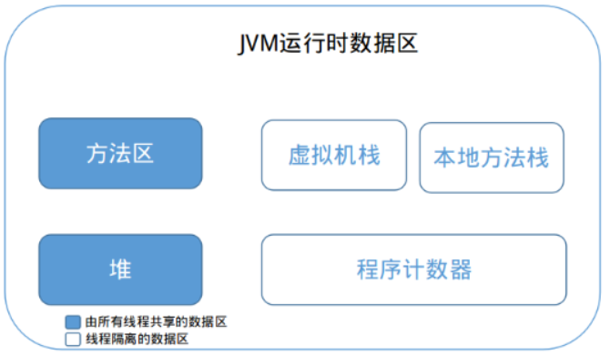
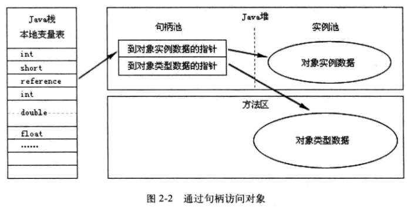

# 1 Java 内存区域

## 1.1 JVM 运行时数据区



### 1.1.1 程序计数器 Program Counter Register

类似于计算机组成原理中的程序计数器 PC。它的作用可以看作是当前线程所执行的字节码的行号指示器。唯一一个不会导致内存泄漏的内存区域。

程序计数器是线程私有的，各个线程之间独立拥有一个程序计数器，互不影响。

### 1.1.2 虚拟机栈 Java Virtual Machine Stacks

线程私有的

会产生```StackOverflowError```和```OutOfMemoryError```错误。

设置JVM参数 **-Xss228k**（栈大小为228k）

### 1.1.3 本地方法栈 Native Method Stacks

会产生```StackOverflowError```和```OutOfMemoryError```错误。

程序计数器、虚拟机栈、本地方法栈随线程而生而灭。

### 1.1.4 堆 Heap

被所有线程所共享的，再虚拟机启动时被创建。

用于存放对象实例。

堆是垃圾收集器管理的主要区域。也被称为 GC 堆。

可以细分为：新生代和老年代。

**-Xms20M  -Xmx20M**（前者表示初始堆大小20M，后者表示最大堆大小20M）

会产生```OutOfMemoryError```错误。

### 1.1.5 方法区 Method Area

被所有线程所共享的。

用于存储：已被虚拟机加载的类信息、常量、静态变量、即时编译器编译后的代码等。

别名：Non-Heap

会产生```OutOfMemoryError```错误。

### 1.1.6 运行时常量池

属于方法区的一部分，用于存放：编译期生成的各种字面量和符号引用

会产生```OutOfMemoryError```错误。

## 1.2 对象访问

1. 句柄


2. 直接指针

