- [1 Java 简介](#1-java-简介)
    - [1.1 Java语言版本迭代](#11-java语言版本迭代)
    - [1.2 JDK JRE JVM 三者间的关系](#12-jdk-jre-jvm-三者间的关系)
    - [1.3 Hello World 程序](#13-hello-world-程序)
    - [1.4 注释](#14-注释)
- [2 变量](#2-变量)
    - [2.1 变量的声明和赋值](#21-变量的声明和赋值)
    - [2.2 Java 变量的分类](#22-java-变量的分类)
        - [2.2.1 按数据类型分](#221-按数据类型分)
        - [2.3.2 按声明位置分](#232-按声明位置分)
    - [2.3 变量间的运算](#23-变量间的运算)
        - [2.3.1 基本数据类型间的运算（不包括boolean）](#231-基本数据类型间的运算不包括boolean)
        - [2.3.2 基本数据类型和String间的运算](#232-基本数据类型和string间的运算)
- [3 标识符和关键字](#3-标识符和关键字)
    - [3.1 关键字和保留字](#31-关键字和保留字)
    - [3.2 标识符](#32-标识符)
- [4 运算符](#4-运算符)
    - [4.1 算术运算符](#41-算术运算符)
    - [4.2 赋值运算符](#42-赋值运算符)
    - [4.3 关系运算符（比较运算符）](#43-关系运算符比较运算符)
    - [4.4 逻辑运算符](#44-逻辑运算符)
    - [4.5 位运算符](#45-位运算符)
        - [4.5.1 进制](#451-进制)
        - [4.5.2 原码 反码 补码](#452-原码-反码-补码)
        - [4.5.3 位运算](#453-位运算)
    - [4.6 三元运算符](#46-三元运算符)
    - [4.7 运算符的优先级](#47-运算符的优先级)

# 1 Java 简介

## 1.1 Java语言版本迭代

1995年发布JDK1.0；JDK1.5开始改名为JDK5.0,以后都是6.0，7.0 …。

JavaSE（J2SE）：Java核心API + 桌面级应用开发

JavaEE（J2EE）：企业级开发（Web应用）

JavaME（J2ME）：移动端应用开发

## 1.2 JDK JRE JVM 三者间的关系

JDK = JRE + Java开发工具集

JRE = JVM + Java SE 标准类库

## 1.3 Hello World 程序

(1) **创建**：创建一个以.java结尾的文件

(2) **编辑**：

``` java  
public class HelloWorld {    
    public  static void main(String[] args) {        
        System.out.println("hello, world");    
    }  
} 
```

(3) **编译**：javac 源文件名.Java     可以生成一个或多个字节码文件（有几个类就有几个字节码文件）

(4) **运行**：java 字节码文件名（注意：不要.class拓展名）

说明：

1. 一个源文件中可以由多个类，但是只能有一个public类；

2. public类的名字必须和源文件名一样

## 1.4 注释

(1) **单行注释**：//

(2) **多行注释**：/* */

​    多行注释不能被嵌套使用

(3) **文档注释**：/** */

javadoc -d 目标路径 -author -version 源文件名.java


# 2 变量

## 2.1 变量的声明和赋值

第一种：声明变量，同时赋值

```java
// 一个变量  
int a = 1;  
// 多个变量  
int a = 1, b = 2, c = 3;  
```

第二种：先声明后赋值

```java
// 一个变量  
int a;  
a = 2;  
// 多个变量  
int a, b, c;  
a = b = c = 10;  
```

说明：

1.  变量的作用域：声明变量所在的那对大括号内；

2.  在同一个作用域内，变量命不允许重复；

3.  变量应该先声明后使用；

4.  同一个变量可以被多次赋值，后一次赋值覆盖前一次赋值。

## 2.2 Java 变量的分类

### 2.2.1 按数据类型分

(1) 整数类型：byte、short、int、long

​	Java的整数类型有固定的表数范围和字段长度，不受具体的操作系统的影响，以保证Java程序的可移植性。

​	Java整型常量默认为int类型，long类型常量必须在末尾加上“l”或者“L”。

| **类型** | **占用的存储空间** | **表数范围**             |
| -------- | ------------------ | ------------------------ |
| byte     | 1字节              | -128 ~ 127               |
| short    | 2字节              | -32768 ~ 32767           |
| int      | 4字节              | -2147483648 ~ 2147483647 |
| long     | 8字节              | -2^63  ~ 2^63-1          |

(2) 浮点类型：float、double

​	Java的浮点类型有固定的表数范围和字段长度，不受具体的操作系统的影响，以保证Java程序的可移植性。

​	Java浮点型常量默认为double类型（也可以在末尾加上“d”或者“D”），float类型常量必须在末尾加上“f”或者“F”。

​	浮点数表示形式：

​		十进制数表示法：5.12，512.0f，.512

​		科学计数表示法：5.12e2，512E2，100E-2

| **类型** | **占用的存储空间** | **表数范围**           |
| -------- | ------------------ | ---------------------- |
| float    | 4字节              | -3.403E38 ~ 3.403E38   |
| double   | 8字节              | -1.798E308 ~ 1.798E308 |

(3) 字符类型：char 

​	Java中的字符类型是占两个字节的。其表示方式有以下三种：

```java
// 单个普通字符  
char c1 = 'A';
char c2 = '中'; 
// 转义字符  
char n1 = '\n';  
// 3. Unicode值  
char n2 = '\u0056';
char c3 = 65;  
```

| 转义字符 | 意义                                | ASCII码值（十进制） |
| -------- | ----------------------------------- | ------------------- |
| \a       | 响铃(BEL)                           | 007                 |
| \b       | 退格(BS) ，将当前位置移到前一列     | 008                 |
| \f       | 换页(FF)，将当前位置移到下页开头    | 012                 |
| \n       | 换行(LF) ，将当前位置移到下一行开头 | 010                 |
| \r       | 回车(CR) ，将当前位置移到本行开头   | 013                 |
| \t       | 水平制表(HT) （跳到下一个TAB位置）  | 009                 |
| \v       | 垂直制表(VT)                        | 011                 |
| \\       | 代表一个反斜线字符''\'              | 092                 |
| \'       | 代表一个单引号（撇号）字符          | 039                 |
| \"       | 代表一个双引号字符                  | 034                 |
| \?       | 代表一个问号                        | 063                 |
| \0       | 空字符(NUL)                         | 000                 |
| \ddd     | 1到3位八进制数所代表的任意字符      | 三位八进制          |
| \xhh     | 十六进制所代表的任意字符            | 十六进制            |

**拓展:Unicode编码与UTF-8**

**UTF-8** **是 Unicode 的实现方式之一。**

UTF-8 的编码规则很简单，只有二条：

(1) 对于单字节的符号，字节的第一位设为0，后面7位为这个符号的 Unicode 码。因此对于英语字母，UTF-8 编码和 ASCII 码是相同的。

(2) 对于n字节的符号（n > 1），第一个字节的前n位都设为1，第n + 1位设为0，后面字节的前两位一律设为10。剩下的没有提及的二进制位，全部为这个符号的 Unicode 码。

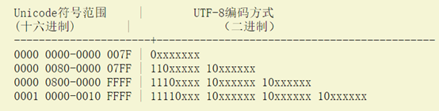 

跟据上表，解读 UTF-8 编码非常简单。如果一个字节的第一位是0，则这个字节单独就是一个字符；如果第一位是1，则连续有多少个1，就表示当前字符占用多少个字节。

引用自: http://www.ruanyifeng.com/blog/2007/10/ascii_unicode_and_utf-8.html

(4) 布尔类型

只有true和false两个值。

(5)  各类型所占字节数

```java
/**
输出Java中基本类型所占字节数
版权声明：本文为CSDN博主「阳光岛主」的原创文章，遵循 CC 4.0 BY-SA 版权协议，转载请附上原文出处链接及本声明。
原文链接：https://blog.csdn.net/ithomer/article/details/7310008
*/
public class CalSize {
    public static void main(String[] args) {
		System.out.println("int:\t" + Integer.SIZE/8);      // 4
		System.out.println("short:\t" + Short.SIZE/8);      // 2	
		System.out.println("long:\t" + Long.SIZE/8);	    // 8
		System.out.println("byte:\t" + Byte.SIZE/8);        // 1
		System.out.println("char:\t" + Character.SIZE/8);   // 2
		System.out.println("float:\t" + Float.SIZE/8);      // 4
		System.out.println("double:\t" + Double.SIZE/8);    // 8
		//System.out.println("Boolean: " + Boolean);
    }
}
```

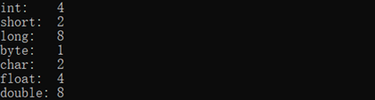 

### 2.3.2 按声明位置分

（1）成员变量

（2）局部变量

 

## 2.3 变量间的运算

### 2.3.1 基本数据类型间的运算（不包括boolean）

**(1) 自动类型提升**

自动类型提升：小容量的变量与大容量的变量做运算，结果用大容量的变量来接收。

byte，short，char --> int --> long --> float --> double

注意：

1、容量指的是表数范围，而不是所占存储空间。float（4字节）的表数范围大于long（8字节）。

​       2、byte，short，char三者之间的运算都会自动提升为int类型。

 

**这是字段类型提升的一个坑：**

自动类型提升有好处，但它也会引起令人疑惑的编译错误。例如，下面看起来正确的程序却会引起问题：

```java
byte b = 50;
b = b * 2;    // Type mismatch: cannot convert from int to byte
```

如上所示，第二行会报“类型不匹配：无法从int转换为byte”错误。

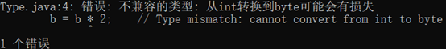 

该程序试图将一个完全合法的 byte 型的值 50*2 再存储给一个 byte 型的变量。但是当表达式求值的时候，操作数被自动的提升为 int 型，计算结果也被提升为 int 型。这样表达式的结果现在是 int 型，不强制转换它就不能被赋为 byte 型。确实如此，在这个特别的情况下，被赋的值将仍然适合目标类型。

所以应该使用一个显示的强制类型转换，例如：

```java
byte b = 50;
b = (byte)(b * 2);
```

这样就能产生正确的值 100。

注意：char 类型比较特殊，char 自动转换成 int、long、float 和 double，但 byte 和 short 不能自动转换为 char，而且 char 也不能自动转换为 byte 或 short。

引用自：http://c.biancheng.net/view/796.html

**这是另一个坑**

float和long运算，会自动类型提升为float。例如如下代码编译错误：

```java
long l = 200L;
float f = 10.0F;
long r = l + f;
```

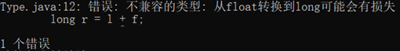 

需要使用float类型变量来存储运算结果。

```java
long l = 200L;
float f = 10.0F;
float r = l + f;
```

**(2) 强制类型转换：自动类型提升的逆过程。**

格式：目标类型 变量 = (目标类型)源类型变量/常量

注意：

​	1、使用强制类型转换运算符号“(类型)”。

​	2、可能会损失精度或者类型溢出。

​	3、在强制类型转换中目标类型和源类型变量的类型始终没有发生改变。

### 2.3.2 基本数据类型和String间的运算

​	1、 字符串和基本数据类型之间只能做连接运算，没有自动类型提升。

​	2、 字符串做链接运算的结果是字符串类型，只能用字符串来接受

​	3、 注意“+”号是做加法，还是做字符串连接符。

# 3 标识符和关键字

## 3.1 关键字和保留字

关键字的定义：Java关键字是Java语言里事先定义的，被赋予了特殊含义的标识符。

关键字的特点：关键字均为小写。

保留字的定义：现版本暂未使用，但以后版本可能用来作为关键字。

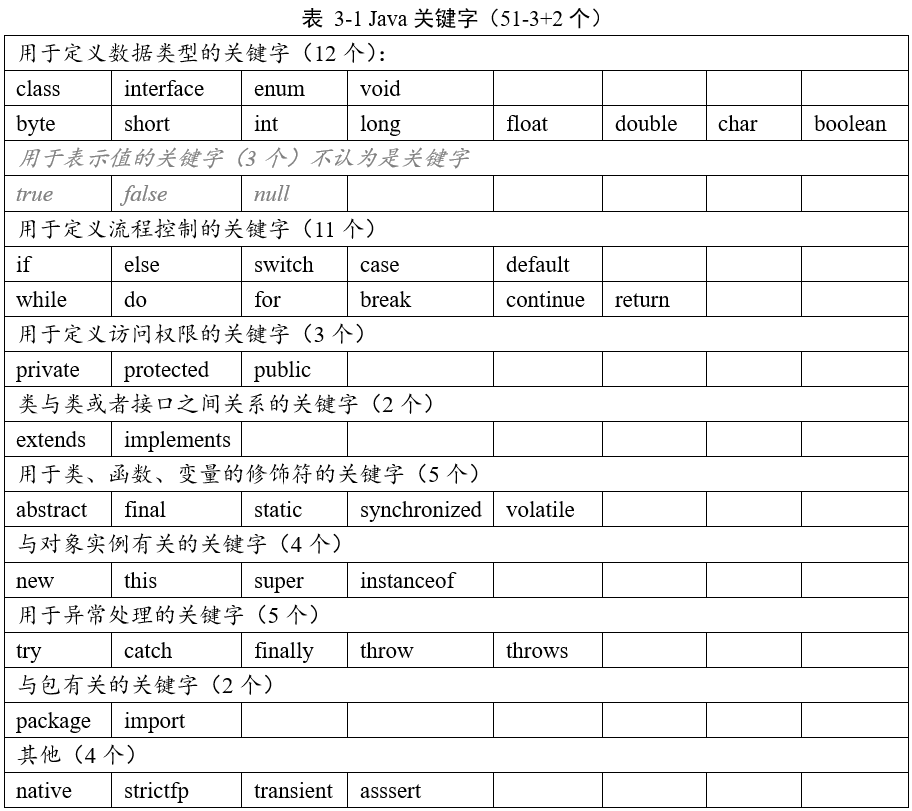

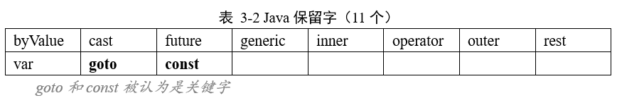

注：java官方文档有说明: “An identifier cannot have the same spelling (Unicode character sequence) as a keyword (§3.9), boolean literal (§3.10.3), or the null literal (§3.10.7), or a compile-time error occurs. While true and false might appear to be keywords, they are technically boolean literals (§3.10.3). Similarly, while null might appear to be a keyword, it is technically the null literal (§3.10.7). ”

【译文: 标识符不能具有与关键字（§3.9），布尔文字（§3.10.3）或空文字（§3.10.7）相同的拼写（Unicode字符序列），否则会发生编译时错误。 尽管true和false可能是关键字，但从技术上讲，它们是布尔文字（第3.10.3节）。 同样，尽管null似乎是一个关键字，但从技术上讲，它是null文字（第3.10.7节）。】

true false null不属于关键字，但是属于标识符。规定的关键字只有50个，包含两个保留字(goto，const)，但是这53个都属于标识符。它们之间的关系是：标识符包含 关键字、boolean literal（true,false）、 null literal; 关键字里面又包含有两个保留字。

引用自：https://blog.csdn.net/u012506661/article/details/52756452下的评论

以下是《Java 语言规范 基于 Java SE 8》一书中关于“关键字”的描述。（第15页）

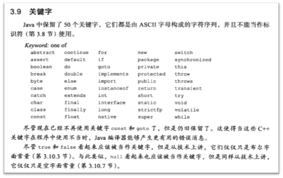 

## 3.2 标识符

合法标识符：

​	1、 由大小写英文字母（a-z, A-Z），数字（0-9），下划线（_），美元符号（$）组成；

​	2、 不能以数字开头；

​	3、 不可以使用关键字、保留字、true、false、null

​	4、 标识符严格区分大小写，长度无限制

​	5、 标识符不能包含空格

标识符命名风格：

1.【强制】代码中的命名均不能以下划线或美元符号开始，也不能以下划线或美元符号结束。

2.【强制】代码中的命名严禁使用拼音与英文混合的方式，更不允许直接使用中文的方式

3.【强制】类名使用UpperCamelCase风格，但以下情形例外：DO / BO / DTO / VO / AO / PO / UID等。

4.【强制】方法名、参数名、成员变量、局部变量都统一使用lowerCamelCase风格，必须遵 从驼峰形式

5.【强制】常量命名全部大写，单词间用下划线隔开，力求语义表达完整清楚，不要嫌名字 长。

6.【强制】抽象类命名使用Abstract或Base开头；异常类命名使用Exception 结尾；测试类 命名以它要测试的类的名称开始，以Test结尾

7.【强制】包名统一使用小写，点分隔符之间有且仅有一个自然语义的英语单词。包名统一使 用单数形式，但是类名如果有复数含义，类名可以使用复数形式。

8.【参考】枚举类名带上Enum后缀，枚举成员名称需要全大写，单词间用下划线隔开。

引用自：《Java 开发手册》——阿里巴巴

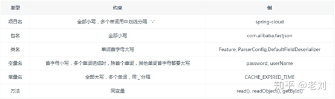 

图片引用自：https://zhuanlan.zhihu.com/p/96100037

单下划线作为标识符是不可行的，但是双下划线是可行的。

```java
public class _ {
    public static void main(String[] args) {
        int _ = 99;
        System.out.println(_);
    }
}
```

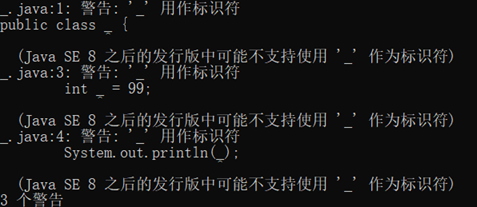 

# 4 运算符

## 4.1 算术运算符

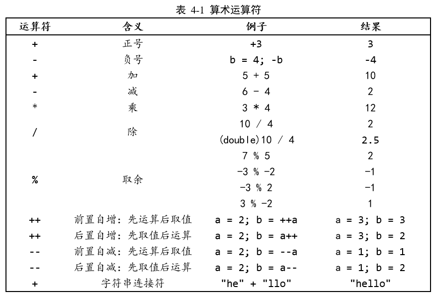

注意：

​		1、整数除法的结果是整数，即求整除的商。

​		2、取余运算只适用于两个整数，结果的正负号和被取余数的正负号相同。

## 4.2 赋值运算符

=、+=、-=、*=、/=、%=、<<=、>>=、&=、^=、|=

设byte b = 10;，b += 2并不等于 b = b + 2。后者会进行数据类型提升，而前者数据类型不发生转换。

设int i = 1;，i *= 0.1可以相当于i = (int)(i * 0.1)。结果为0。上面的b += 2可以相当于b = (byte)(b + 2)。

```java
public class SetValue {
    public static void main(String[] args) {
        byte b = 10;
        b += 2;  // 不会进行类型转换
        System.out.println(b);
        
        b = b + 2; // 报错：类型不兼容
        System.out.println(b);

int i = 1;
        i *= 0.1; // 0，相当于 i = (int)(i * 0.1)
        System.out.println(i);
    }
}
```

【面试题】

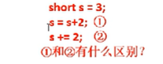 

答：1 编译不通过，因为short在做运算时，会先自动类型提升为int类型，所以必须用int类型的变量来接收结果。2 编译通过，s的值变为5。+=不会改变原来的数据类型，相当于 s = (short)(s+2)。

## 4.3 关系运算符（比较运算符）

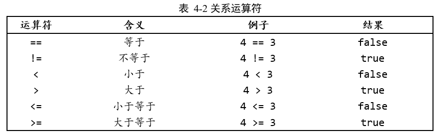

关系运算符的结果都是boolean类型的，值要么是true，要么是false。

这里说明一下，Java和C/C++不一样，在Java中if语句的小括号里面的值或者表达式的值必须为boolean类型，否则会报错：类型不兼容。因此如果是一条int类型的赋值语句，则不能作为if的条件（在C/C++中是可以的）。但需要注意的是如果赋值表达式的左值是boolean类型的，那么赋值表达式的值也会是boolean类型的。代码如下：

```java
public class Equals {
    public static void main(String[] args) {
        boolean boo = false;

        // 这里不会报错， 因为赋值语句的值是表达式最左边变量的值
        // 即就是boo的值，是boolean类型的
        if(boo = true)
        {
            System.out.println("第一个if里面的语句执行了");
        }

        int number = 0;
        // 这里会报错：类型不兼容。因为表达式number = 3的值是number的值3
        // 而if里面所需要的值必须为boolean类型
        if(number = 3)
        {
            System.out.println("第二个if里面的语句执行了");
        }

        System.out.println("完成！");
    }
}
```

## 4.4 逻辑运算符

& 逻辑与   | 逻辑或  ! 逻辑非

&& 短路与  || 短路或  ^ 逻辑异或

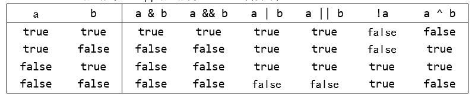

异或：异为真。不一样，则结果为真。

说明：逻辑运算的操作数都是boolean类型，运算结果也是boolean类型。


【面试题】 &与&&，|与||的区别。

答：

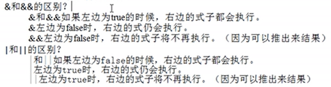 

```java
public class Logic {
    public static void main(String[] args) {
        int x, y;
        x = 0; y = 10;
        // 先判断x==0, 0==0为true，再执行x++, x=1；
        // 前面的为true，根据短路性，后面的不执行，y=10。
        if( (x++ == 0) || ((y=20) == 20) )
        {
            System.out.println("y="+y);
        }
        
        // 先执行x++, x=1；再判断x==0, 1==0为false；
        // 前面的为false，不能直接推断出结果，执行后面的语句，y=20。
        if( (++x == 0) || ((y=20) == 20) )
        {
            System.out.println("y="+y);
        }
        
        int a, b;
        a = 0; b = 10;
        // 先判断x==0, 0==0为true，再执行x++, x=1；
        // 前面的为true，没有短路性，执行后面的语句，y=20。
        // 或者把 | 理解为位运算操作符。
        if( (a++ == 0) | ((b=20) == 20) )
        {
            System.out.println("b="+b);
        }
    }
}
```

结果：

 

这篇文章对&和|的理解思路很清奇，认真看完，不要看到第一个问题就不看了。文章地址：https://blog.csdn.net/websph/article/details/5669363

## 4.5 位运算符

### 4.5.1 进制

世界上有10种人，一种是都二进制的，另一种是不懂二进制的。

l 二进制：0, 1，以0b或者0B开头；

l 十进制：0-9；

l 八进制：0-7，以0开头；

l 十六进制：0-9及A-B，以0x或者0X开头。A-F大小写不区分。

### 4.5.2 原码 反码 补码

(1)  正数的原码、反码、补码都相同。（9的原码：0000 1001）

(2)  负数

负数的原码：最高位为符号位，1表示负数。即把其对应的正数的原码的符号位改为1。（-9的原码：1000 1001）

负数的反码：符号位不变，把负数的原码的其它位按位取反。（-9的反码：1111 0110）

负数的补码：反码加一。（-9的补码：1111 0111）

 

(byte)128 => -128

128：0000 0000, 0000 0000, 0000 0000, 1000 0000

(byte)128：1000 0000 => -128

### 4.5.3 位运算

Java定义了位运算符，应用于整数类型(int)，长整型(long)，短整型(short)，字符型(char)，和字节型(byte)等类型。位运算符作用在所有的位上，并且按位运算。

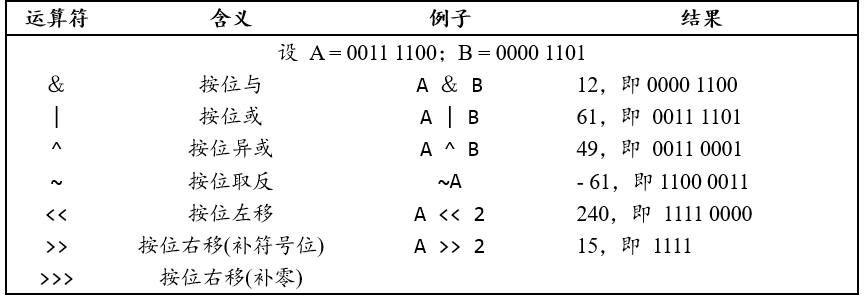

<< 左移： 规则是带符号位移，高位移出，低位补0，移动位数超过该类型的最大位数，则进行取模，如对Integer型左移34位，实际上只移动了两位。左移一位相当于乘以2的一次方，左移n位相当于乘以2的n次方。

\>> 右移：规则是低位移出，高位补符号位，移动位数超过该类型的最大位数，则进行取模，如对Integer型左移34位，实际上只移动了两位。

\>>> 无符号右移：无符号位移是什么意思呢，就是右移的时候，无论正负数，高位始终补0。当然，它也仅仅针对负数计算有意义。

 

直接上代码：

```java
public class Bit {
    public static void main(String[] args) {
        byte a = -1; // 1111 1111
        
        byte b1 = (byte)(a >> 4);
        byte b2 = (byte)(a >>> 4);
        
        System.out.println(b1); // -1
        System.out.println(b2); // -1
        // byte类型运算时会转为int类型，后强转为byte后只有低8位，全为1。
        
        System.out.println("-------------------");
        
        int i = -1; // 1111 1111
        
        // 高位补符号位 1111 1111 1111 1111, 1111 1111 1111 1111
        int c1 = i >> 4;
        // 高位补零 0000 1111 1111 1111, 1111 1111 1111 1111  ==  ‭268435455‬‬‬‬‬‬‬‬‬‬‬‬‬‬‬‬‬‬‬‬‬‬‬‬‬
        int c2 = i >>> 4; 
        
        System.out.println(c1);
        System.out.println(c2);
    }
}
```

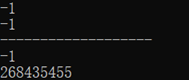 

这个有意思哦~ 并不是循环左移

```java
System.out.println(1 << 31);
System.out.println(3 << 31);
System.out.println(3 << 32);
System.out.println(3 << 33);
System.out.println((3 << 31) << 1); // 这个好玩
System.out.println(-1 << 32);
System.out.println(-1 << 33);
System.out.println(-1 << 34); // 得-4 不是循环左移
```

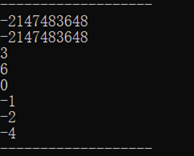 

## 4.6 三元运算符

(条件表达式) ? 表达式1 : 表达式2

​		1、条件表达式的结果为boolean类型。

​		2、条件表达式为true，执行表达式1；为false, 执行表达式2。

​		3、表达式1和表达式2的类型必须相同。或者可以进行类型转换。

​		4、三元运算符可以被嵌套使用，但不建议这样使用。

​		5、三元运算符可以被if语句替代；反之，不成立。

## 4.7 运算符的优先级

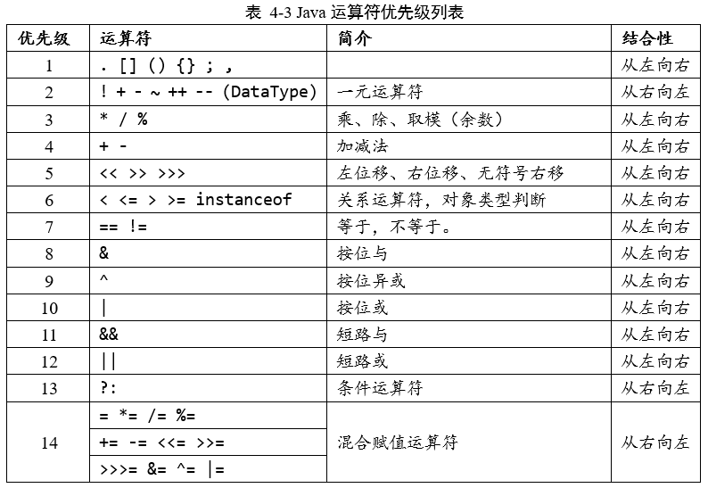