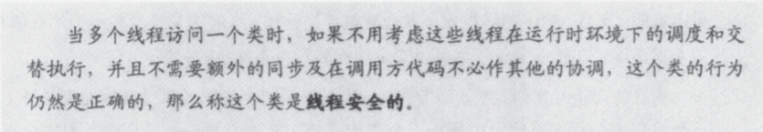
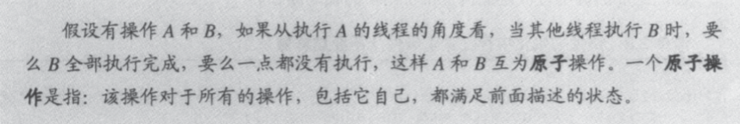
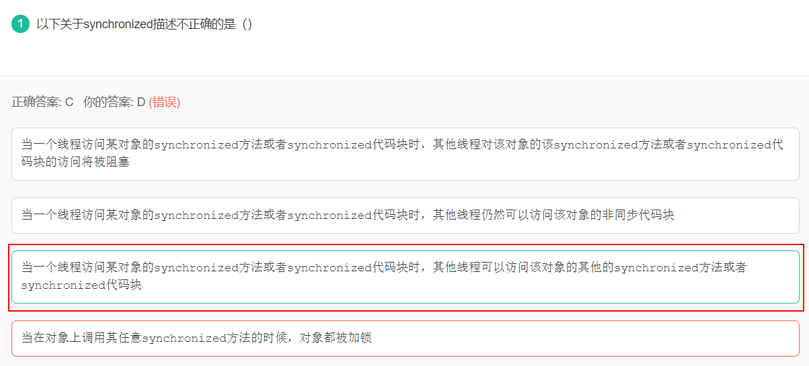
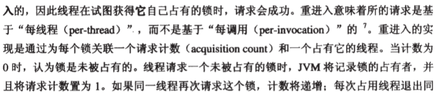
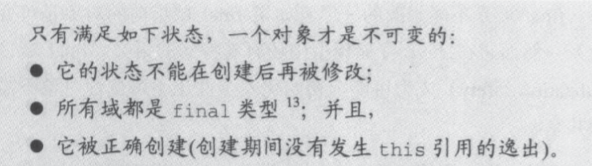
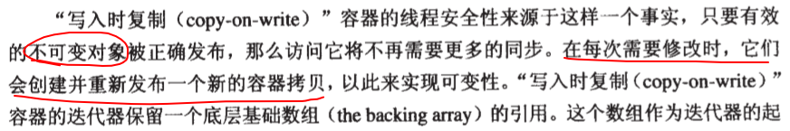

- [0 反射](#0-反射)
- [1 多线程](#1-多线程)
    - [1.1 线程安全](#11-线程安全)
    - [1.2 内部锁 synchronized](#12-内部锁-synchronized)
    - [1.3 重进入 Reentrancy](#13-重进入-reentrancy)
- [2 同步](#2-同步)
    - [2.1 非原子的 64 位操作](#21-非原子的-64-位操作)
    - [2.2 volatile 变量](#22-volatile-变量)
    - [2.3 发布和逸出](#23-发布和逸出)
    - [2.4 不可变性](#24-不可变性)
- [3 组合对象](#3-组合对象)
    - [3.1 设计线程安全的类](#31-设计线程安全的类)
- [4 构建块](#4-构建块)
    - [4.1 同步容器](#41-同步容器)
    - [4.2 并发容器](#42-并发容器)
        - [4.2.1 ConcurrentHashMap](#421-concurrenthashmap)
        - [4.2.2 CopyOnWriteArrayList](#422-copyonwritearraylist)
- [5 AbustactQueuedSynchronizer](#5-abustactqueuedsynchronizer)
    - [5.1 同步状态](#51-同步状态)
    - [5.2 同步队列](#52-同步队列)
- [6 线程池](#6-线程池)
    - [6.1 线程池各个参数的作用，如何进行的?](#61-线程池各个参数的作用如何进行的)
    - [6.2 线程池异常处理](#62-线程池异常处理)
    - [6.3 线程池的工作队列](#63-线程池的工作队列)
    - [6.4 几种常用的线程池](#64-几种常用的线程池)
    - [6.5 线程池状态](#65-线程池状态)

# 0 反射

反射：主要是指程序可以访问，检测和修改它本身状态或行为的一种能力，并能根据自身行为的状态和结果，调整或修改应用所描述行为的状态和相关的语义。

反射机制主要提供以下功能：

1. 在运行时判断任意一个对象所属的类；

2. 在运行时构造任意一个类的对象；

3. 在运行时判断任意一个类所具有的成员变量和方法；

4. 在运行时调用任意一个对象的方法；

5. 生成动态代理。

与反射有关的类：

```java
// 类
java.lang.Class;
// 构造器
java.lang.reflect.Constructor;
// 属性
java.lang.reflect.Field;
// 方法
java.lang.reflect.Method;
// 访问修饰符
java.lang.reflect.Modifier;
```

**优点：** 
（1）能够运行时动态获取类的实例，大大提高系统的灵活性和扩展性。 
（2）与Java动态编译相结合，可以实现无比强大的功能 
**缺点：** 
（1）使用反射的性能较低 
（2）使用反射相对来说不安全 
（3）破坏了类的封装性，可以通过反射获取这个类的私有方法和属性 


# 1 多线程

## 1.1 线程安全

编写线程安全的代码，本质上就是管理对对象的状态的访问，而且这些状态通常都是共享的、可变的。

一个对象的**状态**就是它的数据，存储在状态变量中。**共享**就是一个变量可以被多个线程访问。可变是指变量的值在其生命周期内是可以被**改变**的。

按照线程安全的安全程度分：

1. 不可变：final，java.lang.String的对象是不可变对象
2. 绝对线程安全：不论何种环境下，不需要做任何额外同步措施
3. 相对线程安全：使用额外的同步手段保证调用的正确性
4. 线程兼容：对象本身不是线程安全的，可以通过调用段使用同步手段来保证对象安全
5. 线程对立：不管采用哪种方式，都不能并发的使用。

线程安全的定义：一个类是线程安全的，是指在被多个线程访问时，类可以持续进行正确的行为。



线程安全的类封装了任何必要的同步，因此客户不需要自己提供。

无状态对象永远是线程安全的。多数 Servlet 都可以实现为无状态的。

**原子操作**



## 1.2 内部锁 synchronized

 

```java
synchronized(lock) {
    // 代码
}
```

执行线程进入 synchronized 块之前会自动获得对象的内部锁，离开 synchronized 块时自动释放锁。获得内部锁的唯一途径是进入这个内部锁保护的同步块或方法。

内部锁是互斥锁，至多只有一个线程可以拥有内部锁。其他线程会被阻塞，直到锁被释放。

【看看题】



1.synchronzied关键字修饰static方法：该锁由该类持有，相同类只可持有一把锁。

2.synchronzied关键字修饰普通方法：该锁由类对象持有，相同对象只可持有一把锁。


(1) synchronized 修饰方法时锁定的是调用该方法的对象。它并不能使调用该方法的多个对象在执行顺序上互斥。

(2)在synchronized锁上阻塞的线程是不可中断的

(3) synchronized锁释放是自动的

(4)线程在竞争synchronized锁时是非公平的

(5)synchronized锁是读写互斥并且读读也互斥


(1)ReentrantLock 锁能实现可中断的阻塞。

(2)ReentrantLock 释放非自动需要在try-finally块中释放锁

(3)ReentrantLock 能够实现锁的公平性

(4)ReentrantReadWriteLock 分为读锁和写锁，而读锁可以同时被多个线程持有，适合于读多写少场景的并发。

## 1.3 重进入 Reentrancy




获得的对象关联的锁并不能阻止其他线程访问这个对象，只能阻止其他线程再获得相同的锁。

每个对象都有一个内部锁。 

# 2 同步

## 2.1 非原子的 64 位操作

没有被声明位 volatile 的 64 位数值变量 (double、long)，JVM 允许将64位的读写划分为两个 32 位操作。

## 2.2 volatile 变量

volatile 变量的特性：

1. 保证该变量对所有线程可见。确保变量的更新以可预见的方式告知其他的线程
2. 禁止指令重排序优化。它是共享的，对它的操作不会与其他内存操作一起被重排序
3. volatile 变量不会缓存在寄存器或者缓存在其他处理器隐藏的地方

因此，读取 volatile 变量时，总会访问由某一线程写入的最新值。

注意：volatile 语义不会保证自增操作原子化。

要使用 volatile 变量，得满足：

1. 写入变量时并不依赖变量的当前值；或者能够确保只有单一的线程修改变量的值
2. 变量不需要与其他状态变量参与不变约束
3. 访问变量时，没有其他的原因需要加锁

## 2.3 发布和逸出

发布一个对象，是使它能够被当前范围之外的代码所使用。

## 2.4 不可变性

不可变对象永远是线程安全的。

 

# 3 组合对象

## 3.1 设计线程安全的类

设计线程安全的类包括以下三要素：

1. 确定对象状态是由哪些变量构成的
2. 确定限制状态变量的不变约束
3. 制定一个管理并发访问对象状态的策略

# 4 构建块

## 4.1 同步容器

同步容器类包括：

1. Vector 和 HashTable
2. jdk 1.2 加入的 同步包装类 (wrapper)，由 Collections.synchronizedXxx 工厂方法创建

这些类通过封装它们的状态，并对每个公共方法进行同步，来实现线程安全。


会出现的问题：对于复合操作，需要额外的加锁处理。

迭代器 ConcurrentModificationException 并发修改异常

## 4.2 并发容器

jdk 5 提供了几种并发的容器类。

ConcurrentHashMap、CopyOnWriteArrayList


### 4.2.1 ConcurrentHashMap

使用 **分离锁**，它允许更深层次的共享访问。

任意数量的读线程可以并发访问；读者和写者也可以并发访问；有限数量的写线程可以并发修改。

好处：为并发访问带来更高的吞吐量，并且几乎没有损失单个线程访问的性能。

其迭代器不会抛出 ConcurrentModificationException  异常，不需要在迭代中加锁。返回的迭代器具有 **弱一致性**，可以感知 (但不保证) 在迭代器被创建后容器的修改。

### 4.2.2 CopyOnWriteArrayList



# 5 线程池

**线程池：** 用于管理线程的池子。

1. 线程池帮助我们管理线程，避免增加创建线程和销毁线程的资源消耗。

2. 提高程序响应速度。直接从线程池中拿线程的速度肯定快于创建一条线程。
3. 可以重复利用线程。

## 5.1 线程池各个参数的作用，如何进行的?

ThreadPoolExecutor 构造器

```java
public ThreadPoolExecutor(
    int corePoolSize,     // 线程池核心线程数最大值
    int maximumPoolSize,  // 线程池最大线程数大小
    long keepAliveTime,   // 程池中非核心线程空闲的存活时间大小
    TimeUnit unit,        // 线程空闲存活时间单位
    BlockingQueue<Runnable> workQueue, // 存放任务的阻塞队列
    ThreadFactory threadFactory,       // 用于设置创建线程的工厂，可以给创建的线程设置有意义的名字，可方便排查问题
    RejectedExecutionHandler handler   // 线城池的饱和策略事件，主要有四种类型。
)
```

线程池执行流程：核心线程 — 任务队列 — 非核心线程 — 拒绝策略

 

四种拒绝策略：

1. AbortPolicy：抛出一个异常，默认的
2. DiscardPolicy：直接丢弃任务
3. DiscardOldestPolicy：丢弃队列里最老的任务，将当前这个任务继续提交给线程池
4. CallerRunsPolicy：交给线程池调用所在的线程进行处理

## 5.2 线程池异常处理

1. try - catch 处理
2. 通过 Future 对象的 get 方法接收抛出的异常，再处理
3. 使用自己的ThreadFactory，创建线程时设置线程的 UncaughtExceptionHandler，在 uncaughtException方法中处理异常
4. 重写 ThreadPoolExecutor 的 afterExecute方法，处理传递的异常引用

## 5.3 线程池的工作队列

1. ArrayBlockingQueue：有界队列，用数组实现的，FIFO
2. LinkedBlockingQueue：可设置容量队列，基于链表，FIFO，不设置容量则无限扩大，最大为 Integer.MAX_VALUE
3. DelayQueue：延迟队列，其中的对象到期时才能从队列中取走
4. PriorityBlockingQueue：优先级队列
5. SynchronousQueue：同步队列，插入操作必须等到另一个线程调用移除操作，否则插入操作一直处于阻塞状态

## 5.4 几种常用的线程池

1. **newFixedThreadPool  固定线程数目的线程池**

   最大线程数目 和 核心线程数目 相等。

   keepAliveTime 非核心线程空闲的存活时间 为 0

   阻塞队列是 LinkedBlockingQueue   可能导致 OOM

   适用于处理CPU密集型的任务，即适用执行长期的任务。

2. **newCachedThreadPool  可缓存线程的线程池**

   最大核心线程数目为 0   任务直接放入队列

   最大线程数为 Integer.MAX_VALUE

   非核心线程空闲的存活时间 为 60 秒

   阻塞队列是 SynchronousQueue

   用于并发执行大量短期的小任务。

3. **newSingleThreadExecutor  单线程的线程池**

   核心线程数为 1

   最大线程数也为 1

   keepAliveTime为 0

   阻塞队列是 LinkedBlockingQueue

   适用于串行执行任务的场景，一个任务一个任务地执行。

4. **newScheduledThreadPool  定时及周期执行的线程池**

   最大线程数为 Integer.MAX_VALUE

   阻塞队列是 DelayedWorkQueue

   keepAliveTime为 0

   scheduleAtFixedRate() ：按某种速率周期执行

   scheduleWithFixedDelay()：在某个延迟后执行

   周期性执行任务的场景，需要限制线程数量的场景

## 5.5 线程池状态

1. **Running**

   该状态的线程池会接收新任务，并处理阻塞队列中的任务;

   调用线程池的 shutdown() 方法，可以切换到 Shutdown 状态;

   调用线程池的 shutdownNow() 方法，可以切换到 Stop 状态;

2. **Shutdown**

   该状态的线程池不会接收新任务，但会处理阻塞队列中的任务；

   队列为空，并且线程池中执行的任务也为空,进入 Tidying 状态;

3. **Stop**

   该状态的线程不会接收新任务，也不会处理阻塞队列中的任务，而且会中断正在运行的任务；

   线程池中执行的任务为空, 进入 Tidying 状态;

4. **Tidying**

   该状态表明所有的任务已经运行终止，记录的任务数量为0。

   terminated() 执行完毕，进入 Terminated 状态

5. **Terminated**

   该状态表示线程池彻底终止


# 6 集合

 

**集合有关的接口：**

- java.util.Collection 接口：集合类的根接口，没有这个接口的直接实现类。
  - java.util.Set 接口：不能包含重复的元素。
  - java.util.List 接口：有序的集合，可以包含重复的元素，提供了按索引访问的方式。

- java.util.Map 接口：Map不能包含重复的key，但是可以包含相同的value。
- java.util.Iterator 接口：所有的集合类都实现了它，这是一个用于遍历集合中元素的接口。
  
  > hasNext() 是否还有下一个元素。
  > next() 返回下一个元素。
  > remove() 删除当前元素。

综上：List（有序可重复）、Set（无序不能重复）、Map（键值对：键唯一，值可重复）

**集合遍历方式：**

1. Iterator：迭代输出，是使用最多的输出方式。

2. ListIterator：是Iterator的子接口，专门用于输出List中的内容。

3. foreach输出：JDK1.5之后提供的新功能，可以输出数组或集合。

4. for循环

**集合有关的抽象类：**

- java.util.AbstractCollection 抽象类 实现 Collection 

  ```java
  public abstract class AbstractCollection<E>
      implements Collection<E>
  ```

  - java.util.AbstractList 抽象类 继承 AbstractCollection  实现 List

    ```java
    public abstract class AbstractList<E> 
        extends AbstractCollection<E>
        implements List<E>
    ```

**集合有关的具体类：**

**1、ArrayList和LinkedList**

ArrayList 和 LinkedList在用法上没有区别，但是在功能上还是有区别的。

LinkedList 经常用在增删操作较多而查询操作很少的情况下，ArrayList则相反。

- java.util.ArrayList 继承 AbstractList 实现 List

  ```java
  public class ArrayList<E> 
      extends AbstractList<E>
      implements List<E>, RandomAccess, Cloneable, java.io.Serializable
  ```

- java.util.LinkedList 继承 AbstractSequentialList 实现 List

  ```java
  public class LinkedList<E>
      extends AbstractSequentialList<E>
      implements List<E>, Deque<E>, Cloneable, java.io.Serializable
  ```

**2、Map 集合**

HashMap、ConcurrentHashMap、Hashtable、LinkedHashMap、TreeMap。

- HashMap

  HashMap是最常用的Map，它根据键的HashCode值存储数据，根据键可以直接获取它的值，具有很快的访问速度 o(1)。遍历时，取得数据的**顺序是完全随机**的。因为键对象不可以重复，所以HashMap最多**只允许一条记录的键为null**，允许多条记录的值为null，是**非同步的**。

- Hashtable

  Hashtable与HashMap类似，是**HashMap的线程安全版**，它支持线程的同步。HashTable是直接在操作方法上加synchronized关键字，锁住整个数组，锁粒度比较大。即任一时刻只有一个线程能写Hashtable，因此也导致了Hashtale在**写入时会比较慢**，它继承自Dictionary类，不同的是**它不允许记录的键或者值为null**，同时效率较低。

- ConcurrentHashMap

  ConcurrentHashMap使用**分段锁**，降低了锁粒度，让并发度大大提高。**线程安全**，并且锁分离。ConcurrentHashMap内部使用段(Segment)来表示这些不同的部分，**每个段其实就是一个小的hash table**，它们有自己的锁。**只要多个修改操作发生在不同的段上，它们就可以并发进行**。

- LinkedHashMap

  LinkedHashMap **是有序的**，内部使用一个**链表**，有头尾节点。LinkedHashMap保存了**记录的插入顺序**，在用Iteraor遍历LinkedHashMap时，先得到的记录肯定是先插入的，在遍历的时候会比HashMap慢，有HashMap的全部特性。

- TreeMap

  TreeMap实现SortMap接口，能够把它保存的记录**根据键排序**，默认是按键值的升序排序（自然顺序），也可以**指定排序的比较器**，当用Iterator遍历TreeMap时，得到的记录是排过序的。不允许key值为空，**非同步的**。

