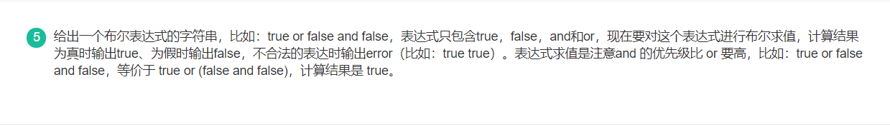

1. 计算二叉树的深度

 

思路：使用递归，当前节点的高度 = max(左子树高度, 右子树高度) + 1

```java
public int TreeDepth(TreeNode root) {
    // {} 的高度为 0
    if(root == null){
        return 0;
    }

    //分别计算左右子树的高度
    int l = TreeDepth(root.left);
    int r = TreeDepth(root.right);

    // 该节点高度 = max(l, r) + 1
    return Math.max(l, r) + 1;
}
```

2. 判定平衡二叉树

 

思路：每次判断当前树的左右子树的高度差。

```java
public boolean IsBalanced_Solution(TreeNode root) {
    return depth(root) != -1;
}
public int depth(TreeNode root){
    // 空树高度为 0
    if(root == null) {
        return 0;
    }
    
    int left = depth(root.left);
    if(left == -1) {
        return -1; //如果发现子树不平衡之后就没有必要进行下面的高度的求解了
    }
    int right = depth(root.right);
    if(right == -1) {
        return -1; //如果发现子树不平衡之后就没有必要进行下面的高度的求解了
    }
    
    // 当前树不平衡, 返回 -1 
    if(left - right < (-1) || left - right > 1) {
        return -1;
    } else { // 当前树平衡, 返回当前树的高度
        return 1 + (left > right ? left : right);
    }
}
```

3. 计算布尔表达式的值

 

```java
package com.codeam.algorithm;

import java.util.Scanner;
import java.util.Stack;

public class Stack_DemoOne {
    public static void main(String[] args) {
        solation();
    }
    static void solation(){
        Scanner scanner = new Scanner(System.in);
        String line = scanner.nextLine();
        String[] splits = line.split(" ");
        //检查表达式，当表达式不符合条件的情况下直接输出error
        if(splits[splits.length-1].equals("and")||splits[splits.length-1].equals("or")) {
            System.out.println("error");
            return;
        }
        Stack<String> stack = new Stack<String>();
        for(int i=0;i<splits.length;i++) {
            String temp = splits[i];
            if(i%2==0&&(temp.equals("or")||temp.equals("and"))){
                System.out.println("error");
                return;
            }else if(i%2==1&&(temp.equals("true")||temp.equals("false"))) {
                System.out.println("error");
                return;
            }else {
                //核心逻辑
                if(temp.equals("and")) {
                    temp = stack.pop();
                    temp = temp.equals("false")||splits[i+1].equals("false")?"false":"true";
                    stack.push(temp);
                    i++;
                }else {
                    stack.push(temp);
                }
            }
        }
        //表达式中只剩下or，true，false
        while(!stack.isEmpty()) {
            String istrue = stack.pop();
            if(istrue.equals("true")) {
                System.out.println("true");
                return;
            }
        }
        System.out.println("false");
        return;
    }
}
```

