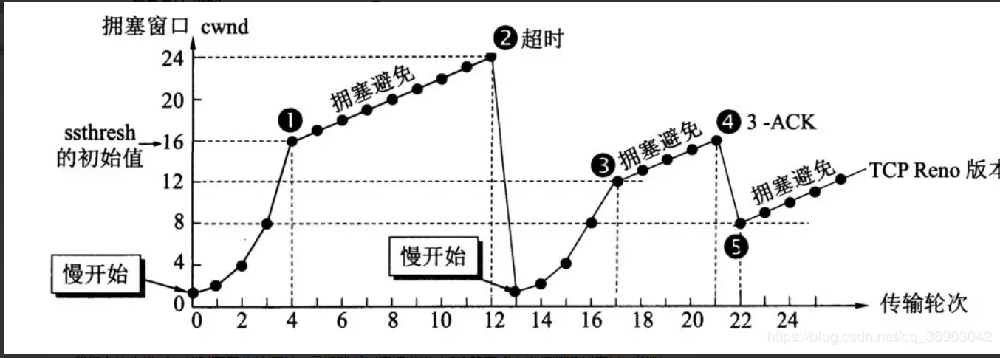
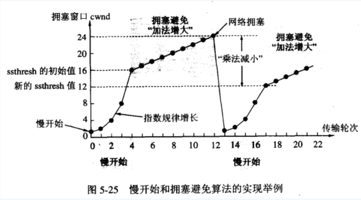
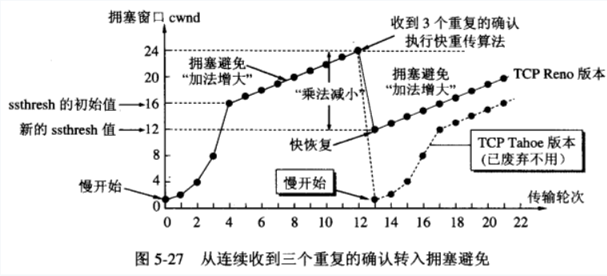
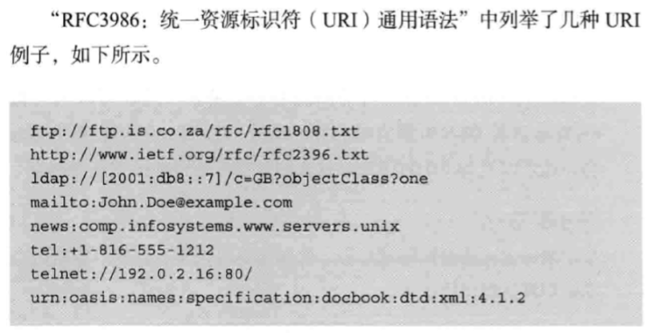
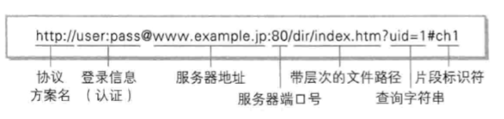
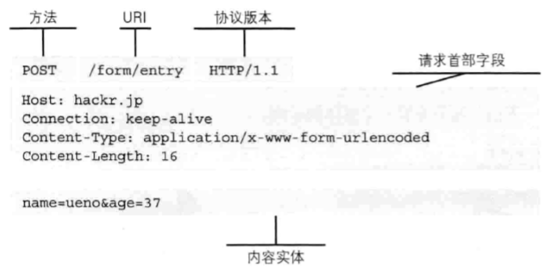
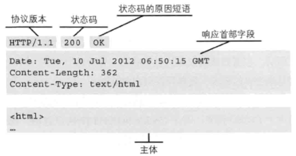

<!-- TOC -->autoauto- [1 网络分层模型](#1-网络分层模型)auto- [2 IP 地址](#2-ip-地址)auto- [3 五层体系结构](#3-五层体系结构)auto    - [3.1 应用层](#31-应用层)auto    - [3.2 运输层协议 TCP UDP](#32-运输层协议-tcp-udp)auto        - [3.2.1 TCP](#321-tcp)auto        - [3.2.2 UDP](#322-udp)auto    - [3.3 网络层](#33-网络层)auto    - [3.4 数据链路层](#34-数据链路层)auto    - [3.5 物理层](#35-物理层)auto- [4 TCP三次握手和四次挥手](#4-tcp三次握手和四次挥手)auto    - [4.1 三次握手](#41-三次握手)auto    - [4.2 四次挥手](#42-四次挥手)auto    - [4.3 拥塞控制](#43-拥塞控制)auto- [5 输入 url 到 显示网页的全过程](#5-输入-url-到-显示网页的全过程)auto- [6 HTTP与HTTPS的区别](#6-http与https的区别)auto- [7 HTTP](#7-http)auto    - [7.1 URI 和 URL](#71-uri-和-url)auto    - [7.2 简单 HTTP 协议](#72-简单-http-协议)auto    - [7.3 HTTP 方法](#73-http-方法)autoauto<!-- /TOC -->

# 1 网络分层模型

OSI 7层：物理层、数据链路层、网络层、传输层、会话层、表示层、应用层。

TCP/IP 4层：网络接口层、网际层、运输层、应用层。

5 层：物理层、数据链路层、网络层、运输层、应用层。

各层协议：

- 物理层：RJ45、CLOCK、IEEE802.3   （中继器，集线器，网关） 
- 数据链路：PPP、FR、HDLC、VLAN、MAC  （网桥，交换机） 
- 网络层：IP、ICMP、ARP、RARP、OSPF、IPX、RIP、IGRP、 （路由器） 
- 传输层：TCP、UDP、SPX 
- 会话层：NFS、SQL、NETBIOS、RPC 
- 表示层：JPEG、MPEG、ASII 
- 应用层：FTP、DNS、Telnet、SMTP、HTTP、WWW、NFS

各层作用：

- 物理层：通过媒介传输比特,确定机械及电气规范（比特Bit）  
- 数据链路层：将比特组装成帧和点到点的传递（帧Frame）  
- 网络层：负责数据包从源到宿的传递和网际互连（包Package）  
- 传输层：提供端到端的可靠报文传递和错误恢复（段Segment）  
- 会话层：建立、管理和终止会话（会话协议数据单元SPDU）  
- 表示层：对数据进行翻译、加密和压缩（表示协议数据单元PPDU）  
- 应用层：允许访问OSI环境的手段（应用协议数据单元APDU）

# 2 IP 地址

A 类地址：以 0 开头，1.0.0.0~126.255.255.255，前一字节做网络号

B 类地址：以 10 开头，128.1.0.0~191.255.255.255，前两字节做网络号

C 类地址：以 110 开头，192.0.1.0~223.255.255.255，前三字节做网络号

D 类地址：以 1110 开头，224.0.0.0~239.255.255.255，多播地址

E 类地址：以 1111 开头，240.0.0.0~247.255.255.255保留地址

私网地址：10.0.0.0 - 10.255.255.255，172.16.0.0 - 172.31.255.255，192.168.0.0 - 192.168.255.255。

# 3 五层体系结构

## 3.1 应用层

传输层协议

TCP:

- FTP：21，文件传输协议
- Telnet：23，远程登陆
- SMTP：25，邮件传送协议，发送邮件
- POP3：110，邮件传送协议，接受邮件
- HTTP：80，从 Web 服务器传输超文本到本地浏览器的协议

UDP:

- DNS：53，域名解析服务
- SNMP：161，简单网络管理协议
- TFTP：69，简单文件传输协议

## 3.2 运输层协议 TCP UDP

运输层的主要任务就是负责向两台主机**进程**之间的通信提供通用的数据传输服务，端到端的通讯。

### 3.2.1 TCP

传输控制协议 (Transmission Control Protocol)：面向连接的，可靠的。

1. TCP是面向连接的。（就好像打电话一样，通话前需要先拨号建立连接，通话结束后要挂机释放连接）；
2. 每一条TCP连接只能有两个端点，每一条TCP连接只能是点对点的（一对一）；
3. TCP提供可靠交付的服务。通过TCP连接传送的数据，无差错、不丢失、不重复、并且按序到达；
4. TCP提供全双工通信。TCP允许通信双方的应用进程在任何时候都能发送数据。TCP连接的两端都设有发送缓存和接收缓存，用来临时存放双方通信的数据；
5. 面向字节流。TCP中的“流”（stream）指的是流入进程或从进程流出的字节序列。“面向字节流”的含义是：虽然应用程序和TCP的交互是一次一个数据块（大小不等），但TCP把应用程序交下来的数据仅仅看成是一连串的无结构的字节流。

**TCP一般用于文件传输、发送和接收邮件、远程登录等场景。**

### 3.2.2 UDP

用户数据协议 (User Datagram Protocol)：面向无连接的，不保证数据传输的可靠性，尽最大努力传输数据。

1. UDP是无连接的；
2. UDP使用尽最大努力交付，即不保证可靠交付，因此主机不需要维持复杂的链接状态（这里面有许多参数）；
3. UDP是面向报文的；
4. UDP没有拥塞控制，因此网络出现拥塞不会使源主机的发送速率降低（对实时应用很有用，如IP电话，实时视频会议等）；
5. UDP支持一对一、一对多、多对一和多对多的交互通信；
6. UDP的首部开销小，只有8个字节，比TCP的20个字节的首部要短。

**虽然UDP不提供可靠交付，但在某些情况下UDP确是一种最有效的工作方式（一般用于即时通信），比如： QQ语音 QQ视频 、直播等等**

**面向连接和非面向连接的服务的特点是什么？**

面向连接的服务，通信双方在进行通信之前，要先在双方建立起一个完整的可以彼此沟通的通道，在通信过程中，整个连接的情况一直可以被实时地监控和管理。 

非面向连接的服务，不需要预先建立一个联络两个通信节点的连接，需要通信的时候，发送节点就可以往网络上发送信息，让信息自主地在网络上去传，一般在传输的过程中不再加以监控。

握手 挥手 滑动窗口 拥塞控制

## 3.3 网络层

网络层负责为分组交换网上的不同主机提供通信服务。在发送数据时，网络层把运输层产生的报文段或用户数据报封装成**分组**和**包**进行传送

在TCP/IP体系结构中，由于网络层使用IP协议，因此分组也叫**IP数据报**，简称数据报。

互联网是由大量的**异构**（heterogeneous）网络通过**路由器**（router）相互连接起来的。互联网使用的网络层协议是**无连接**的**网际协议（Intert Prococol）**和许多路由选择协议，因此互联网的网络层也叫做**网际层**或**IP层**。

## 3.4 数据链路层

数据链路层通常简称为链路层。两台主机之间的数据传输，总是在一段一段的链路上传送的，这就需要使用专门的链路层的协议。

 在两个相邻节点之间传送数据时，数据链路层将网络层交下来的IP数据报**封装成帧**，在两个相邻节点间的链路上传送帧。每一帧包括数据和必要的控制信息（如同步信息，地址信息，差错控制等）。

## 3.5 物理层

在物理层上所传送的数据单位是比特。

# 4 TCP三次握手和四次挥手

## 4.1 三次握手

- 第一次握手：客户端发送带有 SYN 标志的数据包给服务器。
- 第二次握手：服务器发送带有 SYN/ACK 标志的数据包给客户端。
- 第三次握手：客户端发送带有 ACK 标志的数据包给服务器。

**为什么是三次握手？**

因为，要确保通讯可靠就需要让双方知道互相发送消息是无误的。

即是要满足以下四点：

1. 客户端要知道 自己发送给服务器的消息可以成功到达；

2. 客户端要知道 服务器发送给自己的消息可以成功到达；

3. 服务器要知道 客户端发送自己给的消息可以成功到达；

4. 服务器要知道 自己发送给客户端的消息可以成功到达。

第一次握手时，服务器知道了 客户端 --> 自己可以到达，满足 3；

第二次握手时，客户端知道了 自己 --> 服务器 和 服务器 --> 自己可以到达，满足1 2；

第三次握手时，服务器知道了 自己 --> 客户端可以到达，满足 4。

所以需要三次，两次不能满足基本的可靠通讯，四次也不能100%的可靠。

**为什么TCP客户端最后还要发送一次确认呢？**

主要防止已经失效的连接请求报文突然又传送到了服务器，从而产生错误。

如果使用的是两次握手建立连接，假设有这样一种场景，客户端发送了第一个请求连接并且没有丢失，只是因为在网络结点中滞留的时间太长了，由于TCP的客户端迟迟没有收到确认报文，以为服务器没有收到，此时重新向服务器发送这条报文，此后客户端和服务器经过两次握手完成连接，传输数据，然后关闭连接。此时此前滞留的那一次请求连接，网络通畅了到达了服务器，这个报文本该是失效的，但是，两次握手的机制将会让客户端和服务器再次建立连接，这将导致不必要的错误和资源的浪费。

如果采用的是三次握手，就算是那一次失效的报文传送过来了，服务端接受到了那条失效报文并且回复了确认报文，但是客户端不会再次发出确认。由于服务器收不到确认，就知道客户端并没有请求连接。

## 4.2 四次挥手

- 客户端 发送一个 FIN，用来关闭客户端到服务器的数据传输；
- 服务器 收到这个 FIN 后，发回一个 ACK;
- 服务器 关闭与客户端的连接，发送一个 FIN 给客户端；
- 客户端 发回 ACK 报文确认。

为什么客户端发送完最后一个报文需要等待 2 msl?

## 4.3 拥塞控制

慢开始：以指数方式增长滑动窗口

拥塞避免：到达 ssthresh 时，每次增加一

当超时：重新进入慢开始；当收到三个重复的确认报文时，进入快重传

 

 

# 5 输入 url 到 显示网页的全过程

1. 浏览器先向DNS域名服务器请求解析域名为 IP 地址。
2. 先建立 TCP 连接
3. 浏览器向目标服务器发起一个 HTTP 请求，cookies 会随之发送过去。
4. 在运输层通过TCP协议进行数据封装，把一个HTTP会话请求分为若干报文段，添加源端口和目的端口。
5. 网络层则把TCP报文段，划分为不同分组，每个分组各自进行路由选择，最终到达服务器。为确保分组的顺序不乱，需要在发送前给每个分组编号。
6. 服务器收到浏览器的请求后，便会进行逻辑处理，发回一个 HTML 响应。
7. 浏览器接受到 HTML 文件后，进行渲染显示。

html 渲染：https://blog.csdn.net/xzm_0602/article/details/53231348

1. 下载的顺序是从上到下，渲染的顺序也是从上到下，下载和渲染是同时进行的。 
2. 在渲染到页面的某一部分时，其上面的所有部分都已经下载完成（并不是说所有相关联的元素都已经下载完）。
3. 如果遇到语义解释性的标签嵌入文件（JS脚本，CSS样式），那么此时下载过程会启用单独连接进行下载。 
4. 样式表在下载完成后，将和以前下载的所有样式表一起进行解析，解析完成后，将对此前所有元素（含以前已经渲染的）重新进行渲染。 
5. JS、CSS中如有重定义，后定义函数将覆盖前定义函数。

**reflow（回流）**
浏览器要花时间、花精力去渲染页面，当它发现某个部分发生了点变化影响了布局，需要倒回去重新渲染，内行称这个回退的过程叫 reflow。 
reflow 几乎是无法避免的。只要引起了页面上某些元素的占位面积、定位方式、边距等属性的变化，都会引起它内部、周围甚至整个页面的重新渲 染。 当 然，reflow 问题是可以优化的，我们可以尽量减少不必要的 reflow。比如例子中的  图片载入问题 —— 给图片设置宽度和高度就可以避免的 reflow。这样浏览器就知道了图片的占位面积，在载入图片前就预留好了位置。
**repaint（重绘）**
repaint，中文叫重绘。如果只是改变某个元素的背景色、文 字颜色、边框颜色等等不影响它周围或内部布局的属性，将只会引起浏览器 repaint。

**状态码：**

1XX：Information 信息性状态码，接受到请求正在处理

2XX：Success 成功状态码，请求正常处理完毕

3XX：Redirection 重定向状态码，需要进行附加操作以完成请求

4XX：Client Error 客户端错误状态码，服务器无法处理请求

5XX：Server Error 服务器错误状态码，服务器处理请求错误

- 200 OK：**请求已正常处理**
- 204 No Content：**请求处理成功，但没有任何资源可以返回给客户端**，一般在只需要从客户端往服务器发送信息，而对客户端不需要发送新信息内容的情况下使用。
- 206 Partial Content：**是对资源某一部分的请求**，该状态码表示客户端进行了范围请求，而服务器成功执行了这部分的GET请求。响应报文中包含由Content-Range指定范围的实体内容。
- 301 Moved Permanently：**永久性重定向**。资源的 url 已更新，你也更新下你的书签引用吧。请求的资源已经被分配了新的URI，以后应使用资源现在所指的URI。
- 302 Found：**临时性重定向**。资源的URI已临时定位到其他位置了，姑且算你已经知道了这个情况了。和301相似，但302代表的资源不是永久性移动，只是临时性性质的。换句话说，已移动的资源对应的URI将来还有可能发生改变。
- 303 See Other：资源的URI已更新，你是否能临时按新的URI访问。该状态码表示由于请求对应的资源存在着另一个URL，应使用GET方法定向获取请求的资源。303状态码和302状态码有着相同的功能，但303状态码明确表示客户端应当采用GET方法获取资源，这点与302状态码有区别。
- 304 Not Modified：资源已找到，但未符合条件请求。
- 307 Temporary Redirect：临时重定向。与302有相同的含义。
- 400 Bad Request：服务器端无法理解客户端发送的请求，**请求报文中可能存在语法错误**。
- 401 Unauthorized：该状态码表示发送的请求需要有通过HTTP认证（BASIC认证，DIGEST认证）的认证信息。
- 403 Forbidden：**不允许访问**那个资源。该状态码表明对请求资源的访问被服务器拒绝了。（权限，未授权IP等）
- 404 Not Found：服务器上没有请求的资源。路径错误等。
- 500 Internal Server Error：貌似**内部资源出故障了**。该状态码表明服务器端在执行请求时发生了错误。也有可能是web应用存在bug或某些临时故障。
- 503 Service Unavailable：抱歉，我现在**正在忙着**。该状态码表明服务器暂时处于超负载或正在停机维护，现在无法处理请求。

**RESTful**:
REST，即Representational State Transfer 表现层状态转化

- GET（SELECT）：从服务器取出资源（一项或多项）。
- POST（CREATE）：在服务器新建一个资源。
- PUT（UPDATE）：在服务器更新资源（客户端提供改变后的完整资源）。(id, new Object)
- PATCH（UPDATE）：在服务器更新资源（客户端提供改变的属性）。
- DELETE（DELETE）：从服务器删除资源。
- HEAD：获取资源的元数据。
- OPTIONS：获取信息，关于资源的哪些属性是客户端可以改变的。

HTTP 幂等方法，是指无论调用多少次都不会有不同结果的 HTTP 方法。不管你调用一次，还是调用一百次，一千次，结果都是相同的。

- GET：用于获取资源，不管调用多少次接口，结果都不会改变，所以是**幂等的**。
- POST：是一个**非幂等**方法，因为调用多次，都将产生新的资源。
- PUT：因为它直接把实体部分的数据替换到服务器的资源，我们多次调用它，只会产生一次影响，但是有相同结果的 HTTP 方法，所以满足**幂等性**。
- PATCH：我们服务端对方法的处理是，当调用一次方法，更新部分字段，将这条 ticket 记录的操作记录加一，这次，每次调用的资源是不是变了呢，所以它是有可能是**非幂等**的操作。比如点赞按钮。
- DELETE：调用一次和多次对资源产生影响是相同的，所以也满足**幂等性**。

**状态码** http://www.ruanyifeng.com/blog/2014/05/restful_api.html

- 200 OK - [GET]：服务器成功返回用户请求的数据，该操作是幂等的（Idempotent）。
- 201 CREATED - [POST/PUT/PATCH]：用户新建或修改数据成功。
- 202 Accepted - [*]：表示一个请求已经进入后台排队（异步任务）
- 204 NO CONTENT - [DELETE]：用户删除数据成功。
- 400 INVALID REQUEST - [POST/PUT/PATCH]：用户发出的请求有错误，服务器没有进行新建或修改数据的操作，该操作是幂等的。
- 401 Unauthorized - [*]：表示用户没有权限（令牌、用户名、密码错误）。
- 403 Forbidden - [*] 表示用户得到授权（与401错误相对），但是访问是被禁止的。
- 404 NOT FOUND - [*]：用户发出的请求针对的是不存在的记录，服务器没有进行操作，该操作是幂等的。
- 406 Not Acceptable - [GET]：用户请求的格式不可得（比如用户请求JSON格式，但是只有XML格式）。
- 410 Gone -[GET]：用户请求的资源被永久删除，且不会再得到的。
- 422 Unprocesable entity - [POST/PUT/PATCH] 当创建一个对象时，发生一个验证错误。
- 500 INTERNAL SERVER ERROR - [*]：服务器发生错误，用户将无法判断发出的请求是否成功。

**get 和 post 的区别**

- GET在浏览器回退时是无害的，而POST会再次提交请求。
- GET产生一个TCP数据包；POST产生两个TCP数据包。

- GET参数通过URL传递，POST放在Request body中。

- 对参数的数据类型，GET只接受ASCII字符，而POST没有限制。
- GET请求在URL中传送的参数是有长度限制的，而POST没有。
- GET产生的URL地址可以被Bookmark，而POST不可以。(Bookmark:加入书签)
- GET请求会被浏览器主动cache，而POST不会，除非手动设置。
- GET请求只能进行 url 编码，而POST支持多种编码方式。
- GET请求参数会被完整保留在浏览器历史记录里，而POST中的参数不会被保留。
- GET比POST更不安全，因为参数直接暴露在URL上，所以不能用来传递敏感信息。

对于GET方式的请求，浏览器会把http header和data一并发送出去，服务器响应200（返回数据）；

而对于POST，浏览器先发送header，服务器响应100 continue，浏览器再发送data，服务器响应200 ok（返回数据）。

# 6 HTTP与HTTPS的区别

HTTP协议以明文方式发送内容，不提供任何方式的数据加密。

安全套接字层 超文本传输协议HTTPS：为了数据传输的安全，**在HTTP的基础上加入了SSL协议，SSL依靠证书来验证服务器的身份，并为浏览器和服务器之间的通信加密**。

HTTPS 的作用：1、建立一个安全的信息通道；2、确认网站的真实性。

**HTTP与HTTPS的区别:**

1. HTTPS 需要申请 CA 证书。
2. HTTP 是明文传输数据的；HTTPS则是具有安全性的SSL加密传输协议。
3. HTTP 默认端口号 80；HTTPS 默认端口号 443。
4. HTTP 连接比较简单，是无状态的；HTTPS 可以加密传输和进行身份认证。
5. HTTP 页面响应速度比 HTTPS 快，主要是因为 HTTP 使用 TCP 三次握手建立连接，客户端和服务器需要交换 3 个包，而 HTTPS除了 TCP 的三个包，还要加上 SSL 握手需要的 9 个包，所以一共是 12 个包。

**HTTPS 的连接流程：**

- TCP 三次握手
- 客户端验证服务器数字证书
- DH 算法协商对称加密算法的密钥、hash 算法的密钥
- SSL 安全加密隧道协商完成
- 网页以加密的方式传输，用协商的对称加密算法和密钥加密，保证数据机密性；用协商的hash算法进行数据完整性保护，保证数据不被篡改。

算法协商：

1. 浏览器把自己支持的密钥算法套件发给服务器
2. 服务器接受到后，与自己支持的套件做对比。如果找到双方都支持的，则告知浏览器；如果没有，则浏览器会报错。
3. 浏览器和服务器使用匹配的密钥算法套件进行通讯。

# 7 HTTP

## 7.1 URI 和 URL

URI 统一资源标识符，用字符串标识某一互联网资源；URL 统一资源定位符，表示资源在互联网上所处的位置。

URI 的格式

 

## 7.2 简单 HTTP 协议

HTTP 是无状态协议。

请求报文由 请求方法、请求 URI、协议版本、请求首部字段(可选)、内容实体 构成。

响应报文由 协议版本、状态码、原因短语、响应首部字段(可选)、实体主体 构成。

 

## 7.3 HTTP 方法

GET 获取资源

POST 传输实体主体