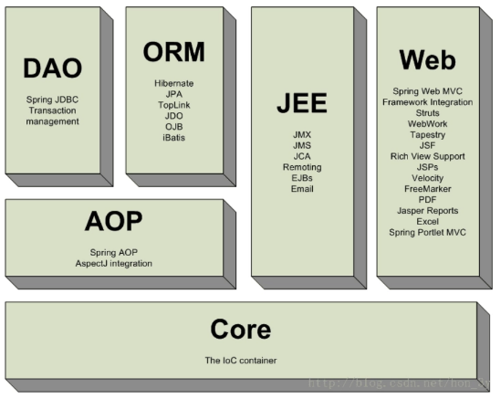

<!-- TOC -->

- [1 Spring IOC](#1-spring-ioc)
    - [1.1 IOC容器的原理](#11-ioc容器的原理)
    - [1.2 IOC 容器装配 Bean](#12-ioc-容器装配-bean)
- [2 Spring IOC相关面试题](#2-spring-ioc相关面试题)
- [3 Spring AOP](#3-spring-aop)

<!-- /TOC -->

# 1 Spring IOC

Spring的IoC容器是 Spring 的核心，Spring AOP是 Spring 框架的重要组成部分。

在传统的面向对象程序设计中，调用者A **依赖于** 被调用者 B，当 A 需要使用到 B 的功能时，往往是由 A 来创建 B 的实例。而在 Spring 中，A 对 B对象的**控制权不再由自己管理**了，而是交由 Spring 容器来管理，即**控制反转**。Spring 容器创建 B 对象后，将其注入给 A 使用，即**依赖注入**。

依赖注入：从外部注入 A 依赖的对象 B。

控制反转：把 对 B 的控制权，由 A 的内部 反转到 外部来了。

- 控制指的是：当前对象对内部成员的控制权。
- 反转指的是：这种控制权不由当前对象**内部**管理了，由其他**外部**(类,第三方容器)来管理。
- 对象的创建交给外部容器完成，这个就做控制反转。

IoC(思想，设计模式)主要的实现方式有两种：依赖查找，依赖注入。

依赖注入是一种更可取的方式(实现的方式)

使用IOC的好处：

1. 不用自己组装，拿来就用。
2. 享受单例的好处，效率高，不浪费空间。
3. 便于单元测试，方便切换mock组件。
4. 便于进行AOP操作，对于使用者是透明的。
5. 统一配置，便于修改。

## 1.1 IOC容器的原理

IOC 容器其实就是一个大工厂。它用来管理我们所有的对象以及依赖关系。

- 通过 Java 的反射技术来实现的。
- 通过配置文件或者注解来描述类和类之间的关系。
- IOC容器就可以根据配置文件，利用反射来构建出对象及其依赖关系。

1. 根据Bean配置信息在容器内部创建Bean定义注册表
2. 根据注册表加载、实例化bean、建立Bean与Bean之间的依赖关系
3. 将这些准备就绪的Bean放到Map缓存池中，等待应用程序调用

两种 Bean 工厂：

- BeanFactory：这是最基础、面向Spring的
- ApplicationContext：在BeanFactory基础之上，面向开发者提供了一系列的功能

区别：

1. ApplicationContext 在初始化时就实例化所有的单例对象。BeanFactory直到第一次访问某个bean时才实例化。
2. ApplicationContext 利用反射自动识别配置文件中定义的BeanPostProcessor、 InstantiationAwareBeanPostProcesso 和BeanFactoryPostProcessor 后置器并注册；BeanFactory 需要手动调用`addBeanPostProcessor()`方法进行注册。

Bean 的初始化：

1. BeanDefinitionReader 读取并解析配置文件，对每个 `<bean>`产生一个BeanDefinition对象，保存到BeanDefinitionRegistry中。
2. 容器遍历所有的 BeanDefinition对象，使用InstantiationStrategy 实例化所有的 Bean 对象，使用 BeanWrapper给每个Bean对象设置属性。

## 1.2 IOC 容器装配 Bean

**装配 Bean 的 4 种方式：**

1. XML 配置文件
2. 注解
3. JavaConfig 类
4. Groovy DSL配置

**依赖注入的 3 种方式：**

1. setter 注入
2. 构造器注入
3. 工厂方法注入

**Bean 对象之间的 3 种关系：**

1. 依赖
2. 继承
3. 引用

**Bean 的作用域：**

- singleton 单例：Spring默认的bean作用域，spring容器一旦加载会直接实例化对象，多次获取的是同一个对象
- prototype 原型：多例，spring容器加载后不会创建对象，每次获取对象之前实例化，每次获取的都是不同对象
- request
- session
- globalSession

单例对象返回多例的成员变量：需要用`lookup`方法注入

# 2 Spring IOC相关面试题

**1、什么是 Spring?**

Spring 是 用于 Java 企业级开发的，轻量级的，非侵入式的 开源的 开发框架。Spring框架目标是简化 Java 企业级应用开发。

*侵入式的做法就是要求用户代码知道框架的代码，表现为用户代码需要继承框架提供的类。非侵入式则不需要用户代码引入框架代码的信息，从类的编写者角度来看，察觉不到框架的存在。*

**2、Spring 框架的好处?**

- **轻量**：Spring 是轻量的，基本的版本大约2MB。
- **控制反转**：Spring通过控制反转实现了松散耦合，对象们给出它们的依赖，而不是创建或查找依赖的对象们。
- **面向切面的编程**(AOP)：Spring支持面向切面的编程，并且把应用业务逻辑和系统服务分开。
- **容器**：Spring 包含并管理应用中对象的生命周期和配置。
- **MVC框架**：Spring的WEB框架是个精心设计的框架，是Web框架的一个很好的替代品。
- **事务管理**：Spring 提供一个持续的事务管理接口，可以扩展到上至本地事务下至全局事务（JTA）。
- **异常处理**：Spring 提供方便的API把具体技术相关的异常（比如由JDBC，Hibernate or JDO抛出的）转化为一致的unchecked 异常。

**3、Spring可以分为6大模块：**

- Spring **Core**：spring的核心功能。IOC容器, 解决对象创建及依赖关系
- Spring **Web**：Spring对web模块的支持。
  - 可以与struts整合,让struts的action创建交给spring
  - spring mvc模式
- Spring **EE**：spring 对javaEE其他模块的支持
- Spring **AOP** ：面向切面编程
- Spring **DAO**：Spring 对jdbc操作的支持 【JdbcTemplate模板工具类】
- Spring **ORM**：spring对orm的支持：
  - 既可以与hibernate整合，【session】
  - 也可以使用spring的对hibernate操作的封装

 

**涉及到Spring core的开发jar包有6个**：

- commons-logging.jar：日志
- spring-beans.jar：bean节点
- spring-context.jar：spring上下文节点
- spring-core.jar：spring核心功能
- spring-expression.jar：spring表达式相关表

- log4j.jar：spring 依赖于 log4j

# 3 Spring AOP

面向切面编程：将相同逻辑的重复代码横向抽取出来，使用**动态代理**技术将这些重复代码织入到目标对象方法中，实现和原来一样的功能。

